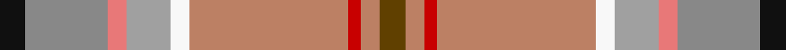

This page is one **sett** — a single exact thread-count. It belongs to the [tartan](/tartans/k4oi13ri3lr7w3o25r2o3dy4/)
(the same proportion at any scale), whose colour order is pattern [GRRRWYRRK](/stripes/grrrwyrrk/).

Sourced from tartans-authority.  It is a [9 stripe tartan](/stripes/stripes9/).

Original link http://www.tartansauthority.com/tartan-ferret/display/7069/

## Register references

External register numbers recorded for this tartan.

- Scottish Tartans Authority (ITI): 7069

## Thread count
K/8 Na26 LR6 N14 W6 LT50 R4 LT6 T/8

## Palette

Palette: <strong>Tartan Register</strong> <small style="color:#888">(7 of 8 colours)</small>
<table><thead><tr><th>Colour</th><th>Threads</th><th>Shade</th><th>Base</th><th>OKLCh</th></tr></thead><tbody><tr><td>K/</td><td style="text-align:right;font-variant-numeric:tabular-nums">8</td><td><code style="background-color:#101010;">#101010</code> <small style="color:#888">#101010</small></td><td>K <code style="background-color:#000000;">#000000</code></td><td><small style="color:#888">oklch(17.3% 0.000 89.9)</small></td></tr><tr><td>Na</td><td style="text-align:right;font-variant-numeric:tabular-nums">26</td><td><code style="background-color:#888888;">#888888</code> <small style="color:#888">#888888</small></td><td>R <code style="background-color:#CC0000;">#CC0000</code></td><td><small style="color:#888">oklch(62.7% 0.000 89.9)</small></td></tr><tr><td>LR</td><td style="text-align:right;font-variant-numeric:tabular-nums">6</td><td><code style="background-color:#E87878;">#E87878</code> <small style="color:#888">#E87878</small></td><td>R <code style="background-color:#CC0000;">#CC0000</code></td><td><small style="color:#888">oklch(70.0% 0.139 21.2)</small></td></tr><tr><td>N</td><td style="text-align:right;font-variant-numeric:tabular-nums">14</td><td><code style="background-color:#A0A0A0;">#A0A0A0</code> <small style="color:#888">#A0A0A0</small></td><td>Y <code style="background-color:#F2BF00;">#F2BF00</code></td><td><small style="color:#888">oklch(70.6% 0.000 89.9)</small></td></tr><tr><td>W</td><td style="text-align:right;font-variant-numeric:tabular-nums">6</td><td><code style="background-color:#F8F8F8;">#F8F8F8</code> <small style="color:#888">#F8F8F8</small></td><td>W <code style="background-color:#F7F7F7;">#F7F7F7</code></td><td><small style="color:#888">oklch(97.9% 0.000 89.9)</small></td></tr><tr><td>LT</td><td style="text-align:right;font-variant-numeric:tabular-nums">50</td><td><code style="background-color:#BC8064;">#BC8064</code> <small style="color:#888">#BC8064</small></td><td>R <code style="background-color:#CC0000;">#CC0000</code></td><td><small style="color:#888">oklch(65.4% 0.085 45.8)</small></td></tr><tr><td>R</td><td style="text-align:right;font-variant-numeric:tabular-nums">4</td><td><code style="background-color:#C80000;">#C80000</code> <small style="color:#888">#C80000</small></td><td>R <code style="background-color:#CC0000;">#CC0000</code></td><td><small style="color:#888">oklch(52.3% 0.215 29.2)</small></td></tr><tr><td>LT</td><td style="text-align:right;font-variant-numeric:tabular-nums">6</td><td><code style="background-color:#BC8064;">#BC8064</code> <small style="color:#888">#BC8064</small></td><td>R <code style="background-color:#CC0000;">#CC0000</code></td><td><small style="color:#888">oklch(65.4% 0.085 45.8)</small></td></tr><tr><td>T/</td><td style="text-align:right;font-variant-numeric:tabular-nums">8</td><td><code style="background-color:#604000;">#604000</code> <small style="color:#888">#604000</small></td><td>G <code style="background-color:#006100;">#006100</code></td><td><small style="color:#888">oklch(39.8% 0.083 76.8)</small></td></tr></tbody></table>

## Nearest tartans

The nearest existing variants by ΔTartan distance, with this tartan at the top so the swatches line up against it.

ΔTartan

Tartan

Sett

—

<a href="/ttd/edit/#slug=k4oi13ri3lr7w3o25r2o3dy4~x2">Australian Donkey (Corporate)</a> <a class="nn-out" href="/setts/s9/k4oi13ri3lr7w3o25r2o3dy4~x2/" title="open its dictionary page">↗</a>

0.48

<a href="/ttd/edit/#slug=k4y13m3lr7w3oi25r2oi3o4~x2">Australian Donkey</a> <a class="nn-out" href="/setts/s9/k4y13m3lr7w3oi25r2oi3o4~x2/" title="open its dictionary page">↗</a>

1.61

<a href="/ttd/edit/#slug=r12g2o5g2y9ly2t8w1t3w1t3w1t8~x2">Saint Joseph de Sorel</a> <a class="nn-out" href="/setts/s13/r12g2o5g2y9ly2t8w1t3w1t3w1t8~x2/" title="open its dictionary page">↗</a>

1.67

<a href="/ttd/edit/#slug=lr4oi2n2w2o16n5k2lr18g2lr4~x2">Australian Heavy Horse (Corporate)</a> <a class="nn-out" href="/setts/s10/lr4oi2n2w2o16n5k2lr18g2lr4~x2/" title="open its dictionary page">↗</a>

1.71

<a href="/ttd/edit/#slug=y48o26lbi5dy7lb10y3b7o10r3~x2">State Seal of Mississippi (Fashion)</a> <a class="nn-out" href="/setts/s9/y48o26lbi5dy7lb10y3b7o10r3~x2/" title="open its dictionary page">↗</a>

1.87

<a href="/setts/s10/nii4ni2nii18k2n5do16w2n2lr2nii4~x2/">Australian Heavy Horse</a>

1.91

<a href="/ttd/edit/#slug=ri1r12g1n9dy1t12lg1~x4">Wallace Memorial Centenary</a> <a class="nn-out" href="/setts/s7/ri1r12g1n9dy1t12lg1~x4/" title="open its dictionary page">↗</a>

1.96

<a href="/ttd/edit/#slug=o5db2r14dr9g8t3r3t3r3t3g19w3~x2">Meath</a> <a class="nn-out" href="/setts/s12/o5db2r14dr9g8t3r3t3r3t3g19w3~x2/" title="open its dictionary page">↗</a>

2.10

<a href="/ttd/edit/#slug=ly3oi24db4oi8w2oi2g10r12o2r5w2~x2">Unidentified 31</a> <a class="nn-out" href="/setts/s11/ly3oi24db4oi8w2oi2g10r12o2r5w2~x2/" title="open its dictionary page">↗</a>

2.10

<a href="/ttd/edit/#slug=k2lg3w2lg3n4lg19o6n23r3ly2~x2">MacLeroy &amp; Troine</a> <a class="nn-out" href="/setts/s10/k2lg3w2lg3n4lg19o6n23r3ly2~x2/" title="open its dictionary page">↗</a>

2.11

<a href="/ttd/edit/#slug=t8w1t3w1t3w1t8ly2o9g2lo5g2r12t8t3t3~x2">Saint Joseph de Sorel</a> <a class="nn-out" href="/setts/s16/t8w1t3w1t3w1t8ly2o9g2lo5g2r12t8t3t3~x2/" title="open its dictionary page">↗</a>

## Neighbour map

Every grey dot is one of 14359 variants placed by the first two principal components of the ΔTartan feature space (44% of its variance). Red is this tartan; blue dots are its nearest — click one to open its page.

<svg viewBox="0 0 640 380" role="img" style="max-width:100%;height:auto;border:1px solid #e0e0e0;border-radius:4px;display:block" xmlns="http://www.w3.org/2000/svg"><image href="/nn/cloud.v1.png" width="640" height="380"/><a href="/setts/s9/k4y13m3lr7w3oi25r2oi3o4~x2/"><circle cx="191.6" cy="117.6" r="4" fill="#3465a4"><title>Australian Donkey</title></circle></a><a href="/setts/s13/r12g2o5g2y9ly2t8w1t3w1t3w1t8~x2/"><circle cx="150.0" cy="135.3" r="4" fill="#3465a4"><title>Saint Joseph de Sorel</title></circle></a><a href="/setts/s10/lr4oi2n2w2o16n5k2lr18g2lr4~x2/"><circle cx="190.7" cy="129.9" r="4" fill="#3465a4"><title>Australian Heavy Horse (Corporate)</title></circle></a><a href="/setts/s9/y48o26lbi5dy7lb10y3b7o10r3~x2/"><circle cx="242.2" cy="140.3" r="4" fill="#3465a4"><title>State Seal of Mississippi (Fashion)</title></circle></a><a href="/setts/s10/nii4ni2nii18k2n5do16w2n2lr2nii4~x2/"><circle cx="204.5" cy="143.9" r="4" fill="#3465a4"><title>Australian Heavy Horse</title></circle></a><a href="/setts/s7/ri1r12g1n9dy1t12lg1~x4/"><circle cx="169.5" cy="149.9" r="4" fill="#3465a4"><title>Wallace Memorial Centenary</title></circle></a><a href="/setts/s12/o5db2r14dr9g8t3r3t3r3t3g19w3~x2/"><circle cx="130.5" cy="142.0" r="4" fill="#3465a4"><title>Meath</title></circle></a><a href="/setts/s11/ly3oi24db4oi8w2oi2g10r12o2r5w2~x2/"><circle cx="201.2" cy="121.8" r="4" fill="#3465a4"><title>Unidentified 31</title></circle></a><a href="/setts/s10/k2lg3w2lg3n4lg19o6n23r3ly2~x2/"><circle cx="204.0" cy="134.6" r="4" fill="#3465a4"><title>MacLeroy &amp; Troine</title></circle></a><a href="/setts/s16/t8w1t3w1t3w1t8ly2o9g2lo5g2r12t8t3t3~x2/"><circle cx="216.6" cy="140.2" r="4" fill="#3465a4"><title>Saint Joseph de Sorel</title></circle></a><circle cx="187.1" cy="118.1" r="5" fill="#c00000"/></svg>

ID: /setts/s9/k4oi13ri3lr7w3o25r2o3dy4~x2/
