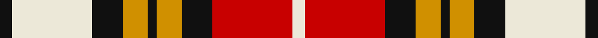

**Bands:** [KWKYKYKRW](/stripes/kwkykykrw/) · **Stripes:** [K W K LO K LO K R W](/stripes/stripes9/) K W K LO K LO K R W

This was sourced from register-of-tartans.  It is a [9 band tartan](/bands/bands9/).

Original link https://www.tartanregister.gov.uk/tartanDetails.aspx?ref=2216

## Attestations

This cloth appears in 2 source records; the oldest owns this page.

- 01/01/1973 — Lord Laird (register-of-tartans, [record](https://www.tartanregister.gov.uk/tartanDetails.aspx?ref=2216))
- pre 1973 — Lord Laird (Fashion) (tartans-authority, [record](http://www.tartansauthority.com/tartan-ferret/display/5491/))

## Register references

External register numbers recorded for this tartan.

- Scottish Register of Tartans: [2216](https://www.tartanregister.gov.uk/tartanDetails.aspx?ref=2216)
- Scottish Tartans Authority (ITI): 5491

## Thread count
K/8 LN52 K20 DY16 K6 DY16 K20 R52 LN/8

## Palette
Each colour and its ΔE from the base-6 reference it is a variant of.

| Colour | Shade | Base | ΔE (OKLab) |
|---|---|---|---|
| DY | <code style="background-color:#D09000;">#D09000</code> `#D09000` | Y <code style="background-color:#F2BF00;">#F2BF00</code> | 0.13 |
| K | <code style="background-color:#101010;">#101010</code> `#101010` | K <code style="background-color:#000000;">#000000</code> | 0.17 |
| LN | <code style="background-color:#ECE8D8;">#ECE8D8</code> `#ECE8D8` | W <code style="background-color:#F7F7F7;">#F7F7F7</code> | 0.05 |
| R | <code style="background-color:#C80000;">#C80000</code> `#C80000` | R <code style="background-color:#CC0000;">#CC0000</code> | 0.01 |

## Nearest tartans

The nearest existing variants by ΔTartan distance.

1. [Aberlour](/setts/s8/lb23k4lb4k4lb4k22o23lo5~x2/) — ΔT 1.18
1. [Kinloch Anderson Check (Fashion)](/setts/s7/k3lo18k12lo18k2lo2k3~x2/) — ΔT 1.19
1. [MacGlashan](/setts/s14/dr10lb1dr3lb6dr1lb3dr1o5ly1o3ly6o1ly3o1~x4/) — ΔT 1.19
1. [Holden Beige (Corporate)](/setts/s8/lb13k3lb3k3lb3k15lo18r3~x2/) — ΔT 1.23
1. [Heriot](/setts/s8/o20db2o2db2lo3db12w18db3~x2/) — ΔT 1.28
1. [Glasgow](/setts/s7/dg20r3y3r15w19dg3t2~x2/) — ΔT 1.31
1. [Bannockbane](/setts/s8/dr2lo2dr15lo1w10o15lo2o2~x2/) — ΔT 1.33
1. [Bannock Bane M.405](/setts/s8/do4r3do21r2w14o22r3o4~x2/) — ΔT 1.34
1. [MacDuff Dress #4](/setts/s11/r16k6r14dg22k16db16w10r6w45k4r4/) — ΔT 1.34
1. [Carnegie Dress](/setts/s13/w8r2w2r6w13r2k13dg13r6dg2r2dg4ly3~x2/) — ΔT 1.40

## Neighbour map

Every grey dot is one of 14299 variants placed by the first two principal components of the ΔTartan feature space (44% of its variance). Red is this tartan; blue dots are its nearest — click one to open its page.

<svg viewBox="0 0 640 380" role="img" style="max-width:100%;height:auto;border:1px solid #e0e0e0;border-radius:4px;display:block" xmlns="http://www.w3.org/2000/svg"><image href="/nn/cloud.v1.png" width="640" height="380"/><a href="/setts/s8/lb23k4lb4k4lb4k22o23lo5~x2/"><circle cx="131.0" cy="191.8" r="4" fill="#3465a4"><title>Aberlour</title></circle></a><a href="/setts/s7/k3lo18k12lo18k2lo2k3~x2/"><circle cx="161.5" cy="181.7" r="4" fill="#3465a4"><title>Kinloch Anderson Check (Fashion)</title></circle></a><a href="/setts/s14/dr10lb1dr3lb6dr1lb3dr1o5ly1o3ly6o1ly3o1~x4/"><circle cx="127.8" cy="143.8" r="4" fill="#3465a4"><title>MacGlashan</title></circle></a><a href="/setts/s8/lb13k3lb3k3lb3k15lo18r3~x2/"><circle cx="128.9" cy="191.2" r="4" fill="#3465a4"><title>Holden Beige (Corporate)</title></circle></a><a href="/setts/s8/o20db2o2db2lo3db12w18db3~x2/"><circle cx="168.6" cy="161.4" r="4" fill="#3465a4"><title>Heriot</title></circle></a><a href="/setts/s7/dg20r3y3r15w19dg3t2~x2/"><circle cx="134.8" cy="157.9" r="4" fill="#3465a4"><title>Glasgow</title></circle></a><a href="/setts/s8/dr2lo2dr15lo1w10o15lo2o2~x2/"><circle cx="186.2" cy="149.5" r="4" fill="#3465a4"><title>Bannockbane</title></circle></a><a href="/setts/s8/do4r3do21r2w14o22r3o4~x2/"><circle cx="185.4" cy="171.2" r="4" fill="#3465a4"><title>Bannock Bane M.405</title></circle></a><a href="/setts/s11/r16k6r14dg22k16db16w10r6w45k4r4/"><circle cx="99.3" cy="135.6" r="4" fill="#3465a4"><title>MacDuff Dress #4</title></circle></a><a href="/setts/s13/w8r2w2r6w13r2k13dg13r6dg2r2dg4ly3~x2/"><circle cx="61.7" cy="153.1" r="4" fill="#3465a4"><title>Carnegie Dress</title></circle></a><circle cx="107.2" cy="166.1" r="5" fill="#c00000"/></svg>

ID: /setts/s9/k4w26k10lo8k3lo8k10r26w4~x2/
