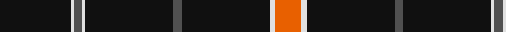

In pattern [KWBWKBKWR](/patterns/kwbwkbkwr/).

This was sourced from tartans-authority.  It is a [9 stripes tartan](/stripes/stripes9/).

Original link http://www.tartansauthority.com/tartan-ferret/display/7502/

## Attestations

This cloth appears in 3 source records; the oldest owns this page.

- Oct. 2007 — Savannah Harley Davidson (Corporate) (tartans-authority, [record](http://www.tartansauthority.com/tartan-ferret/display/7502/))
- undated — Savannah Harley Davidson (register-of-tartans, [record](https://www.tartanregister.gov.uk/tartanDetails.aspx?ref=5542))
- undated — Savannah Harley Davidson American Corporate Tartan Tartan Number: 7502. Earliest known date: Oct. 2007 Woven sample from Lochcarron produced in October 2007 for Galeic Themes of Glasgow for the Savannah Harley Davidson compnay in Georgia (http://www.savannahhd.com/). See products available Copyright © Blair Urquhart, Comrie, 2015 (house-of-tartan, [record](http://www.house-of-tartan.scotland.net/house/TartanViewjs.asp?colr=Def&tnam=7502))

## Thread count
K/50 LN2 N6 LN2 K62 N6 K62 LN4 O/18

## Palette
Each colour and its ΔE from the base-6 reference it is a variant of.

| Colour | Shade | Base | ΔE (OKLab) |
|---|---|---|---|
| K | <code style="background-color:#101010;">#101010</code> `#101010` | K <code style="background-color:#000000;">#000000</code> | 0.17 |
| LN | <code style="background-color:#E0E0E0;">#E0E0E0</code> `#E0E0E0` | W <code style="background-color:#F4F4F0;">#F4F4F0</code> | 0.06 |
| N | <code style="background-color:#505050;">#505050</code> `#505050` | B <code style="background-color:#2C4084;">#2C4084</code> | 0.12 |
| O | <code style="background-color:#E86000;">#E86000</code> `#E86000` | R <code style="background-color:#C80000;">#C80000</code> | 0.14 |

ID: /setts/s9/k50w2b6w2k62b6k62w4r18-b505050-k101010-re86000-we0e0e0/
