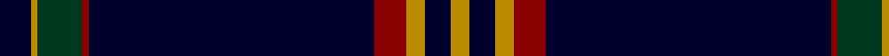

In pattern [KYGRKRYKY](/patterns/kygrkryky/).

This was sourced from tartans-authority.  It is a [9 stripes tartan](/stripes/stripes9/).

Original link http://www.tartansauthority.com/tartan-ferret/display/10652/

## Thread count
DB/10 DY2 DG14 DR2 DB90 DR10 DY6 DB8 DY/6

## Palette
Each colour and its ΔE from the base-6 reference it is a variant of.

| Colour | Shade | Base | ΔE (OKLab) |
|---|---|---|---|
| DB | <code style="background-color:#00002C;">#00002C</code> `#00002C` | K <code style="background-color:#000000;">#000000</code> | 0.16 |
| DG | <code style="background-color:#003820;">#003820</code> `#003820` | G <code style="background-color:#006100;">#006100</code> | 0.15 |
| DR | <code style="background-color:#880000;">#880000</code> `#880000` | R <code style="background-color:#CC0000;">#CC0000</code> | 0.15 |
| DY | <code style="background-color:#BC8C00;">#BC8C00</code> `#BC8C00` | Y <code style="background-color:#F2BF00;">#F2BF00</code> | 0.16 |

## Nearest tartans

The nearest existing variants by ΔTartan distance.

1. [Marine Harvest (Scotland)](/setts/s8/b10ba2k2b1k6ba1k45y2x2~b0000cd-ba778899-k101010-yffa500/) — ΔT 0.77
1. [degli Uberti, Baron of Cartsburn (Personal)](/setts/s8/b8r1k6r1y8r1k45y1x2~b000080-k101010-rbe3d3d-ybc933d/) — ΔT 0.99
1. [United States](/setts/s9/b7k5y6k5r7k2b2k70y2~b304080-k000030-rc00000-yb0b0b0/) — ΔT 1.08
1. [Marine Harvest Scotland (Corporate)](/setts/s8/b10w2k2b1k6w1k45y2x2~b1474b4-k101010-wc0c0c0-yd87c00/) — ΔT 1.08
1. [Brooks Brothers Signature](/setts/s9/b5y1g7r1b45r5y3b4y3x2~b000e48-g006b1b-rb30000-yffd014/) — ΔT 1.13
1. [degli Uberti, Baron of Cartsburn (P)](/setts/s8/b8r1k6r1y8r1k45y1x2~b202060-k101010-rc80000-ybc8c00/) — ΔT 1.24
1. [Gibson, Robert (Personal)](/setts/s7/k5b15k5ba1k35r1k2x4~b0000cd-ba1474b4-k101010-rb458ac/) — ΔT 1.32
1. [Calum's Cabin](/setts/s10/b32r4ba12b2ba4b2ba2g16b67r6~b000048-ba003c64-g808080-re86000/) — ΔT 1.32
1. [American Heritage](/setts/s11/w5k2b14k4r8k4b4k80r6k4r4~b244470-k101010-r880000-wf8f4d0/) — ΔT 1.33
1. [McCann of Castlecraig (Personal)](/setts/s7/k64g12b6k15r1g5y1x2~b5c5c5c-g545c24-k00002c-rb47800-ya0a0a0/) — ΔT 1.37

## Neighbour map

Every grey dot is one of 15726 variants placed by the first two principal components of the ΔTartan feature space (44% of its variance). Red is this tartan; blue dots are its nearest — click one to open its page.

<svg viewBox="0 0 640 380" role="img" style="max-width:100%;height:auto;border:1px solid #e0e0e0;border-radius:4px;display:block" xmlns="http://www.w3.org/2000/svg"><image href="/nn/cloud.v1.png" width="640" height="380"/><a href="/setts/s8/b10ba2k2b1k6ba1k45y2x2~b0000cd-ba778899-k101010-yffa500/"><circle cx="548.9" cy="127.7" r="4" fill="#3465a4"><title>Marine Harvest (Scotland)</title></circle></a><a href="/setts/s8/b8r1k6r1y8r1k45y1x2~b000080-k101010-rbe3d3d-ybc933d/"><circle cx="497.7" cy="120.8" r="4" fill="#3465a4"><title>degli Uberti, Baron of Cartsburn (Personal)</title></circle></a><a href="/setts/s9/b7k5y6k5r7k2b2k70y2~b304080-k000030-rc00000-yb0b0b0/"><circle cx="532.2" cy="123.4" r="4" fill="#3465a4"><title>United States</title></circle></a><a href="/setts/s8/b10w2k2b1k6w1k45y2x2~b1474b4-k101010-wc0c0c0-yd87c00/"><circle cx="537.4" cy="121.6" r="4" fill="#3465a4"><title>Marine Harvest Scotland (Corporate)</title></circle></a><a href="/setts/s9/b5y1g7r1b45r5y3b4y3x2~b000e48-g006b1b-rb30000-yffd014/"><circle cx="479.1" cy="107.5" r="4" fill="#3465a4"><title>Brooks Brothers Signature</title></circle></a><a href="/setts/s8/b8r1k6r1y8r1k45y1x2~b202060-k101010-rc80000-ybc8c00/"><circle cx="505.3" cy="122.6" r="4" fill="#3465a4"><title>degli Uberti, Baron of Cartsburn (P)</title></circle></a><a href="/setts/s7/k5b15k5ba1k35r1k2x4~b0000cd-ba1474b4-k101010-rb458ac/"><circle cx="522.5" cy="167.2" r="4" fill="#3465a4"><title>Gibson, Robert (Personal)</title></circle></a><a href="/setts/s10/b32r4ba12b2ba4b2ba2g16b67r6~b000048-ba003c64-g808080-re86000/"><circle cx="459.2" cy="137.5" r="4" fill="#3465a4"><title>Calum's Cabin</title></circle></a><a href="/setts/s11/w5k2b14k4r8k4b4k80r6k4r4~b244470-k101010-r880000-wf8f4d0/"><circle cx="493.7" cy="107.8" r="4" fill="#3465a4"><title>American Heritage</title></circle></a><a href="/setts/s7/k64g12b6k15r1g5y1x2~b5c5c5c-g545c24-k00002c-rb47800-ya0a0a0/"><circle cx="533.1" cy="132.2" r="4" fill="#3465a4"><title>McCann of Castlecraig (Personal)</title></circle></a><circle cx="507.0" cy="121.2" r="5" fill="#c00000"/></svg>

ID: /setts/s9/k5y1g7r1k45r5y3k4y3x2~g003820-k00002c-r880000-ybc8c00/
