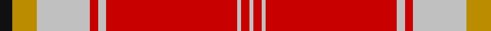

In pattern [KYWRWRWRW](/patterns/kywrwrwrw/).

This was sourced from tartans-authority.  It is a [9 stripes tartan](/stripes/stripes9/).

Original link http://www.tartansauthority.com/tartan-ferret/display/10835/

## Thread count
K/6 DY12 N26 R4 N4 R64 N2 R4 N/2

## Palette
Each colour and its ΔE from the base-6 reference it is a variant of.

| Colour | Shade | Base | ΔE (OKLab) |
|---|---|---|---|
| DY | <code style="background-color:#BC8C00;">#BC8C00</code> `#BC8C00` | Y <code style="background-color:#E8C000;">#E8C000</code> | 0.16 |
| K | <code style="background-color:#101010;">#101010</code> `#101010` | K <code style="background-color:#000000;">#000000</code> | 0.17 |
| N | <code style="background-color:#C0C0C0;">#C0C0C0</code> `#C0C0C0` | W <code style="background-color:#F4F4F0;">#F4F4F0</code> | 0.16 |
| R | <code style="background-color:#C80000;">#C80000</code> `#C80000` | R <code style="background-color:#C80000;">#C80000</code> | 0.00 |

## Nearest tartans

The nearest existing variants by ΔTartan distance.

1. [Fueglistal (Aargau) (Personal)](/setts/s9/k6y12ya26r4ya4r64ya2r4ya4-k101010-rc50000-yc27c05-ya9da39d/) — ΔT 0.85
1. [Drummond of Perth, dress](/setts/s9/r134y6b12w6wa50r20b12w14wa6-b505050-rc00000-wc0c0c0-wae0e0e0-yf0c000/) — ΔT 1.10
1. [Drummond of Perth Dress #3](/setts/s9/r134y6b12w6wa50r20b12w14wa6-b505050-rdc0000-wc0c0c0-wae0e0e0-ye8c000/) — ΔT 1.13
1. [Wcwm 9275-1626](/setts/s10/g8r8b4r64ba2b24r4g32r8b4-b441800-ba2474e8-g8c7038-re87878/) — ΔT 1.14
1. [Drummond of Perth Dress](/setts/s9/r80y2k4g2w30r10k10g10w2-g808080-k101010-rdc0000-we0e0e0-ye8c000/) — ΔT 1.18
1. [Drummond of Perth Dress Clan Tartan Tartan Number: 1717. Earliest known date: pre 2003 Nothing See products available Copyright © Blair Urquhart, Comrie, 2015](/setts/s9/r80y2k4ra2w30r10k10ra10w2-k101010-rc80000-ra888888-we0e0e0-ye8c000/) — ΔT 1.19
1. [Spens Family Tartan Tartan Number: 1671. Earliest known date: c.1815 The Spens tartan is similar in many respects to the Perthshire District sett, which is in turn, a variation of one of the Drummond tartans. The Perthshire sett was being woven by Wilson's of Bannockburn in the early years of the nineteenth century. The name, Spens, is linked to a specimen preserved in the collection of the Highland Society of London. See products available Copyright © Blair Urquhart, Comrie, 2015](/setts/s8/r56w2b6w2g32r11b6w5-b2c2c80-g006818-rc80000-we0e0e0/) — ΔT 1.21
1. [Union Memorial Tartan (Military)](/setts/s10/y24y8w8y8b4r112w36b2r8r6-b1c0070-ra00000-wc0c0c0-ye8c000/) — ΔT 1.29
1. [Stuart of Bute](/setts/s9/r48g24k4g8k4g4k24r96w8-g789484-k101010-rc80000-wffffff/) — ΔT 1.29
1. [VeMMA](/setts/s10/r48y4ya14y6k4b8k4y2r8y2-b6b747b-k101010-rff4000-yadadad-yaff9f80/) — ΔT 1.29

## Neighbour map

Every grey dot is one of 15726 variants placed by the first two principal components of the ΔTartan feature space (44% of its variance). Red is this tartan; blue dots are its nearest — click one to open its page.

<svg viewBox="0 0 640 380" role="img" style="max-width:100%;height:auto;border:1px solid #e0e0e0;border-radius:4px;display:block" xmlns="http://www.w3.org/2000/svg"><image href="/nn/cloud.v1.png" width="640" height="380"/><a href="/setts/s9/k6y12ya26r4ya4r64ya2r4ya4-k101010-rc50000-yc27c05-ya9da39d/"><circle cx="412.8" cy="111.6" r="4" fill="#3465a4"><title>Fueglistal (Aargau) (Personal)</title></circle></a><a href="/setts/s9/r134y6b12w6wa50r20b12w14wa6-b505050-rc00000-wc0c0c0-wae0e0e0-yf0c000/"><circle cx="350.5" cy="90.8" r="4" fill="#3465a4"><title>Drummond of Perth, dress</title></circle></a><a href="/setts/s9/r134y6b12w6wa50r20b12w14wa6-b505050-rdc0000-wc0c0c0-wae0e0e0-ye8c000/"><circle cx="356.5" cy="89.8" r="4" fill="#3465a4"><title>Drummond of Perth Dress #3</title></circle></a><a href="/setts/s10/g8r8b4r64ba2b24r4g32r8b4-b441800-ba2474e8-g8c7038-re87878/"><circle cx="360.0" cy="114.1" r="4" fill="#3465a4"><title>Wcwm 9275-1626</title></circle></a><a href="/setts/s9/r80y2k4g2w30r10k10g10w2-g808080-k101010-rdc0000-we0e0e0-ye8c000/"><circle cx="373.6" cy="62.1" r="4" fill="#3465a4"><title>Drummond of Perth Dress</title></circle></a><a href="/setts/s9/r80y2k4ra2w30r10k10ra10w2-k101010-rc80000-ra888888-we0e0e0-ye8c000/"><circle cx="372.2" cy="64.0" r="4" fill="#3465a4"><title>Drummond of Perth Dress Clan Tartan Tartan Number: 1717. Earliest known date: pre 2003 Nothing See products available Copyright © Blair Urquhart, Comrie, 2015</title></circle></a><a href="/setts/s8/r56w2b6w2g32r11b6w5-b2c2c80-g006818-rc80000-we0e0e0/"><circle cx="359.1" cy="123.3" r="4" fill="#3465a4"><title>Spens Family Tartan Tartan Number: 1671. Earliest known date: c.1815 The Spens tartan is similar in many respects to the Perthshire District sett, which is in turn, a variation of one of the Drummond tartans. The Perthshire sett was being woven by Wilson's of Bannockburn in the early years of the nineteenth century. The name, Spens, is linked to a specimen preserved in the collection of the Highland Society of London. See products available Copyright © Blair Urquhart, Comrie, 2015</title></circle></a><a href="/setts/s10/y24y8w8y8b4r112w36b2r8r6-b1c0070-ra00000-wc0c0c0-ye8c000/"><circle cx="376.6" cy="54.6" r="4" fill="#3465a4"><title>Union Memorial Tartan (Military)</title></circle></a><a href="/setts/s9/r48g24k4g8k4g4k24r96w8-g789484-k101010-rc80000-wffffff/"><circle cx="414.4" cy="122.3" r="4" fill="#3465a4"><title>Stuart of Bute</title></circle></a><a href="/setts/s10/r48y4ya14y6k4b8k4y2r8y2-b6b747b-k101010-rff4000-yadadad-yaff9f80/"><circle cx="339.6" cy="90.0" r="4" fill="#3465a4"><title>VeMMA</title></circle></a><circle cx="395.2" cy="97.7" r="5" fill="#c00000"/></svg>

ID: /setts/s9/k6y12w26r4w4r64w2r4w2-k101010-rc80000-wc0c0c0-ybc8c00/
