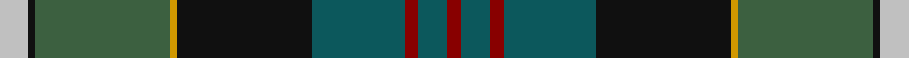

In pattern [RBRBKYGKW](/stripes/rbrbkygkw/).

This was sourced from tartans-authority.  It is a [9 stripe tartan](/stripes/stripes9/).

Original link http://www.tartansauthority.com/tartan-ferret/display/1422/

## Thread count
Na/16 K4 N76 DY4 K76 G52 DR8 G16 DR/8

## Palette
Each colour and the base-6 reference it is a variant of.

| Colour | Shade | Base |
|---|---|---|
| DR | <code style="background-color:#880000;">#880000</code> `oklch(39.4% 0.162 29.2)` <small>#880000</small> | R <code style="background-color:#CC0000;">#CC0000</code> |
| DY | <code style="background-color:#D09800;">#D09800</code> `oklch(71.4% 0.147 82.1)` <small>#D09800</small> | Y <code style="background-color:#F2BF00;">#F2BF00</code> |
| G | <code style="background-color:#0C585C;">#0C585C</code> `oklch(42.0% 0.068 200.5)` <small>#0C585C</small> | B <code style="background-color:#2A418A;">#2A418A</code> |
| K | <code style="background-color:#101010;">#101010</code> `oklch(17.3% 0.000 89.9)` <small>#101010</small> | K <code style="background-color:#000000;">#000000</code> |
| N | <code style="background-color:#3C6040;">#3C6040</code> `oklch(45.2% 0.066 147.1)` <small>#3C6040</small> | G <code style="background-color:#006100;">#006100</code> |
| Na | <code style="background-color:#C0C0C0;">#C0C0C0</code> `oklch(80.8% 0.000 89.9)` <small>#C0C0C0</small> | W <code style="background-color:#F7F7F7;">#F7F7F7</code> |

## Nearest tartans

The nearest existing variants by ΔTartan distance, with this tartan at the top so the swatches line up against it.

ΔTartan

Tartan

Sett

—

<a href="/ttd/edit/#slug=lb4k1y19lo1k19n13r2n4r2~x4">Whitson (Name)</a> <a class="nn-out" href="/setts/s9/lb4k1y19lo1k19n13r2n4r2~x4/" title="open its dictionary page">↗</a>

0.66

<a href="/ttd/edit/#slug=r9dt8r8g52w2k32dt44b4">Highland Wedding (Fashion)</a> <a class="nn-out" href="/setts/s8/r9dt8r8g52w2k32dt44b4/" title="open its dictionary page">↗</a>

0.77

<a href="/ttd/edit/#slug=r2y2n9k10g12k1y1k1ly1~x4">Trades House</a> <a class="nn-out" href="/setts/s9/r2y2n9k10g12k1y1k1ly1~x4/" title="open its dictionary page">↗</a>

0.89

<a href="/ttd/edit/#slug=t1dr4t12dr1k7dg12k7do21w1~x2">Redgate (Connecticut) Hunting</a> <a class="nn-out" href="/setts/s9/t1dr4t12dr1k7dg12k7do21w1~x2/" title="open its dictionary page">↗</a>

0.91

<a href="/ttd/edit/#slug=r4g4k2g17do5g5do17g6lb1db22r2~x2">Adams (Name)</a> <a class="nn-out" href="/setts/s11/r4g4k2g17do5g5do17g6lb1db22r2~x2/" title="open its dictionary page">↗</a>

0.92

<a href="/ttd/edit/#slug=n3dg3r2dg20k25ly2n13k2n3r3~x2">Loch Freuchie</a> <a class="nn-out" href="/setts/s10/n3dg3r2dg20k25ly2n13k2n3r3~x2/" title="open its dictionary page">↗</a>

0.99

<a href="/ttd/edit/#slug=r4g4k2g15do5g5do15g6w1db19r2~x2">Adams</a> <a class="nn-out" href="/setts/s11/r4g4k2g15do5g5do15g6w1db19r2~x2/" title="open its dictionary page">↗</a>

0.99

<a href="/ttd/edit/#slug=n12r2n3r4n15k24dg18ly1k3dg3w3~x2">Groen (Personal)</a> <a class="nn-out" href="/setts/s11/n12r2n3r4n15k24dg18ly1k3dg3w3~x2/" title="open its dictionary page">↗</a>

1.01

<a href="/ttd/edit/#slug=r7g20ly2g4k5b4k2b20k3w1~x2">McMeeken (Name)</a> <a class="nn-out" href="/setts/s10/r7g20ly2g4k5b4k2b20k3w1~x2/" title="open its dictionary page">↗</a>

1.01

<a href="/ttd/edit/#slug=dg19w2dg5k4db21k4w2dg5w1ly1w1do14~x2">Womack (2014)</a> <a class="nn-out" href="/setts/s12/dg19w2dg5k4db21k4w2dg5w1ly1w1do14~x2/" title="open its dictionary page">↗</a>

1.03

<a href="/ttd/edit/#slug=n3dg3r2dg20k25k2n13k2n3r3~x2">Loch Freuchie District Tartan Tartan Number: 10725. Earliest known date: 25 October 2012 A tartan for the area around Loch Freuchie near Crieff. The tartan is based on the Murray of Atholl and Breadalbane setts, with differences, to relate the tartan to the particular Loch Freuchie area. Mr MacArthur-Fox has created a tartan for anyone to wear without fear of offending another person or group. See products available Copyright © Blair Urquhart, Comrie, 2015</a> <a class="nn-out" href="/setts/s10/n3dg3r2dg20k25k2n13k2n3r3~x2/" title="open its dictionary page">↗</a>

## Neighbour map

Every grey dot is one of 14299 variants placed by the first two principal components of the ΔTartan feature space (44% of its variance). Red is this tartan; blue dots are its nearest — click one to open its page.

<svg viewBox="0 0 640 380" role="img" style="max-width:100%;height:auto;border:1px solid #e0e0e0;border-radius:4px;display:block" xmlns="http://www.w3.org/2000/svg"><image href="/nn/cloud.v1.png" width="640" height="380"/><a href="/setts/s8/r9dt8r8g52w2k32dt44b4/"><circle cx="193.7" cy="144.4" r="4" fill="#3465a4"><title>Highland Wedding (Fashion)</title></circle></a><a href="/setts/s9/r2y2n9k10g12k1y1k1ly1~x4/"><circle cx="154.5" cy="161.5" r="4" fill="#3465a4"><title>Trades House</title></circle></a><a href="/setts/s9/t1dr4t12dr1k7dg12k7do21w1~x2/"><circle cx="166.4" cy="148.1" r="4" fill="#3465a4"><title>Redgate (Connecticut) Hunting</title></circle></a><a href="/setts/s11/r4g4k2g17do5g5do17g6lb1db22r2~x2/"><circle cx="208.2" cy="141.7" r="4" fill="#3465a4"><title>Adams (Name)</title></circle></a><a href="/setts/s10/n3dg3r2dg20k25ly2n13k2n3r3~x2/"><circle cx="180.5" cy="148.6" r="4" fill="#3465a4"><title>Loch Freuchie</title></circle></a><a href="/setts/s11/r4g4k2g15do5g5do15g6w1db19r2~x2/"><circle cx="193.4" cy="148.7" r="4" fill="#3465a4"><title>Adams</title></circle></a><a href="/setts/s11/n12r2n3r4n15k24dg18ly1k3dg3w3~x2/"><circle cx="176.1" cy="120.9" r="4" fill="#3465a4"><title>Groen (Personal)</title></circle></a><a href="/setts/s10/r7g20ly2g4k5b4k2b20k3w1~x2/"><circle cx="190.4" cy="134.0" r="4" fill="#3465a4"><title>McMeeken (Name)</title></circle></a><a href="/setts/s12/dg19w2dg5k4db21k4w2dg5w1ly1w1do14~x2/"><circle cx="176.4" cy="118.1" r="4" fill="#3465a4"><title>Womack (2014)</title></circle></a><a href="/setts/s10/n3dg3r2dg20k25k2n13k2n3r3~x2/"><circle cx="193.9" cy="156.7" r="4" fill="#3465a4"><title>Loch Freuchie District Tartan Tartan Number: 10725. Earliest known date: 25 October 2012 A tartan for the area around Loch Freuchie near Crieff. The tartan is based on the Murray of Atholl and Breadalbane setts, with differences, to relate the tartan to the particular Loch Freuchie area. Mr MacArthur-Fox has created a tartan for anyone to wear without fear of offending another person or group. See products available Copyright © Blair Urquhart, Comrie, 2015</title></circle></a><circle cx="175.7" cy="145.3" r="5" fill="#c00000"/></svg>

ID: /setts/s9/lb4k1y19lo1k19n13r2n4r2~x4/
