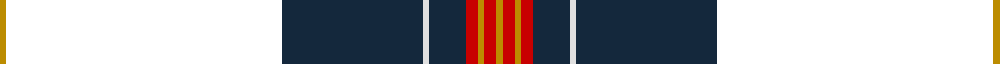

In pattern [YKBWBRYRY](/stripes/ykbwbryry/).

This was sourced from house-of-tartan.  It is a [9 stripe tartan](/stripes/stripes9/).

Original link http://www.house-of-tartan.scotland.net/house/TartanViewjs.asp?colr=Def&tnam=6596

## Thread count
DY/2 DR90 DN46 LN2 DN12 R4 DY2 R4 DY/2

## Palette
Each colour and the base-6 reference it is a variant of.

| Colour | Shade | Base |
|---|---|---|
| DB | <code style="background-color:#202060;">#202060</code> `oklch(28.9% 0.111 276.9)` <small>#202060</small> | B <code style="background-color:#2A418A;">#2A418A</code> |
| DN | <code style="background-color:#14283C;">#14283C</code> `oklch(27.1% 0.046 249.9)` <small>#14283C</small> | B <code style="background-color:#2A418A;">#2A418A</code> |
| DY | <code style="background-color:#BC8C00;">#BC8C00</code> `oklch(66.8% 0.137 84.1)` <small>#BC8C00</small> | Y <code style="background-color:#F2BF00;">#F2BF00</code> |
| LN | <code style="background-color:#E0E0E0;">#E0E0E0</code> `oklch(90.7% 0.000 89.9)` <small>#E0E0E0</small> | W <code style="background-color:#F7F7F7;">#F7F7F7</code> |
| R | <code style="background-color:#C80000;">#C80000</code> `oklch(52.3% 0.215 29.2)` <small>#C80000</small> | R <code style="background-color:#CC0000;">#CC0000</code> |

## Nearest tartans

The nearest existing variants by ΔTartan distance, with this tartan at the top so the swatches line up against it.

ΔTartan

Tartan

Sett

—

<a href="/ttd/edit/#slug=lo1k45dt23w1dt6r2lo1r2lo1~x2">Arbroath Smokie Corporate Tartan Tartan Number: 6596. Earliest known date: 01/01/2005 Designed by Heather Yellowly of the Strathmore Woollen Co, of Forfar for Campbell Scott of Arbroath Fisheries. The tartan celebrates the European protective geographical status being awarded to the Arbroath Smokie - one of only a few food products to have been awarded this status. Colours: red represents the sandstone of Arbroath Abbey where the Declaration of Independence was signed in 1320; blue and white represent the sea; the red glow of the smokie barrel and the golden yellow of the delicacy itself. See products available Copyright © Blair Urquhart, Comrie, 2015</a> <a class="nn-out" href="/setts/s9/lo1k45dt23w1dt6r2lo1r2lo1~x2/" title="open its dictionary page">↗</a>

1.22

<a href="/ttd/edit/#slug=k43ly3n1w1db1ly3db25r2~x2">Royal Yaght Britannia, The</a> <a class="nn-out" href="/setts/s8/k43ly3n1w1db1ly3db25r2~x2/" title="open its dictionary page">↗</a>

1.25

<a href="/ttd/edit/#slug=k36db6ly1db1lb1db1dy8o4db1o2lb1~x4">Flotilla Navy</a> <a class="nn-out" href="/setts/s11/k36db6ly1db1lb1db1dy8o4db1o2lb1~x4/" title="open its dictionary page">↗</a>

1.37

<a href="/ttd/edit/#slug=k4dt6k4n4dt29n6k68db10k4b6db4w2">Earthrise</a> <a class="nn-out" href="/setts/s12/k4dt6k4n4dt29n6k68db10k4b6db4w2/" title="open its dictionary page">↗</a>

1.44

<a href="/ttd/edit/#slug=r4k1k1db8r2k44g8k1ly2k1g4~x2">Marsa Scout Group</a> <a class="nn-out" href="/setts/s11/r4k1k1db8r2k44g8k1ly2k1g4~x2/" title="open its dictionary page">↗</a>

1.45

<a href="/ttd/edit/#slug=r4k2w6k2db40k80dg10w6r3">Italian American</a> <a class="nn-out" href="/setts/s9/r4k2w6k2db40k80dg10w6r3/" title="open its dictionary page">↗</a>

1.48

<a href="/ttd/edit/#slug=r4k1db8k1r2k44g8k1ly2k1g4~x2">Marsa Scout Group</a> <a class="nn-out" href="/setts/s11/r4k1db8k1r2k44g8k1ly2k1g4~x2/" title="open its dictionary page">↗</a>

1.49

<a href="/ttd/edit/#slug=k43ly3dg1w1db1ly3db25r2~x2">Royal Yacht Britannia</a> <a class="nn-out" href="/setts/s8/k43ly3dg1w1db1ly3db25r2~x2/" title="open its dictionary page">↗</a>

1.53

<a href="/ttd/edit/#slug=db9g5w1g15k2g1k44r1~x2">Ataç, H.M. &amp; I.C. (Personal)</a> <a class="nn-out" href="/setts/s8/db9g5w1g15k2g1k44r1~x2/" title="open its dictionary page">↗</a>

1.58

<a href="/ttd/edit/#slug=k28r1k2r1k8db24g2db3~x2">Home, or Hume</a> <a class="nn-out" href="/setts/s8/k28r1k2r1k8db24g2db3~x2/" title="open its dictionary page">↗</a>

1.66

<a href="/ttd/edit/#slug=db12w1db2k3r15k1ly2k39r2~x2">Superstition Fire Honor Guard Pipes</a> <a class="nn-out" href="/setts/s9/db12w1db2k3r15k1ly2k39r2~x2/" title="open its dictionary page">↗</a>

## Neighbour map

Every grey dot is one of 14299 variants placed by the first two principal components of the ΔTartan feature space (44% of its variance). Red is this tartan; blue dots are its nearest — click one to open its page.

<svg viewBox="0 0 640 380" role="img" style="max-width:100%;height:auto;border:1px solid #e0e0e0;border-radius:4px;display:block" xmlns="http://www.w3.org/2000/svg"><image href="/nn/cloud.v1.png" width="640" height="380"/><a href="/setts/s8/k43ly3n1w1db1ly3db25r2~x2/"><circle cx="333.9" cy="86.7" r="4" fill="#3465a4"><title>Royal Yaght Britannia, The</title></circle></a><a href="/setts/s11/k36db6ly1db1lb1db1dy8o4db1o2lb1~x4/"><circle cx="338.7" cy="67.6" r="4" fill="#3465a4"><title>Flotilla Navy</title></circle></a><a href="/setts/s12/k4dt6k4n4dt29n6k68db10k4b6db4w2/"><circle cx="326.4" cy="90.8" r="4" fill="#3465a4"><title>Earthrise</title></circle></a><a href="/setts/s11/r4k1k1db8r2k44g8k1ly2k1g4~x2/"><circle cx="421.0" cy="84.2" r="4" fill="#3465a4"><title>Marsa Scout Group</title></circle></a><a href="/setts/s9/r4k2w6k2db40k80dg10w6r3/"><circle cx="341.6" cy="97.0" r="4" fill="#3465a4"><title>Italian American</title></circle></a><a href="/setts/s11/r4k1db8k1r2k44g8k1ly2k1g4~x2/"><circle cx="399.7" cy="73.6" r="4" fill="#3465a4"><title>Marsa Scout Group</title></circle></a><a href="/setts/s8/k43ly3dg1w1db1ly3db25r2~x2/"><circle cx="354.3" cy="90.6" r="4" fill="#3465a4"><title>Royal Yacht Britannia</title></circle></a><a href="/setts/s8/db9g5w1g15k2g1k44r1~x2/"><circle cx="402.4" cy="120.1" r="4" fill="#3465a4"><title>Ataç, H.M. &amp; I.C. (Personal)</title></circle></a><a href="/setts/s8/k28r1k2r1k8db24g2db3~x2/"><circle cx="368.5" cy="152.6" r="4" fill="#3465a4"><title>Home, or Hume</title></circle></a><a href="/setts/s9/db12w1db2k3r15k1ly2k39r2~x2/"><circle cx="355.0" cy="96.4" r="4" fill="#3465a4"><title>Superstition Fire Honor Guard Pipes</title></circle></a><circle cx="382.1" cy="99.6" r="5" fill="#c00000"/></svg>

ID: /setts/s9/lo1k45dt23w1dt6r2lo1r2lo1~x2/
