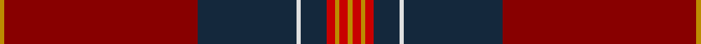

In pattern [YRBWBRYRY](/stripes/yrbwbryry/).

This was sourced from register-of-tartans.  It is a [9 stripe tartan](/stripes/stripes9/).

Original link https://www.tartanregister.gov.uk/tartanDetails.aspx?ref=105

## Attestations

This cloth appears in 2 source records; the oldest owns this page.

- 01/01/2005 — Arbroath Smokie (register-of-tartans, [record](https://www.tartanregister.gov.uk/tartanDetails.aspx?ref=105))
- pre 2005 — Arbroath Smokie (Corporate) (tartans-authority, [record](http://www.tartansauthority.com/tartan-ferret/display/6596/))

## Register references

External register numbers recorded for this tartan.

- Scottish Register of Tartans: [105](https://www.tartanregister.gov.uk/tartanDetails.aspx?ref=105)
- Scottish Tartans Authority (ITI): 6596

## Thread count
DY/2 DR90 DN46 LN2 DN12 R4 DY2 R4 DY/2

## Palette
Each colour and the base-6 reference it is a variant of.

| Colour | Shade | Base |
|---|---|---|
| DB | <code style="background-color:#202060;">#202060</code> `oklch(28.9% 0.111 276.9)` <small>#202060</small> | B <code style="background-color:#2A418A;">#2A418A</code> |
| DN | <code style="background-color:#14283C;">#14283C</code> `oklch(27.1% 0.046 249.9)` <small>#14283C</small> | B <code style="background-color:#2A418A;">#2A418A</code> |
| DR | <code style="background-color:#880000;">#880000</code> `oklch(39.4% 0.162 29.2)` <small>#880000</small> | R <code style="background-color:#CC0000;">#CC0000</code> |
| DY | <code style="background-color:#BC8C00;">#BC8C00</code> `oklch(66.8% 0.137 84.1)` <small>#BC8C00</small> | Y <code style="background-color:#F2BF00;">#F2BF00</code> |
| LN | <code style="background-color:#E0E0E0;">#E0E0E0</code> `oklch(90.7% 0.000 89.9)` <small>#E0E0E0</small> | W <code style="background-color:#F7F7F7;">#F7F7F7</code> |
| R | <code style="background-color:#C80000;">#C80000</code> `oklch(52.3% 0.215 29.2)` <small>#C80000</small> | R <code style="background-color:#CC0000;">#CC0000</code> |

## Nearest tartans

The nearest existing variants by ΔTartan distance.

1. [MacDonald of Glencoe #2](/setts/s13/r5ly1db2r2dg30r5db10t1r42dg2r4ly1dg4~x2/) — ΔT 1.07
1. [Slessor (Personal)](/setts/s8/dg2lo1dg11r50lo12db2lo4db2~x2/) — ΔT 1.18
1. [MacDonald of Glenaladale #2](/setts/s13/r6r1db2r2dg40r6db13t1r48dg2r4r1dg4~x2/) — ΔT 1.23
1. [Jack (Personal)](/setts/s6/g4r52k20dy9g2lo1~x2/) — ΔT 1.29
1. [Tyrone Irish County Tartan Tartan Number: 2264. Earliest known date: 1993 One of a series of Irish District tartans designed by Polly Wittering of the House of Edgar, with colours reminiscent of the Country with soft warm colours dominating. See products available Copyright © Blair Urquhart, Comrie, 2015](/setts/s12/dr50o6dy7dg2dy2ly2dy2o14dr8dy2dr9dg3~x2/) — ΔT 1.31
1. [MacDonald of Glencoe Artifact Tartan Tartan Number: 1012. Earliest known date: 17th century Cargill fragment now at Fort William museum. See products available Copyright © Blair Urquhart, Comrie, 2015](/setts/s13/m6r1db2m2g40m6db13t1m48g2m4r1g4~x2/) — ΔT 1.34
1. [MacEdward (MacGregor Hastie)](/setts/s10/r6lo1r24dg6db2k1db2k1db12r1~x2/) — ΔT 1.35
1. [Highland Prince (Fashion)](/setts/s7/r32r2g2db30r1db2ly1~x2/) — ΔT 1.40
1. [Firefighters' Memorial](/setts/s13/r4k4r65k8r6k35lo2k2g7k35r3k2r4/) — ΔT 1.40
1. [Moulin](/setts/s10/o36k3dy3r1dy3k3o4dy6k1r2~x4/) — ΔT 1.49

## Neighbour map

Every grey dot is one of 14299 variants placed by the first two principal components of the ΔTartan feature space (44% of its variance). Red is this tartan; blue dots are its nearest — click one to open its page.

<svg viewBox="0 0 640 380" role="img" style="max-width:100%;height:auto;border:1px solid #e0e0e0;border-radius:4px;display:block" xmlns="http://www.w3.org/2000/svg"><image href="/nn/cloud.v1.png" width="640" height="380"/><a href="/setts/s13/r5ly1db2r2dg30r5db10t1r42dg2r4ly1dg4~x2/"><circle cx="400.6" cy="93.3" r="4" fill="#3465a4"><title>MacDonald of Glencoe #2</title></circle></a><a href="/setts/s8/dg2lo1dg11r50lo12db2lo4db2~x2/"><circle cx="459.8" cy="116.0" r="4" fill="#3465a4"><title>Slessor (Personal)</title></circle></a><a href="/setts/s13/r6r1db2r2dg40r6db13t1r48dg2r4r1dg4~x2/"><circle cx="407.1" cy="93.8" r="4" fill="#3465a4"><title>MacDonald of Glenaladale #2</title></circle></a><a href="/setts/s6/g4r52k20dy9g2lo1~x2/"><circle cx="447.1" cy="136.1" r="4" fill="#3465a4"><title>Jack (Personal)</title></circle></a><a href="/setts/s12/dr50o6dy7dg2dy2ly2dy2o14dr8dy2dr9dg3~x2/"><circle cx="424.7" cy="114.2" r="4" fill="#3465a4"><title>Tyrone Irish County Tartan Tartan Number: 2264. Earliest known date: 1993 One of a series of Irish District tartans designed by Polly Wittering of the House of Edgar, with colours reminiscent of the Country with soft warm colours dominating. See products available Copyright © Blair Urquhart, Comrie, 2015</title></circle></a><a href="/setts/s13/m6r1db2m2g40m6db13t1m48g2m4r1g4~x2/"><circle cx="379.8" cy="77.6" r="4" fill="#3465a4"><title>MacDonald of Glencoe Artifact Tartan Tartan Number: 1012. Earliest known date: 17th century Cargill fragment now at Fort William museum. See products available Copyright © Blair Urquhart, Comrie, 2015</title></circle></a><a href="/setts/s10/r6lo1r24dg6db2k1db2k1db12r1~x2/"><circle cx="394.4" cy="141.6" r="4" fill="#3465a4"><title>MacEdward (MacGregor Hastie)</title></circle></a><a href="/setts/s7/r32r2g2db30r1db2ly1~x2/"><circle cx="387.2" cy="136.0" r="4" fill="#3465a4"><title>Highland Prince (Fashion)</title></circle></a><a href="/setts/s13/r4k4r65k8r6k35lo2k2g7k35r3k2r4/"><circle cx="368.0" cy="105.1" r="4" fill="#3465a4"><title>Firefighters' Memorial</title></circle></a><a href="/setts/s10/o36k3dy3r1dy3k3o4dy6k1r2~x4/"><circle cx="504.1" cy="128.6" r="4" fill="#3465a4"><title>Moulin</title></circle></a><circle cx="433.5" cy="100.2" r="5" fill="#c00000"/></svg>

ID: /setts/s9/lo1r45dt23w1dt6r2lo1r2lo1~x2/
