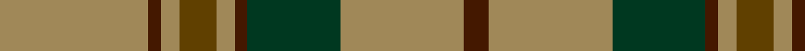

This page is one **sett** — a single exact thread-count. It belongs to the [tartan](/tartans/lt24dr2lt3t6lt3dr2dg15lt20dr4/)
(the same proportion at any scale), whose colour order is pattern [BYGBYGYBY](/stripes/bygbygyby/).

Sourced from register-of-tartans.  It is a [9 stripe tartan](/stripes/stripes9/).

Original link https://www.tartanregister.gov.uk/tartanDetails.aspx?ref=2041

## Also known as

This cloth is also recorded under:

- Land's End, Camel

2 attestations — the source records this cloth was collapsed from (oldest owns this page)

<ul>
<li>01/01/1992 — Land's End Camel (register-of-tartans, <a href="https://www.tartanregister.gov.uk/tartanDetails.aspx?ref=2041">record</a>)</li>
<li>pre 2002 — Land's End, Camel (Fashion) (tartans-authority, <a href="http://www.tartansauthority.com/tartan-ferret/display/2577/">record</a>)</li>
</ul>

## Register references

External register numbers recorded for this tartan.

- Scottish Register of Tartans: [2041](https://www.tartanregister.gov.uk/tartanDetails.aspx?ref=2041)
- Scottish Tartans Authority (ITI): 2577
- Scottish Tartans World Register: 2577

## Thread count
LT/48 DR4 LT6 T12 LT6 DR4 DG30 LT40 DR/8

## Palette
Each colour and the base-6 reference it is a variant of.

| Colour | Shade | Base |
|---|---|---|
| DG | <code style="background-color:#003820;">#003820</code> `oklch(30.0% 0.070 158.3)` <small>#003820</small> | G <code style="background-color:#006100;">#006100</code> |
| DR | <code style="background-color:#441800;">#441800</code> `oklch(27.3% 0.076 46.3)` <small>#441800</small> | B <code style="background-color:#2A418A;">#2A418A</code> |
| LT | <code style="background-color:#A08858;">#A08858</code> `oklch(63.7% 0.071 84.0)` <small>#A08858</small> | Y <code style="background-color:#F2BF00;">#F2BF00</code> |
| T | <code style="background-color:#604000;">#604000</code> `oklch(39.8% 0.083 76.8)` <small>#604000</small> | G <code style="background-color:#006100;">#006100</code> |

## Nearest tartans

The nearest existing variants by ΔTartan distance, with this tartan at the top so the swatches line up against it.

ΔTartan

Tartan

Sett

—

<a href="/ttd/edit/#slug=lo24do2lo3dy6lo3do2dg15lo20do4~x2">Land's End Camel</a> <a class="nn-out" href="/setts/s9/lo24do2lo3dy6lo3do2dg15lo20do4~x2/" title="open its dictionary page">↗</a>

1.18

<a href="/ttd/edit/#slug=n27lr3n14k3n13k3ly23~x2">Grange School</a> <a class="nn-out" href="/setts/s7/n27lr3n14k3n13k3ly23~x2/" title="open its dictionary page">↗</a>

1.29

<a href="/ttd/edit/#slug=ly2g12db6r3g12r4db1~x2">MacKintosh Hunting</a> <a class="nn-out" href="/setts/s7/ly2g12db6r3g12r4db1~x2/" title="open its dictionary page">↗</a>

1.31

<a href="/ttd/edit/#slug=k3y3ly2y30k2y3m12y6m6k3y3~x2">McAlifyfe (Personal)</a> <a class="nn-out" href="/setts/s11/k3y3ly2y30k2y3m12y6m6k3y3~x2/" title="open its dictionary page">↗</a>

1.33

<a href="/ttd/edit/#slug=dt4lo21dt1lo21y8db4y5db4y4dt4">Rice (Welsh Name)</a> <a class="nn-out" href="/setts/s10/dt4lo21dt1lo21y8db4y5db4y4dt4/" title="open its dictionary page">↗</a>

1.36

<a href="/ttd/edit/#slug=r3lg8r2lg18dp5lg3o3lg3o16lg3o3lg3~x2">Dublin Irish County Tartan Tartan Number: 2250. Earliest known date: 1996 One of a series of Irish District tartans designed by Polly Wittering of the House of Edgar, with colours reminiscent of the Country with soft warm colours dominating. See products available Copyright © Blair Urquhart, Comrie, 2015</a> <a class="nn-out" href="/setts/s12/r3lg8r2lg18dp5lg3o3lg3o16lg3o3lg3~x2/" title="open its dictionary page">↗</a>

1.39

<a href="/ttd/edit/#slug=dy48dp11g16ly16dy11r3dy11~x2">Shannon (?)</a> <a class="nn-out" href="/setts/s7/dy48dp11g16ly16dy11r3dy11~x2/" title="open its dictionary page">↗</a>

1.43

<a href="/ttd/edit/#slug=g14dy4db4dy27g3dy4ly5dy4g3dy27db4dy4g14ly5~x2">Invertere (Daks #2)</a> <a class="nn-out" href="/setts/s14/g14dy4db4dy27g3dy4ly5dy4g3dy27db4dy4g14ly5~x2/" title="open its dictionary page">↗</a>

1.43

<a href="/ttd/edit/#slug=lo15o1lo2lo2lo2o1lo3k8o10lo3~x4">Annan Trade Tartan Tartan Number: 1742. Earliest known date: 1988 This sett appears in Paton's collection which is housed at the Scottish Tartans Museum, Comrie in Perthshire, Scotland. The samples are undated but the collection is known to have been put together around the 1830's, with some additions during the Victorian period. See products available Copyright © Blair Urquhart, Comrie, 2015</a> <a class="nn-out" href="/setts/s10/lo15o1lo2lo2lo2o1lo3k8o10lo3~x4/" title="open its dictionary page">↗</a>

1.44

<a href="/ttd/edit/#slug=g3w1g12r6g3k3g2~x4">Arkansas</a> <a class="nn-out" href="/setts/s7/g3w1g12r6g3k3g2~x4/" title="open its dictionary page">↗</a>

1.46

<a href="/ttd/edit/#slug=g55dp7r24g12db4ly3db4~x2">Crieff and Strathearn District Tartan Tartan Number: 664. Earliest known date: 1988 A branch of the Stewart clan from Galloway and the South West of Scotland. See products available Copyright © Blair Urquhart, Comrie, 2015</a> <a class="nn-out" href="/setts/s7/g55dp7r24g12db4ly3db4~x2/" title="open its dictionary page">↗</a>

## Neighbour map

Every grey dot is one of 14299 variants placed by the first two principal components of the ΔTartan feature space (44% of its variance). Red is this tartan; blue dots are its nearest — click one to open its page.

<svg viewBox="0 0 640 380" role="img" style="max-width:100%;height:auto;border:1px solid #e0e0e0;border-radius:4px;display:block" xmlns="http://www.w3.org/2000/svg"><image href="/nn/cloud.v1.png" width="640" height="380"/><a href="/setts/s7/n27lr3n14k3n13k3ly23~x2/"><circle cx="334.3" cy="216.3" r="4" fill="#3465a4"><title>Grange School</title></circle></a><a href="/setts/s7/ly2g12db6r3g12r4db1~x2/"><circle cx="322.7" cy="216.9" r="4" fill="#3465a4"><title>MacKintosh Hunting</title></circle></a><a href="/setts/s11/k3y3ly2y30k2y3m12y6m6k3y3~x2/"><circle cx="352.6" cy="136.6" r="4" fill="#3465a4"><title>McAlifyfe (Personal)</title></circle></a><a href="/setts/s10/dt4lo21dt1lo21y8db4y5db4y4dt4/"><circle cx="323.8" cy="160.1" r="4" fill="#3465a4"><title>Rice (Welsh Name)</title></circle></a><a href="/setts/s12/r3lg8r2lg18dp5lg3o3lg3o16lg3o3lg3~x2/"><circle cx="300.1" cy="189.2" r="4" fill="#3465a4"><title>Dublin Irish County Tartan Tartan Number: 2250. Earliest known date: 1996 One of a series of Irish District tartans designed by Polly Wittering of the House of Edgar, with colours reminiscent of the Country with soft warm colours dominating. See products available Copyright © Blair Urquhart, Comrie, 2015</title></circle></a><a href="/setts/s7/dy48dp11g16ly16dy11r3dy11~x2/"><circle cx="331.2" cy="181.3" r="4" fill="#3465a4"><title>Shannon (?)</title></circle></a><a href="/setts/s14/g14dy4db4dy27g3dy4ly5dy4g3dy27db4dy4g14ly5~x2/"><circle cx="310.0" cy="180.7" r="4" fill="#3465a4"><title>Invertere (Daks #2)</title></circle></a><a href="/setts/s10/lo15o1lo2lo2lo2o1lo3k8o10lo3~x4/"><circle cx="311.1" cy="171.1" r="4" fill="#3465a4"><title>Annan Trade Tartan Tartan Number: 1742. Earliest known date: 1988 This sett appears in Paton's collection which is housed at the Scottish Tartans Museum, Comrie in Perthshire, Scotland. The samples are undated but the collection is known to have been put together around the 1830's, with some additions during the Victorian period. See products available Copyright © Blair Urquhart, Comrie, 2015</title></circle></a><a href="/setts/s7/g3w1g12r6g3k3g2~x4/"><circle cx="367.1" cy="208.6" r="4" fill="#3465a4"><title>Arkansas</title></circle></a><a href="/setts/s7/g55dp7r24g12db4ly3db4~x2/"><circle cx="365.9" cy="158.0" r="4" fill="#3465a4"><title>Crieff and Strathearn District Tartan Tartan Number: 664. Earliest known date: 1988 A branch of the Stewart clan from Galloway and the South West of Scotland. See products available Copyright © Blair Urquhart, Comrie, 2015</title></circle></a><circle cx="365.1" cy="189.1" r="5" fill="#c00000"/></svg>

ID: /setts/s9/lo24do2lo3dy6lo3do2dg15lo20do4~x2/
