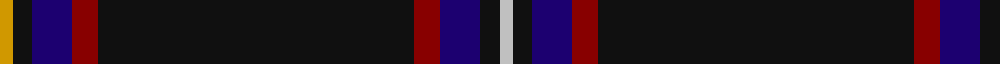

In pattern [WKBRKRBKY](/stripes/wkbrkrbky/).

This was sourced from register-of-tartans.  It is a [9 stripe tartan](/stripes/stripes9/).

Original link https://www.tartanregister.gov.uk/tartanDetails.aspx?ref=1713

## Attestations

This cloth appears in 3 source records; the oldest owns this page.

- 01/01/1996 — Highland Park (register-of-tartans, [record](https://www.tartanregister.gov.uk/tartanDetails.aspx?ref=1713))
- 1996 — Highland Park (Corporate) (tartans-authority, [record](http://www.tartansauthority.com/tartan-ferret/display/5190/))
- undated — Highland Park Corporate Tartan Tartan Number: 5190. Earliest known date: 1996 Designed by Lochcarron in May 1996 for Highland Park Distillery (The Orkney Whisky Company) using the main logo colors. Sample in STA's Johnston Collection. See products available Copyright © Blair Urquhart, Comrie, 2015 (house-of-tartan, [record](http://www.house-of-tartan.scotland.net/house/TartanViewjs.asp?colr=Def&tnam=5190))

## Register references

External register numbers recorded for this tartan.

- Scottish Register of Tartans: [1713](https://www.tartanregister.gov.uk/tartanDetails.aspx?ref=1713)
- Scottish Tartans Authority (ITI): 5190

## Thread count
DY/4 K6 DB12 DR8 K96 DR8 DB12 K6 N/4

## Palette
Each colour and its ΔE from the base-6 reference it is a variant of.

| Colour | Shade | Base | ΔE (OKLab) |
|---|---|---|---|
| DB | <code style="background-color:#1C0070;">#1C0070</code> `#1C0070` | B <code style="background-color:#2A418A;">#2A418A</code> | 0.14 |
| DR | <code style="background-color:#880000;">#880000</code> `#880000` | R <code style="background-color:#CC0000;">#CC0000</code> | 0.15 |
| DY | <code style="background-color:#D09800;">#D09800</code> `#D09800` | Y <code style="background-color:#F2BF00;">#F2BF00</code> | 0.12 |
| K | <code style="background-color:#101010;">#101010</code> `#101010` | K <code style="background-color:#000000;">#000000</code> | 0.17 |
| N | <code style="background-color:#C0C0C0;">#C0C0C0</code> `#C0C0C0` | W <code style="background-color:#F7F7F7;">#F7F7F7</code> | 0.17 |

## Nearest tartans

The nearest existing variants by ΔTartan distance.

1. [Caledonian Mist](/setts/s7/dt27k5dp2n1dp1w1dp5~x4/) — ΔT 0.92
1. [Longmount](/setts/s12/k48n4k6lb2k2r2k2n10o6k2o3r2~x2/) — ΔT 1.11
1. [Pride of Scotland Contemporary](/setts/s11/k9n2o2n2k18n2k2lp1n19k33dp2~x2/) — ΔT 1.18
1. [Martinez (2014)](/setts/s12/dt6k20r3k20ly1dt2ly1k25ly1r2ly1db6~x2/) — ΔT 1.28
1. [State Seal of Wisconsin (Fashion)](/setts/s11/k49db15k2lo6k33r4k3dy8lb3db5k3~x2/) — ΔT 1.28
1. [Initial City Link #2](/setts/s11/k50dg7k4w2k2ly2k2dg7k2dg3ly2~x2/) — ΔT 1.31
1. [Clan Inebriated](/setts/s9/k21dp2o1k1o1dp2k6db2o1~x4/) — ΔT 1.33
1. [Midnight Glen (Fashion)](/setts/s9/dp3k40lr3dp6k10dp10k3lr1o3~x2/) — ΔT 1.33
1. [American Heritage](/setts/s11/w5k2db14k4r8k4db4k80r6k4r4/) — ΔT 1.36
1. [Pride of Scotland Platinum](/setts/s11/k10n2o2n2k14n2k2lp1n12k24m2~x2/) — ΔT 1.37

## Neighbour map

Every grey dot is one of 14299 variants placed by the first two principal components of the ΔTartan feature space (44% of its variance). Red is this tartan; blue dots are its nearest — click one to open its page.

<svg viewBox="0 0 640 380" role="img" style="max-width:100%;height:auto;border:1px solid #e0e0e0;border-radius:4px;display:block" xmlns="http://www.w3.org/2000/svg"><image href="/nn/cloud.v1.png" width="640" height="380"/><a href="/setts/s7/dt27k5dp2n1dp1w1dp5~x4/"><circle cx="431.3" cy="139.8" r="4" fill="#3465a4"><title>Caledonian Mist</title></circle></a><a href="/setts/s12/k48n4k6lb2k2r2k2n10o6k2o3r2~x2/"><circle cx="431.1" cy="104.8" r="4" fill="#3465a4"><title>Longmount</title></circle></a><a href="/setts/s11/k9n2o2n2k18n2k2lp1n19k33dp2~x2/"><circle cx="455.7" cy="133.4" r="4" fill="#3465a4"><title>Pride of Scotland Contemporary</title></circle></a><a href="/setts/s12/dt6k20r3k20ly1dt2ly1k25ly1r2ly1db6~x2/"><circle cx="472.9" cy="143.9" r="4" fill="#3465a4"><title>Martinez (2014)</title></circle></a><a href="/setts/s11/k49db15k2lo6k33r4k3dy8lb3db5k3~x2/"><circle cx="414.6" cy="122.9" r="4" fill="#3465a4"><title>State Seal of Wisconsin (Fashion)</title></circle></a><a href="/setts/s11/k50dg7k4w2k2ly2k2dg7k2dg3ly2~x2/"><circle cx="478.3" cy="112.2" r="4" fill="#3465a4"><title>Initial City Link #2</title></circle></a><a href="/setts/s9/k21dp2o1k1o1dp2k6db2o1~x4/"><circle cx="530.4" cy="161.5" r="4" fill="#3465a4"><title>Clan Inebriated</title></circle></a><a href="/setts/s9/dp3k40lr3dp6k10dp10k3lr1o3~x2/"><circle cx="476.7" cy="139.2" r="4" fill="#3465a4"><title>Midnight Glen (Fashion)</title></circle></a><a href="/setts/s11/w5k2db14k4r8k4db4k80r6k4r4/"><circle cx="495.6" cy="107.7" r="4" fill="#3465a4"><title>American Heritage</title></circle></a><a href="/setts/s11/k10n2o2n2k14n2k2lp1n12k24m2~x2/"><circle cx="431.2" cy="147.6" r="4" fill="#3465a4"><title>Pride of Scotland Platinum</title></circle></a><circle cx="468.4" cy="132.6" r="5" fill="#c00000"/></svg>

ID: /setts/s9/lo2k3db6r4k48r4db6k3lb2~x2/
