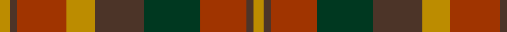

In pattern [YBRGBYRBY](/stripes/ybrgbyrby/).

This was sourced from tartans-authority.  It is a [9 stripe tartan](/stripes/stripes9/).

Original link http://www.tartansauthority.com/tartan-ferret/display/2267/

## Thread count
DY/6 T4 R28 DY16 T28 DG32 R26 T4 DY/6

## Palette
Each colour and the base-6 reference it is a variant of.

| Colour | Shade | Base |
|---|---|---|
| DG | <code style="background-color:#003820;">#003820</code> `oklch(30.0% 0.070 158.3)` <small>#003820</small> | G <code style="background-color:#006100;">#006100</code> |
| DY | <code style="background-color:#BC8C00;">#BC8C00</code> `oklch(66.8% 0.137 84.1)` <small>#BC8C00</small> | Y <code style="background-color:#F2BF00;">#F2BF00</code> |
| R | <code style="background-color:#A03400;">#A03400</code> `oklch(47.9% 0.152 39.6)` <small>#A03400</small> | R <code style="background-color:#CC0000;">#CC0000</code> |
| T | <code style="background-color:#4C3428;">#4C3428</code> `oklch(34.9% 0.040 47.5)` <small>#4C3428</small> | B <code style="background-color:#2A418A;">#2A418A</code> |

## Nearest tartans

The nearest existing variants by ΔTartan distance, with this tartan at the top so the swatches line up against it.

ΔTartan

Tartan

Sett

—

<a href="/ttd/edit/#slug=lo3do2o14lo8do14dg16o13do2lo3~x2">Monaghan, County (District)</a> <a class="nn-out" href="/setts/s9/lo3do2o14lo8do14dg16o13do2lo3~x2/" title="open its dictionary page">↗</a>

0.67

<a href="/ttd/edit/#slug=dy6m2dy2m4dy13dy12o13m4o2m2o6~x2">Glenmorangie #2</a> <a class="nn-out" href="/setts/s11/dy6m2dy2m4dy13dy12o13m4o2m2o6~x2/" title="open its dictionary page">↗</a>

0.95

<a href="/ttd/edit/#slug=lo3dy2o14dg17dy14lo8o14dy2lo3~x2">Monaghan Irish County Tartan Tartan Number: 2267. Earliest known date: 1996 One of a series of Irish District tartans designed by Polly Wittering of the House of Edgar, with colours reminiscent of the Country with soft warm colours dominating. See products available Copyright © Blair Urquhart, Comrie, 2015</a> <a class="nn-out" href="/setts/s9/lo3dy2o14dg17dy14lo8o14dy2lo3~x2/" title="open its dictionary page">↗</a>

0.98

<a href="/ttd/edit/#slug=lo3dr2o14g17dr14lo8o14dr2lo3~x2">Monaghan</a> <a class="nn-out" href="/setts/s9/lo3dr2o14g17dr14lo8o14dr2lo3~x2/" title="open its dictionary page">↗</a>

1.21

<a href="/setts/s16/lo3do2o14lo8do14dg16o13do2lo3~x2/">Monaghan, County</a>

1.23

<a href="/ttd/edit/#slug=r3dy16g10r3g3lb2g3r3~x2">Scott Htg (Clan)</a> <a class="nn-out" href="/setts/s8/r3dy16g10r3g3lb2g3r3~x2/" title="open its dictionary page">↗</a>

1.25

<a href="/setts/s10/dy1r7dy4g7dy1g1~x4/">Dewar</a>

1.28

<a href="/ttd/edit/#slug=dg2ly1dg6r4r6k1r2~x4">Unidentified Printing #3</a> <a class="nn-out" href="/setts/s7/dg2ly1dg6r4r6k1r2~x4/" title="open its dictionary page">↗</a>

1.31

<a href="/ttd/edit/#slug=dg25db4r24db21dy25db4dg3~x2">Orban-Prentice (Personal)</a> <a class="nn-out" href="/setts/s7/dg25db4r24db21dy25db4dg3~x2/" title="open its dictionary page">↗</a>

1.34

<a href="/ttd/edit/#slug=r10do10r4dg2r2do2r4dg12dp12dg3dp4~x2">Hueg (Munich) Hunting (Personal)</a> <a class="nn-out" href="/setts/s11/r10do10r4dg2r2do2r4dg12dp12dg3dp4~x2/" title="open its dictionary page">↗</a>

1.37

<a href="/setts/s12/dg25db4r24db21dy25db4dg3~x2/">Orban-Prentice (Personal)</a>

## Neighbour map

Every grey dot is one of 14299 variants placed by the first two principal components of the ΔTartan feature space (44% of its variance). Red is this tartan; blue dots are its nearest — click one to open its page.

<svg viewBox="0 0 640 380" role="img" style="max-width:100%;height:auto;border:1px solid #e0e0e0;border-radius:4px;display:block" xmlns="http://www.w3.org/2000/svg"><image href="/nn/cloud.v1.png" width="640" height="380"/><a href="/setts/s11/dy6m2dy2m4dy13dy12o13m4o2m2o6~x2/"><circle cx="181.9" cy="225.1" r="4" fill="#3465a4"><title>Glenmorangie #2</title></circle></a><a href="/setts/s9/lo3dy2o14dg17dy14lo8o14dy2lo3~x2/"><circle cx="187.0" cy="221.3" r="4" fill="#3465a4"><title>Monaghan Irish County Tartan Tartan Number: 2267. Earliest known date: 1996 One of a series of Irish District tartans designed by Polly Wittering of the House of Edgar, with colours reminiscent of the Country with soft warm colours dominating. See products available Copyright © Blair Urquhart, Comrie, 2015</title></circle></a><a href="/setts/s9/lo3dr2o14g17dr14lo8o14dr2lo3~x2/"><circle cx="185.6" cy="220.6" r="4" fill="#3465a4"><title>Monaghan</title></circle></a><a href="/setts/s16/lo3do2o14lo8do14dg16o13do2lo3~x2/"><circle cx="198.8" cy="216.4" r="4" fill="#3465a4"><title>Monaghan, County</title></circle></a><a href="/setts/s8/r3dy16g10r3g3lb2g3r3~x2/"><circle cx="247.9" cy="226.7" r="4" fill="#3465a4"><title>Scott Htg (Clan)</title></circle></a><a href="/setts/s10/dy1r7dy4g7dy1g1~x4/"><circle cx="252.8" cy="254.3" r="4" fill="#3465a4"><title>Dewar</title></circle></a><a href="/setts/s7/dg2ly1dg6r4r6k1r2~x4/"><circle cx="180.4" cy="235.2" r="4" fill="#3465a4"><title>Unidentified Printing #3</title></circle></a><a href="/setts/s7/dg25db4r24db21dy25db4dg3~x2/"><circle cx="170.4" cy="244.0" r="4" fill="#3465a4"><title>Orban-Prentice (Personal)</title></circle></a><a href="/setts/s11/r10do10r4dg2r2do2r4dg12dp12dg3dp4~x2/"><circle cx="175.1" cy="238.9" r="4" fill="#3465a4"><title>Hueg (Munich) Hunting (Personal)</title></circle></a><a href="/setts/s12/dg25db4r24db21dy25db4dg3~x2/"><circle cx="174.3" cy="220.2" r="4" fill="#3465a4"><title>Orban-Prentice (Personal)</title></circle></a><circle cx="201.9" cy="231.3" r="5" fill="#c00000"/></svg>

ID: /setts/s9/lo3do2o14lo8do14dg16o13do2lo3~x2/
