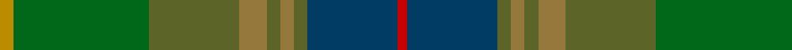

**Bands:** [RBGRGRGGY](/stripes/rbgrgrggy/) · **Stripes:** [R DT Y O Y O Y G LO](/stripes/stripes9/) R DT Y O Y O Y G LO

This was sourced from register-of-tartans.  It is a [9 band tartan](/bands/bands9/).

Original link https://www.tartanregister.gov.uk/tartanDetails.aspx?ref=1436

## Register references

External register numbers recorded for this tartan.

- Scottish Register of Tartans: [1436](https://www.tartanregister.gov.uk/tartanDetails.aspx?ref=1436)
- Scottish Tartans Authority (ITI): 7263

## Thread count
DY/6 G60 Ga40 LT12 Ga6 LT6 Ga6 DB40 R/4

## Palette
Each colour and its ΔE from the base-6 reference it is a variant of.

| Colour | Shade | Base | ΔE (OKLab) |
|---|---|---|---|
| DB | <code style="background-color:#003C64;">#003C64</code> `#003C64` | B <code style="background-color:#2A418A;">#2A418A</code> | 0.08 |
| DY | <code style="background-color:#BC8C00;">#BC8C00</code> `#BC8C00` | Y <code style="background-color:#F2BF00;">#F2BF00</code> | 0.16 |
| G | <code style="background-color:#006818;">#006818</code> `#006818` | G <code style="background-color:#006100;">#006100</code> | 0.02 |
| Ga | <code style="background-color:#5C6428;">#5C6428</code> `#5C6428` | G <code style="background-color:#006100;">#006100</code> | 0.10 |
| Gb | <code style="background-color:#408060;">#408060</code> `#408060` | G <code style="background-color:#006100;">#006100</code> | 0.14 |
| LT | <code style="background-color:#94783C;">#94783C</code> `#94783C` | R <code style="background-color:#CC0000;">#CC0000</code> | 0.19 |
| R | <code style="background-color:#C80000;">#C80000</code> `#C80000` | R <code style="background-color:#CC0000;">#CC0000</code> | 0.01 |

## Nearest tartans

The nearest existing variants by ΔTartan distance.

1. [Glens of Corbie (Corporate)](/setts/s9/k3g30y20o6y3o3y3dt20r2~x2/) — ΔT 0.91
1. [Lunting Papi (Personal)](/setts/s7/o5r8dp13dg21dg34dg55o3/) — ΔT 1.52
1. [State Seal of Minnesota (Fashion)](/setts/s8/r4g46r10db10dy33db5dy4lo3~x2/) — ΔT 1.55
1. [Ramsay (Green Fashion)](/setts/s7/g1r7g7n2r1dg15lb1~x4/) — ΔT 1.60
1. [Hash House Harriers Hunting (Corp)](/setts/s13/g7dy1lb1dy1lo1dy7n7dy1n7dy7g7dy1r1~x4/) — ΔT 1.71
1. [Little-Dowse Wedding](/setts/s8/dy31y6o3db31dy8y60y7b7~x2/) — ΔT 1.72
1. [Little-Dowse Wedding](/setts/s8/do31lo6lr3db36do8dg60lo7t7~x2/) — ΔT 1.81
1. [Tomass](/setts/s8/r2dy1dg9y1dy2y6g2y1~x4/) — ΔT 1.86
1. [Linden Family Tartan Tartan Number: 5772. Earliest known date: Jan 2003 Blue and white from the saltire. Purple and green from the thistle. The name Linden is associated with the colour green. The Linden tree is a lime tree. See products available Copyright © Blair Urquhart, Comrie, 2015](/setts/s8/dt4k9dg20dp2dg20k5dt6lr2~x2/) — ΔT 1.89
1. [de Meuron (Family)](/setts/s12/y9g13dg26dy6dp5dy40dp5dy6dg26g13y9dg3~x2/) — ΔT 1.89

## Neighbour map

Every grey dot is one of 14299 variants placed by the first two principal components of the ΔTartan feature space (44% of its variance). Red is this tartan; blue dots are its nearest — click one to open its page.

<svg viewBox="0 0 640 380" role="img" style="max-width:100%;height:auto;border:1px solid #e0e0e0;border-radius:4px;display:block" xmlns="http://www.w3.org/2000/svg"><image href="/nn/cloud.v1.png" width="640" height="380"/><a href="/setts/s9/k3g30y20o6y3o3y3dt20r2~x2/"><circle cx="214.4" cy="178.5" r="4" fill="#3465a4"><title>Glens of Corbie (Corporate)</title></circle></a><a href="/setts/s7/o5r8dp13dg21dg34dg55o3/"><circle cx="283.4" cy="218.0" r="4" fill="#3465a4"><title>Lunting Papi (Personal)</title></circle></a><a href="/setts/s8/r4g46r10db10dy33db5dy4lo3~x2/"><circle cx="289.3" cy="195.0" r="4" fill="#3465a4"><title>State Seal of Minnesota (Fashion)</title></circle></a><a href="/setts/s7/g1r7g7n2r1dg15lb1~x4/"><circle cx="314.2" cy="212.2" r="4" fill="#3465a4"><title>Ramsay (Green Fashion)</title></circle></a><a href="/setts/s13/g7dy1lb1dy1lo1dy7n7dy1n7dy7g7dy1r1~x4/"><circle cx="217.8" cy="214.0" r="4" fill="#3465a4"><title>Hash House Harriers Hunting (Corp)</title></circle></a><a href="/setts/s8/dy31y6o3db31dy8y60y7b7~x2/"><circle cx="285.7" cy="185.5" r="4" fill="#3465a4"><title>Little-Dowse Wedding</title></circle></a><a href="/setts/s8/do31lo6lr3db36do8dg60lo7t7~x2/"><circle cx="254.0" cy="176.9" r="4" fill="#3465a4"><title>Little-Dowse Wedding</title></circle></a><a href="/setts/s8/r2dy1dg9y1dy2y6g2y1~x4/"><circle cx="234.2" cy="220.5" r="4" fill="#3465a4"><title>Tomass</title></circle></a><a href="/setts/s8/dt4k9dg20dp2dg20k5dt6lr2~x2/"><circle cx="200.2" cy="233.6" r="4" fill="#3465a4"><title>Linden Family Tartan Tartan Number: 5772. Earliest known date: Jan 2003 Blue and white from the saltire. Purple and green from the thistle. The name Linden is associated with the colour green. The Linden tree is a lime tree. See products available Copyright © Blair Urquhart, Comrie, 2015</title></circle></a><a href="/setts/s12/y9g13dg26dy6dp5dy40dp5dy6dg26g13y9dg3~x2/"><circle cx="276.2" cy="232.2" r="4" fill="#3465a4"><title>de Meuron (Family)</title></circle></a><circle cx="238.1" cy="190.0" r="5" fill="#c00000"/></svg>

ID: /setts/s9/lo3g30y20o6y3o3y3dt20r2~x2/
