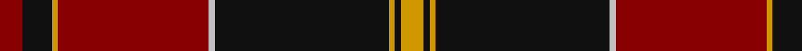

**Bands:** [RKYRWKYKY](/stripes/rkyrwkyky/) · **Stripes:** [R K LO R LB K LO K LO](/stripes/stripes9/) R K LO R LB K LO K LO

This was sourced from tartans-authority.  It is a [9 band tartan](/bands/bands9/).

Original link http://www.tartansauthority.com/tartan-ferret/display/3300/

## Attestations

This cloth appears in 2 source records; the oldest owns this page.

- pre 1999 — MacAlister of Skye (Clan?) (tartans-authority, [record](http://www.tartansauthority.com/tartan-ferret/display/3300/))
- undated — MacAlister of Skye (register-of-tartans, [record](https://www.tartanregister.gov.uk/tartanDetails.aspx?ref=5209))

## Register references

External register numbers recorded for this tartan.

- Scottish Register of Tartans: [5209](https://www.tartanregister.gov.uk/tartanDetails.aspx?ref=5209)
- Scottish Tartans Authority (ITI): 3300

## Thread count
DR/8 K10 DY2 DR52 N2 K60 DY2 K2 DY/8

## Palette
Each colour and its ΔE from the base-6 reference it is a variant of.

| Colour | Shade | Base | ΔE (OKLab) |
|---|---|---|---|
| DR | <code style="background-color:#880000;">#880000</code> `#880000` | R <code style="background-color:#CC0000;">#CC0000</code> | 0.15 |
| DY | <code style="background-color:#D09800;">#D09800</code> `#D09800` | Y <code style="background-color:#F2BF00;">#F2BF00</code> | 0.12 |
| K | <code style="background-color:#101010;">#101010</code> `#101010` | K <code style="background-color:#000000;">#000000</code> | 0.17 |
| N | <code style="background-color:#C0C0C0;">#C0C0C0</code> `#C0C0C0` | W <code style="background-color:#F7F7F7;">#F7F7F7</code> | 0.17 |

## Nearest tartans

The nearest existing variants by ΔTartan distance.

1. [Wcwm 1684](/setts/s10/r48k10dt12k2r3k2dt12k10r2ly3~x2/) — ΔT 0.78
1. [Maciver of Strathendry Castle Dress (Personal)](/setts/s9/ly1k3r24k3r3k24r3k3w1~x2/) — ΔT 0.88
1. [Hickory](/setts/s10/db4dy30k2dy2k14ly2k2ly1k6ly3~x2/) — ΔT 0.91
1. [Mens Bigi](/setts/s8/lo4k17r1k4r2k4r33w3~x2/) — ΔT 1.01
1. [MacDonell of Keppoch](/setts/s10/dg2r2db1r24b1db6r3dg12r4db1~x2/) — ΔT 1.27
1. [Harbor Club (Corporate)](/setts/s10/r47g14k5ly2k3g7k3ly2k5g14~x2/) — ΔT 1.27
1. [Chisholm VS](/setts/s10/r6lr1r24db6dg2k1dg2k1dg12r1~x2/) — ΔT 1.28
1. [MacPherson of Cluny](/setts/s11/r5k2r2g42r5k36r70k2ly2r7g2/) — ΔT 1.30
1. [Glendronach Distillery](/setts/s10/dg22o2lb1lo3o1dg6o22lo3o1dg10~x4/) — ΔT 1.30
1. [MacGillivray](/setts/s13/r4b1db1r32b2r2db12r2dg16r4b1r4db2~x2/) — ΔT 1.32

## Neighbour map

Every grey dot is one of 14313 variants placed by the first two principal components of the ΔTartan feature space (44% of its variance). Red is this tartan; blue dots are its nearest — click one to open its page.

<svg viewBox="0 0 640 380" role="img" style="max-width:100%;height:auto;border:1px solid #e0e0e0;border-radius:4px;display:block" xmlns="http://www.w3.org/2000/svg"><image href="/nn/cloud.v1.png" width="640" height="380"/><a href="/setts/s10/r48k10dt12k2r3k2dt12k10r2ly3~x2/"><circle cx="334.3" cy="130.4" r="4" fill="#3465a4"><title>Wcwm 1684</title></circle></a><a href="/setts/s9/ly1k3r24k3r3k24r3k3w1~x2/"><circle cx="386.4" cy="147.2" r="4" fill="#3465a4"><title>Maciver of Strathendry Castle Dress (Personal)</title></circle></a><a href="/setts/s10/db4dy30k2dy2k14ly2k2ly1k6ly3~x2/"><circle cx="340.8" cy="124.0" r="4" fill="#3465a4"><title>Hickory</title></circle></a><a href="/setts/s8/lo4k17r1k4r2k4r33w3~x2/"><circle cx="365.1" cy="122.7" r="4" fill="#3465a4"><title>Mens Bigi</title></circle></a><a href="/setts/s10/dg2r2db1r24b1db6r3dg12r4db1~x2/"><circle cx="398.5" cy="136.2" r="4" fill="#3465a4"><title>MacDonell of Keppoch</title></circle></a><a href="/setts/s10/r47g14k5ly2k3g7k3ly2k5g14~x2/"><circle cx="324.8" cy="138.9" r="4" fill="#3465a4"><title>Harbor Club (Corporate)</title></circle></a><a href="/setts/s10/r6lr1r24db6dg2k1dg2k1dg12r1~x2/"><circle cx="350.3" cy="115.8" r="4" fill="#3465a4"><title>Chisholm VS</title></circle></a><a href="/setts/s11/r5k2r2g42r5k36r70k2ly2r7g2/"><circle cx="346.0" cy="94.1" r="4" fill="#3465a4"><title>MacPherson of Cluny</title></circle></a><a href="/setts/s10/dg22o2lb1lo3o1dg6o22lo3o1dg10~x4/"><circle cx="360.9" cy="154.8" r="4" fill="#3465a4"><title>Glendronach Distillery</title></circle></a><a href="/setts/s13/r4b1db1r32b2r2db12r2dg16r4b1r4db2~x2/"><circle cx="391.2" cy="105.8" r="4" fill="#3465a4"><title>MacGillivray</title></circle></a><circle cx="365.2" cy="127.3" r="5" fill="#c00000"/></svg>

ID: /setts/s9/lo4k1lo1k30lb1r26lo1k5r4~x2/
