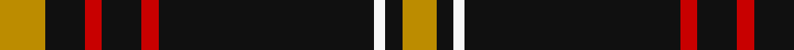

In pattern [YKRKRKWKY](/stripes/ykrkrkwky/).

This was sourced from register-of-tartans.  It is a [9 stripe tartan](/stripes/stripes9/).

Original link https://www.tartanregister.gov.uk/tartanDetails.aspx?ref=439

## Attestations

This cloth appears in 2 source records; the oldest owns this page.

- 01/07/2005 — Bunnahabhain (register-of-tartans, [record](https://www.tartanregister.gov.uk/tartanDetails.aspx?ref=439))
- 2005 July — Bunnahabhain (Corporate) (tartans-authority, [record](http://www.tartansauthority.com/tartan-ferret/display/6685/))

## Register references

External register numbers recorded for this tartan.

- Scottish Register of Tartans: [439](https://www.tartanregister.gov.uk/tartanDetails.aspx?ref=439)
- Scottish Tartans Authority (ITI): 6685

## Thread count
DY/16 K14 R6 K14 R6 K76 W4 K6 DY/12

## Palette
Each colour and its ΔE from the base-6 reference it is a variant of.

| Colour | Shade | Base | ΔE (OKLab) |
|---|---|---|---|
| DY | <code style="background-color:#BC8C00;">#BC8C00</code> `#BC8C00` | Y <code style="background-color:#F2BF00;">#F2BF00</code> | 0.16 |
| K | <code style="background-color:#101010;">#101010</code> `#101010` | K <code style="background-color:#000000;">#000000</code> | 0.17 |
| R | <code style="background-color:#C80000;">#C80000</code> `#C80000` | R <code style="background-color:#CC0000;">#CC0000</code> | 0.01 |
| W | <code style="background-color:#F8F8F8;">#F8F8F8</code> `#F8F8F8` | W <code style="background-color:#F7F7F7;">#F7F7F7</code> | 0.00 |

## Nearest tartans

The nearest existing variants by ΔTartan distance.

1. [Valdres, Kvam & Vang #3](/setts/s10/k4w1r4k2g2r3g2k20r2k2~x2/) — ΔT 0.88
1. [State University of New York College at Buffalo](/setts/s8/k70r5k3lb4dp4lb4k3r12/) — ΔT 1.02
1. [King Robert the Bruce Memorial (Com](/setts/s10/r8k79o4k4lb4k6o22k6r16k6/) — ΔT 1.08
1. [King Robert the Bruce Memorial, The](/setts/s10/r8k79n4k4w4k6n22k6r16k6/) — ΔT 1.27
1. [White Stripes Hunting](/setts/s7/r2k1r2k14w1k1w1~x8/) — ΔT 1.29
1. [Highland Brewing Company](/setts/s8/k42t2r3k5r16k8ly2k3~x2/) — ΔT 1.29
1. [Ashers of Nairn](/setts/s10/ly2k3w3k44ly4k22lb22w3k3ly2/) — ΔT 1.34
1. [Reiver Check](/setts/s10/k27w2k2w2k2w2k2w2k4r5~x4/) — ΔT 1.34
1. [Pride of Scotland Royal fashion Tartan Tartan Number: 5586. Earliest known date: See products available Copyright © Blair Urquhart, Comrie, 2015](/setts/s11/k7lr2w2lr2k13lr2k2b1lr13k26b2~x2/) — ΔT 1.34
1. [Anzac (Fashion)](/setts/s8/k21lb2k4lb4do2lb4k13g2~x4/) — ΔT 1.38

## Neighbour map

Every grey dot is one of 14299 variants placed by the first two principal components of the ΔTartan feature space (44% of its variance). Red is this tartan; blue dots are its nearest — click one to open its page.

<svg viewBox="0 0 640 380" role="img" style="max-width:100%;height:auto;border:1px solid #e0e0e0;border-radius:4px;display:block" xmlns="http://www.w3.org/2000/svg"><image href="/nn/cloud.v1.png" width="640" height="380"/><a href="/setts/s10/k4w1r4k2g2r3g2k20r2k2~x2/"><circle cx="415.2" cy="142.0" r="4" fill="#3465a4"><title>Valdres, Kvam &amp; Vang #3</title></circle></a><a href="/setts/s8/k70r5k3lb4dp4lb4k3r12/"><circle cx="464.0" cy="120.3" r="4" fill="#3465a4"><title>State University of New York College at Buffalo</title></circle></a><a href="/setts/s10/r8k79o4k4lb4k6o22k6r16k6/"><circle cx="400.2" cy="129.8" r="4" fill="#3465a4"><title>King Robert the Bruce Memorial (Com</title></circle></a><a href="/setts/s10/r8k79n4k4w4k6n22k6r16k6/"><circle cx="411.5" cy="137.0" r="4" fill="#3465a4"><title>King Robert the Bruce Memorial, The</title></circle></a><a href="/setts/s7/r2k1r2k14w1k1w1~x8/"><circle cx="456.3" cy="167.2" r="4" fill="#3465a4"><title>White Stripes Hunting</title></circle></a><a href="/setts/s8/k42t2r3k5r16k8ly2k3~x2/"><circle cx="481.5" cy="161.7" r="4" fill="#3465a4"><title>Highland Brewing Company</title></circle></a><a href="/setts/s10/ly2k3w3k44ly4k22lb22w3k3ly2/"><circle cx="372.4" cy="121.6" r="4" fill="#3465a4"><title>Ashers of Nairn</title></circle></a><a href="/setts/s10/k27w2k2w2k2w2k2w2k4r5~x4/"><circle cx="453.0" cy="150.7" r="4" fill="#3465a4"><title>Reiver Check</title></circle></a><a href="/setts/s11/k7lr2w2lr2k13lr2k2b1lr13k26b2~x2/"><circle cx="389.5" cy="125.7" r="4" fill="#3465a4"><title>Pride of Scotland Royal fashion Tartan Tartan Number: 5586. Earliest known date: See products available Copyright © Blair Urquhart, Comrie, 2015</title></circle></a><a href="/setts/s8/k21lb2k4lb4do2lb4k13g2~x4/"><circle cx="402.9" cy="188.6" r="4" fill="#3465a4"><title>Anzac (Fashion)</title></circle></a><circle cx="430.4" cy="144.4" r="5" fill="#c00000"/></svg>

ID: /setts/s9/lo8k7r3k7r3k38w2k3lo6~x2/
