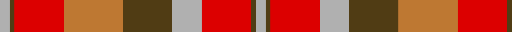

**Bands:** [YGRRGYRGY](/stripes/ygrrgyrgy/) · **Stripes:** [LR DY R O DY LR R DY LR](/stripes/stripes9/) LR DY R O DY LR R DY LR

This was sourced from register-of-tartans.  It is a [9 band tartan](/bands/bands9/).

Original link https://www.tartanregister.gov.uk/tartanDetails.aspx?ref=4382

## Register references

External register numbers recorded for this tartan.

- Scottish Register of Tartans: [4382](https://www.tartanregister.gov.uk/tartanDetails.aspx?ref=4382)
- Scottish Tartans World Register: 1876

## Thread count
N/4 T2 R20 DO24 T20 N12 R20 T2 N/4

## Palette
Each colour and its ΔE from the base-6 reference it is a variant of.

| Colour | Shade | Base | ΔE (OKLab) |
|---|---|---|---|
| DO | <code style="background-color:#BE7832;">#BE7832</code> `#BE7832` | R <code style="background-color:#CC0000;">#CC0000</code> | 0.17 |
| N | <code style="background-color:#B0B0B0;">#B0B0B0</code> `#B0B0B0` | Y <code style="background-color:#F2BF00;">#F2BF00</code> | 0.18 |
| R | <code style="background-color:#DC0000;">#DC0000</code> `#DC0000` | R <code style="background-color:#CC0000;">#CC0000</code> | 0.03 |
| T | <code style="background-color:#503C14;">#503C14</code> `#503C14` | G <code style="background-color:#006100;">#006100</code> | 0.14 |

## Nearest tartans

The nearest existing variants by ΔTartan distance.

1. [St Andrews](/setts/s8/o11db1o11w10db1r11db1r11~x2/) — ΔT 1.16
1. [Manhattan Ethnic](/setts/s7/lo36do15lo9r31lo5do4r16~x2/) — ΔT 1.23
1. [Plaid Wine](/setts/s6/r24n5o9n2o9lb9~x4/) — ΔT 1.27
1. [Loch Rannoch #2](/setts/s8/dy24g2dy5o14g2o5lo17dy2~x2/) — ΔT 1.45
1. [Manhattan Ethnic](/setts/s7/o72dr30o18lr62y10dr7lr32/) — ΔT 1.53
1. [Powys (District)](/setts/s12/dg24r7dg7r7dg7r22r7r4b4r4r40b14/) — ΔT 1.55
1. [Fiddes](/setts/s8/g12r11p12r3r32p8g8p8~x2/) — ΔT 1.56
1. [St. Andrews (Queens University) (Cor](/setts/s8/dy11db1dy11w10db1r11db1r11~x2/) — ΔT 1.59
1. [Australia Dress](/setts/s9/lr11r4y2k4y2r4y12r20t2~x2/) — ΔT 1.62
1. [Bridge of Weir Leather Co. (Corp)](/setts/s12/r3ly14y3ly3y3ly4y11dt11r11r11ly1dt1~x2/) — ΔT 1.63

## Neighbour map

Every grey dot is one of 14313 variants placed by the first two principal components of the ΔTartan feature space (44% of its variance). Red is this tartan; blue dots are its nearest — click one to open its page.

<svg viewBox="0 0 640 380" role="img" style="max-width:100%;height:auto;border:1px solid #e0e0e0;border-radius:4px;display:block" xmlns="http://www.w3.org/2000/svg"><image href="/nn/cloud.v1.png" width="640" height="380"/><a href="/setts/s8/o11db1o11w10db1r11db1r11~x2/"><circle cx="218.0" cy="198.1" r="4" fill="#3465a4"><title>St Andrews</title></circle></a><a href="/setts/s7/lo36do15lo9r31lo5do4r16~x2/"><circle cx="245.4" cy="220.1" r="4" fill="#3465a4"><title>Manhattan Ethnic</title></circle></a><a href="/setts/s6/r24n5o9n2o9lb9~x4/"><circle cx="234.5" cy="206.5" r="4" fill="#3465a4"><title>Plaid Wine</title></circle></a><a href="/setts/s8/dy24g2dy5o14g2o5lo17dy2~x2/"><circle cx="269.2" cy="188.2" r="4" fill="#3465a4"><title>Loch Rannoch #2</title></circle></a><a href="/setts/s7/o72dr30o18lr62y10dr7lr32/"><circle cx="227.4" cy="203.9" r="4" fill="#3465a4"><title>Manhattan Ethnic</title></circle></a><a href="/setts/s12/dg24r7dg7r7dg7r22r7r4b4r4r40b14/"><circle cx="235.2" cy="171.1" r="4" fill="#3465a4"><title>Powys (District)</title></circle></a><a href="/setts/s8/g12r11p12r3r32p8g8p8~x2/"><circle cx="265.2" cy="205.4" r="4" fill="#3465a4"><title>Fiddes</title></circle></a><a href="/setts/s8/dy11db1dy11w10db1r11db1r11~x2/"><circle cx="200.8" cy="190.2" r="4" fill="#3465a4"><title>St. Andrews (Queens University) (Cor</title></circle></a><a href="/setts/s9/lr11r4y2k4y2r4y12r20t2~x2/"><circle cx="233.0" cy="167.0" r="4" fill="#3465a4"><title>Australia Dress</title></circle></a><a href="/setts/s12/r3ly14y3ly3y3ly4y11dt11r11r11ly1dt1~x2/"><circle cx="136.2" cy="156.6" r="4" fill="#3465a4"><title>Bridge of Weir Leather Co. (Corp)</title></circle></a><circle cx="215.3" cy="191.1" r="5" fill="#c00000"/></svg>

ID: /setts/s9/lr2dy1r10o12dy10lr6r10dy1lr2~x2/
