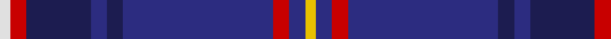

**Bands:** [WRBBBBRBY](/stripes/wrbbbbrby/) · **Stripes:** [W R DB DB DB DB R DB LY](/stripes/stripes9/) W R DB DB DB DB R DB LY

This was sourced from register-of-tartans.  It is a [9 band tartan](/bands/bands9/).

Original link https://www.tartanregister.gov.uk/tartanDetails.aspx?ref=3609

## Attestations

This cloth appears in 2 source records; the oldest owns this page.

- 01/06/2005 — Royal Scottish Corporation (register-of-tartans, [record](https://www.tartanregister.gov.uk/tartanDetails.aspx?ref=3609))
- 2005, June — Royal Scottish Corporation (Corp) (tartans-authority, [record](http://www.tartansauthority.com/tartan-ferret/display/6907/))

## Register references

External register numbers recorded for this tartan.

- Scottish Register of Tartans: [3609](https://www.tartanregister.gov.uk/tartanDetails.aspx?ref=3609)
- Scottish Tartans Authority (ITI): 6907

## Thread count
LN/4 R6 DBb24 DB6 DBb6 DB56 R6 DB6 Y/4

## Palette
Each colour and its ΔE from the base-6 reference it is a variant of.

| Colour | Shade | Base | ΔE (OKLab) |
|---|---|---|---|
| DB | <code style="background-color:#2C2C80;">#2C2C80</code> `#2C2C80` | B <code style="background-color:#2A418A;">#2A418A</code> | 0.06 |
| DBa | <code style="background-color:#003C64;">#003C64</code> `#003C64` | B <code style="background-color:#2A418A;">#2A418A</code> | 0.08 |
| DBb | <code style="background-color:#1C1C50;">#1C1C50</code> `#1C1C50` | B <code style="background-color:#2A418A;">#2A418A</code> | 0.14 |
| LN | <code style="background-color:#E0E0E0;">#E0E0E0</code> `#E0E0E0` | W <code style="background-color:#F7F7F7;">#F7F7F7</code> | 0.07 |
| R | <code style="background-color:#C80000;">#C80000</code> `#C80000` | R <code style="background-color:#CC0000;">#CC0000</code> | 0.01 |
| Y | <code style="background-color:#E8C000;">#E8C000</code> `#E8C000` | Y <code style="background-color:#F2BF00;">#F2BF00</code> | 0.02 |

## Nearest tartans

The nearest existing variants by ΔTartan distance.

1. [St. Andrews University (Corporate)](/setts/s10/db6ly3k2ly5db30g2k4g2db6db4~x2/) — ΔT 1.07
1. [Cheadle (Personal)](/setts/s6/dp10ly3dp8db42g5o5~x2/) — ΔT 1.11
1. [Wcwm 9275-1395](/setts/s7/db6dp3db56k24g6r6g6/) — ΔT 1.19
1. [Glasgow, University of](/setts/s8/db2w2k2lo2k7g4db22k2~x2/) — ΔT 1.20
1. [Pagus Wasia District Tartan Tartan Number: 10962. Earliest known date: 2012 Pagus (shire) Wasia (wetland) is a rural district in Belgium. The tartan was created by the founding members of the new Pagus Wasia Pipes & Drums, based on the colours of the District Coat of Arms. The district is associated with the Belgian surname, Waas. Registration was authorised by Marc Van de Vijver, Mayor of the city of Beveren. See products available Copyright © Blair Urquhart, Comrie, 2015](/setts/s9/ly1db2ly1db3n19dt3n1db2r1~x4/) — ΔT 1.20
1. [St. Leonards (Corporate)](/setts/s8/r16db2o6r3k4t2db40t6~x2/) — ΔT 1.23
1. [MacBeth (Fashion)](/setts/s8/db42k6lo2k3lo2g10r7k2~x2/) — ΔT 1.25
1. [St. Leonards](/setts/s14/db40t2k4r3o6db2r16db2o6r3k4t2db40t6~x2/) — ΔT 1.28
1. [Wcwm 1475-2](/setts/s9/r2db34k2lb2k2n30db3n6r2~x2/) — ΔT 1.31
1. [Burt #2 (Name)](/setts/s9/db8w2k8g12r2db3r2db24r2~x2/) — ΔT 1.32

## Neighbour map

Every grey dot is one of 14313 variants placed by the first two principal components of the ΔTartan feature space (44% of its variance). Red is this tartan; blue dots are its nearest — click one to open its page.

<svg viewBox="0 0 640 380" role="img" style="max-width:100%;height:auto;border:1px solid #e0e0e0;border-radius:4px;display:block" xmlns="http://www.w3.org/2000/svg"><image href="/nn/cloud.v1.png" width="640" height="380"/><a href="/setts/s10/db6ly3k2ly5db30g2k4g2db6db4~x2/"><circle cx="301.0" cy="139.8" r="4" fill="#3465a4"><title>St. Andrews University (Corporate)</title></circle></a><a href="/setts/s6/dp10ly3dp8db42g5o5~x2/"><circle cx="356.7" cy="185.9" r="4" fill="#3465a4"><title>Cheadle (Personal)</title></circle></a><a href="/setts/s7/db6dp3db56k24g6r6g6/"><circle cx="358.4" cy="170.9" r="4" fill="#3465a4"><title>Wcwm 9275-1395</title></circle></a><a href="/setts/s8/db2w2k2lo2k7g4db22k2~x2/"><circle cx="303.1" cy="166.3" r="4" fill="#3465a4"><title>Glasgow, University of</title></circle></a><a href="/setts/s9/ly1db2ly1db3n19dt3n1db2r1~x4/"><circle cx="398.1" cy="145.7" r="4" fill="#3465a4"><title>Pagus Wasia District Tartan Tartan Number: 10962. Earliest known date: 2012 Pagus (shire) Wasia (wetland) is a rural district in Belgium. The tartan was created by the founding members of the new Pagus Wasia Pipes &amp; Drums, based on the colours of the District Coat of Arms. The district is associated with the Belgian surname, Waas. Registration was authorised by Marc Van de Vijver, Mayor of the city of Beveren. See products available Copyright © Blair Urquhart, Comrie, 2015</title></circle></a><a href="/setts/s8/r16db2o6r3k4t2db40t6~x2/"><circle cx="319.0" cy="136.5" r="4" fill="#3465a4"><title>St. Leonards (Corporate)</title></circle></a><a href="/setts/s8/db42k6lo2k3lo2g10r7k2~x2/"><circle cx="343.2" cy="139.7" r="4" fill="#3465a4"><title>MacBeth (Fashion)</title></circle></a><a href="/setts/s14/db40t2k4r3o6db2r16db2o6r3k4t2db40t6~x2/"><circle cx="370.9" cy="117.5" r="4" fill="#3465a4"><title>St. Leonards</title></circle></a><a href="/setts/s9/r2db34k2lb2k2n30db3n6r2~x2/"><circle cx="317.9" cy="151.1" r="4" fill="#3465a4"><title>Wcwm 1475-2</title></circle></a><a href="/setts/s9/db8w2k8g12r2db3r2db24r2~x2/"><circle cx="288.0" cy="171.7" r="4" fill="#3465a4"><title>Burt #2 (Name)</title></circle></a><circle cx="341.7" cy="156.1" r="5" fill="#c00000"/></svg>

ID: /setts/s9/ly2db3r3db28db3db3db12r3w2~x2/
