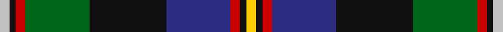

This page is one **sett** — a single exact thread-count. It belongs to the [tartan](/tartans/ly3k2r3db20k24g20r3k2lb3/)
(the same proportion at any scale), whose colour order is pattern [WKRGKBRKY](/stripes/wkrgkbrky/).

Sourced from tartans-authority.  It is a [9 stripe tartan](/stripes/stripes9/).

Original link http://www.tartansauthority.com/tartan-ferret/display/10586/

## Thread count
N/6 K4 R6 G40 K48 DB40 R6 K4 Y/6

## Palette

Palette: <strong>Tartan Register</strong>
<table><thead><tr><th>Colour</th><th>Threads</th><th>Shade</th><th>Base</th><th>OKLCh</th></tr></thead><tbody><tr><td>N/</td><td style="text-align:right;font-variant-numeric:tabular-nums">6</td><td><code style="background-color:#C0C0C0;">#C0C0C0</code> <small style="color:#888">#C0C0C0</small></td><td>W <code style="background-color:#F7F7F7;">#F7F7F7</code></td><td><small style="color:#888">oklch(80.8% 0.000 89.9)</small></td></tr><tr><td>K</td><td style="text-align:right;font-variant-numeric:tabular-nums">4</td><td><code style="background-color:#101010;">#101010</code> <small style="color:#888">#101010</small></td><td>K <code style="background-color:#000000;">#000000</code></td><td><small style="color:#888">oklch(17.3% 0.000 89.9)</small></td></tr><tr><td>R</td><td style="text-align:right;font-variant-numeric:tabular-nums">6</td><td><code style="background-color:#C80000;">#C80000</code> <small style="color:#888">#C80000</small></td><td>R <code style="background-color:#CC0000;">#CC0000</code></td><td><small style="color:#888">oklch(52.3% 0.215 29.2)</small></td></tr><tr><td>G</td><td style="text-align:right;font-variant-numeric:tabular-nums">40</td><td><code style="background-color:#006818;">#006818</code> <small style="color:#888">#006818</small></td><td>G <code style="background-color:#006100;">#006100</code></td><td><small style="color:#888">oklch(45.0% 0.142 145.0)</small></td></tr><tr><td>K</td><td style="text-align:right;font-variant-numeric:tabular-nums">48</td><td><code style="background-color:#101010;">#101010</code> <small style="color:#888">#101010</small></td><td>K <code style="background-color:#000000;">#000000</code></td><td><small style="color:#888">oklch(17.3% 0.000 89.9)</small></td></tr><tr><td>DB</td><td style="text-align:right;font-variant-numeric:tabular-nums">40</td><td><code style="background-color:#2C2C80;">#2C2C80</code> <small style="color:#888">#2C2C80</small></td><td>B <code style="background-color:#2A418A;">#2A418A</code></td><td><small style="color:#888">oklch(35.0% 0.138 276.6)</small></td></tr><tr><td>R</td><td style="text-align:right;font-variant-numeric:tabular-nums">6</td><td><code style="background-color:#C80000;">#C80000</code> <small style="color:#888">#C80000</small></td><td>R <code style="background-color:#CC0000;">#CC0000</code></td><td><small style="color:#888">oklch(52.3% 0.215 29.2)</small></td></tr><tr><td>K</td><td style="text-align:right;font-variant-numeric:tabular-nums">4</td><td><code style="background-color:#101010;">#101010</code> <small style="color:#888">#101010</small></td><td>K <code style="background-color:#000000;">#000000</code></td><td><small style="color:#888">oklch(17.3% 0.000 89.9)</small></td></tr><tr><td>Y/</td><td style="text-align:right;font-variant-numeric:tabular-nums">6</td><td><code style="background-color:#FCCC00;">#FCCC00</code> <small style="color:#888">#FCCC00</small></td><td>Y <code style="background-color:#F2BF00;">#F2BF00</code></td><td><small style="color:#888">oklch(86.2% 0.176 91.5)</small></td></tr></tbody></table>

## Nearest tartans

The nearest existing variants by ΔTartan distance, with this tartan at the top so the swatches line up against it.

ΔTartan

Tartan

Sett

—

<a href="/ttd/edit/#slug=ly3k2r3db20k24g20r3k2lb3~x2">Loch Awe</a> <a class="nn-out" href="/setts/s9/ly3k2r3db20k24g20r3k2lb3~x2/" title="open its dictionary page">↗</a>

0.68

<a href="/ttd/edit/#slug=m4k7m2db25k19w2g13k2ly3~x2">Leung (Personal)</a> <a class="nn-out" href="/setts/s9/m4k7m2db25k19w2g13k2ly3~x2/" title="open its dictionary page">↗</a>

0.73

<a href="/ttd/edit/#slug=r3dt3k2dt18ly2k25g20r2g3lb3~x2">Loch Freuchie (District)</a> <a class="nn-out" href="/setts/s10/r3dt3k2dt18ly2k25g20r2g3lb3~x2/" title="open its dictionary page">↗</a>

0.73

<a href="/ttd/edit/#slug=r3k2g18k18db3k3db3k3db18ly2w3~x2">Tindal</a> <a class="nn-out" href="/setts/s11/r3k2g18k18db3k3db3k3db18ly2w3~x2/" title="open its dictionary page">↗</a>

0.82

<a href="/ttd/edit/#slug=w10k52db52dg24ly10dg5r5">Harvey of Cornwall (Personal)</a> <a class="nn-out" href="/setts/s7/w10k52db52dg24ly10dg5r5/" title="open its dictionary page">↗</a>

0.82

<a href="/ttd/edit/#slug=r2k8ly1k8g13db13lo1r2~x2">Sey (Name)</a> <a class="nn-out" href="/setts/s8/r2k8ly1k8g13db13lo1r2~x2/" title="open its dictionary page">↗</a>

0.83

<a href="/ttd/edit/#slug=k3r3g21r8r3r4k3db26w3~x2">Dunedin</a> <a class="nn-out" href="/setts/s9/k3r3g21r8r3r4k3db26w3~x2/" title="open its dictionary page">↗</a>

0.87

<a href="/ttd/edit/#slug=w1db12k9g1k1g5lb1g3lo1~x4">St. Andrews Golf Club (Corporate)</a> <a class="nn-out" href="/setts/s9/w1db12k9g1k1g5lb1g3lo1~x4/" title="open its dictionary page">↗</a>

0.87

<a href="/ttd/edit/#slug=r2k6ly1dg12ly1db6lr2~x4">James (Personal)</a> <a class="nn-out" href="/setts/s7/r2k6ly1dg12ly1db6lr2~x4/" title="open its dictionary page">↗</a>

0.90

<a href="/ttd/edit/#slug=w3db22k2r7k2dg10k2r7k22ly3~x2">Tantallon #2</a> <a class="nn-out" href="/setts/s10/w3db22k2r7k2dg10k2r7k22ly3~x2/" title="open its dictionary page">↗</a>

0.90

<a href="/ttd/edit/#slug=k5lr5ly2lr5k5dt25k5lr3dg5r2dg5lr3k5~x2">Liberton</a> <a class="nn-out" href="/setts/s13/k5lr5ly2lr5k5dt25k5lr3dg5r2dg5lr3k5~x2/" title="open its dictionary page">↗</a>

## Neighbour map

Every grey dot is one of 14299 variants placed by the first two principal components of the ΔTartan feature space (44% of its variance). Red is this tartan; blue dots are its nearest — click one to open its page.

<svg viewBox="0 0 640 380" role="img" style="max-width:100%;height:auto;border:1px solid #e0e0e0;border-radius:4px;display:block" xmlns="http://www.w3.org/2000/svg"><image href="/nn/cloud.v1.png" width="640" height="380"/><a href="/setts/s9/m4k7m2db25k19w2g13k2ly3~x2/"><circle cx="152.4" cy="147.8" r="4" fill="#3465a4"><title>Leung (Personal)</title></circle></a><a href="/setts/s10/r3dt3k2dt18ly2k25g20r2g3lb3~x2/"><circle cx="155.9" cy="143.2" r="4" fill="#3465a4"><title>Loch Freuchie (District)</title></circle></a><a href="/setts/s11/r3k2g18k18db3k3db3k3db18ly2w3~x2/"><circle cx="141.0" cy="153.9" r="4" fill="#3465a4"><title>Tindal</title></circle></a><a href="/setts/s7/w10k52db52dg24ly10dg5r5/"><circle cx="123.6" cy="167.4" r="4" fill="#3465a4"><title>Harvey of Cornwall (Personal)</title></circle></a><a href="/setts/s8/r2k8ly1k8g13db13lo1r2~x2/"><circle cx="148.0" cy="169.1" r="4" fill="#3465a4"><title>Sey (Name)</title></circle></a><a href="/setts/s9/k3r3g21r8r3r4k3db26w3~x2/"><circle cx="128.7" cy="146.9" r="4" fill="#3465a4"><title>Dunedin</title></circle></a><a href="/setts/s9/w1db12k9g1k1g5lb1g3lo1~x4/"><circle cx="164.5" cy="149.8" r="4" fill="#3465a4"><title>St. Andrews Golf Club (Corporate)</title></circle></a><a href="/setts/s7/r2k6ly1dg12ly1db6lr2~x4/"><circle cx="163.5" cy="169.8" r="4" fill="#3465a4"><title>James (Personal)</title></circle></a><a href="/setts/s10/w3db22k2r7k2dg10k2r7k22ly3~x2/"><circle cx="125.4" cy="140.4" r="4" fill="#3465a4"><title>Tantallon #2</title></circle></a><a href="/setts/s13/k5lr5ly2lr5k5dt25k5lr3dg5r2dg5lr3k5~x2/"><circle cx="131.5" cy="130.7" r="4" fill="#3465a4"><title>Liberton</title></circle></a><circle cx="145.2" cy="144.4" r="5" fill="#c00000"/></svg>

ID: /setts/s9/ly3k2r3db20k24g20r3k2lb3~x2/
