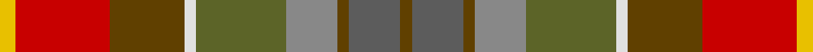

**Bands:** [YRGWGRGBG](/stripes/yrgwgrgbg/) · **Stripes:** [LY R DY W Y O DY N DY](/stripes/stripes9/) LY R DY W Y O DY N DY

This was sourced from house-of-tartan.  It is a [9 band tartan](/bands/bands9/).

Original link http://www.house-of-tartan.scotland.net/house/TartanViewjs.asp?colr=Def&tnam=832

## Thread count
Y/8 R48 T38 LN6 G46 Na26 T6 N26 T/6

## Palette
Each colour and its ΔE from the base-6 reference it is a variant of.

| Colour | Shade | Base | ΔE (OKLab) |
|---|---|---|---|
| G | <code style="background-color:#5C6428;">#5C6428</code> `#5C6428` | G <code style="background-color:#006100;">#006100</code> | 0.10 |
| LN | <code style="background-color:#E0E0E0;">#E0E0E0</code> `#E0E0E0` | W <code style="background-color:#F7F7F7;">#F7F7F7</code> | 0.07 |
| N | <code style="background-color:#5C5C5C;">#5C5C5C</code> `#5C5C5C` | B <code style="background-color:#2A418A;">#2A418A</code> | 0.15 |
| Na | <code style="background-color:#888888;">#888888</code> `#888888` | R <code style="background-color:#CC0000;">#CC0000</code> | 0.24 |
| R | <code style="background-color:#C80000;">#C80000</code> `#C80000` | R <code style="background-color:#CC0000;">#CC0000</code> | 0.01 |
| T | <code style="background-color:#604000;">#604000</code> `#604000` | G <code style="background-color:#006100;">#006100</code> | 0.14 |
| Y | <code style="background-color:#E8C000;">#E8C000</code> `#E8C000` | Y <code style="background-color:#F2BF00;">#F2BF00</code> | 0.02 |

## Nearest tartans

The nearest existing variants by ΔTartan distance.

1. [Teallach](/setts/s9/ly4r24dy19w3y23y13dy3n13dy3~x2/) — ΔT 0.08
1. [Auld Scotland Weavers Tartan Tartan Number: 7303. Earliest known date: September 2007 A new design from Lochcarron for the 2008 season. See products available Copyright © Blair Urquhart, Comrie, 2015](/setts/s10/k2lo12dr3lo3dr12y12n12y12y1ly2~x2/) — ΔT 1.09
1. [Auld Scotland](/setts/s10/dr2lo12dr3lo3dr12y12n12y12y1ly2~x2/) — ΔT 1.33
1. [Teallach (Personal)](/setts/s9/lo4o24dy19w3y23n13dy3o13dy3~x2/) — ΔT 1.42
1. [Bracken (WCWM)](/setts/s11/dy30k6dy6r6lo6o14k4o3n14k6n16~x2/) — ΔT 1.58
1. [Blaylock Hunting](/setts/s12/g4lr2g8do8o2do8o16k2do5lr2o5ly2~x2/) — ΔT 1.80
1. [Bruce of Kinnaird (Vivienne Westwood Design)](/setts/s10/dy22y22dr2lb6dr2lo2dr16g5dy8lb2~x2/) — ΔT 1.84
1. [Meath](/setts/s12/o5db2r14dr9g8t3r3t3r3t3g19w3~x2/) — ΔT 1.86
1. [Christmas Hill Game Farm (Corporate)](/setts/s7/dy5lo20r3dg13dy13db3g3~x2/) — ΔT 1.94
1. [YPO Dress](/setts/s8/k3y16k2dp12dg12k2o16lb3~x2/) — ΔT 1.95

## Neighbour map

Every grey dot is one of 14299 variants placed by the first two principal components of the ΔTartan feature space (44% of its variance). Red is this tartan; blue dots are its nearest — click one to open its page.

<svg viewBox="0 0 640 380" role="img" style="max-width:100%;height:auto;border:1px solid #e0e0e0;border-radius:4px;display:block" xmlns="http://www.w3.org/2000/svg"><image href="/nn/cloud.v1.png" width="640" height="380"/><a href="/setts/s9/ly4r24dy19w3y23y13dy3n13dy3~x2/"><circle cx="93.6" cy="181.9" r="4" fill="#3465a4"><title>Teallach</title></circle></a><a href="/setts/s10/k2lo12dr3lo3dr12y12n12y12y1ly2~x2/"><circle cx="79.5" cy="164.1" r="4" fill="#3465a4"><title>Auld Scotland Weavers Tartan Tartan Number: 7303. Earliest known date: September 2007 A new design from Lochcarron for the 2008 season. See products available Copyright © Blair Urquhart, Comrie, 2015</title></circle></a><a href="/setts/s10/dr2lo12dr3lo3dr12y12n12y12y1ly2~x2/"><circle cx="129.5" cy="189.1" r="4" fill="#3465a4"><title>Auld Scotland</title></circle></a><a href="/setts/s9/lo4o24dy19w3y23n13dy3o13dy3~x2/"><circle cx="126.2" cy="203.0" r="4" fill="#3465a4"><title>Teallach (Personal)</title></circle></a><a href="/setts/s11/dy30k6dy6r6lo6o14k4o3n14k6n16~x2/"><circle cx="149.6" cy="177.6" r="4" fill="#3465a4"><title>Bracken (WCWM)</title></circle></a><a href="/setts/s12/g4lr2g8do8o2do8o16k2do5lr2o5ly2~x2/"><circle cx="174.3" cy="185.9" r="4" fill="#3465a4"><title>Blaylock Hunting</title></circle></a><a href="/setts/s10/dy22y22dr2lb6dr2lo2dr16g5dy8lb2~x2/"><circle cx="170.3" cy="160.0" r="4" fill="#3465a4"><title>Bruce of Kinnaird (Vivienne Westwood Design)</title></circle></a><a href="/setts/s12/o5db2r14dr9g8t3r3t3r3t3g19w3~x2/"><circle cx="130.9" cy="141.4" r="4" fill="#3465a4"><title>Meath</title></circle></a><a href="/setts/s7/dy5lo20r3dg13dy13db3g3~x2/"><circle cx="149.1" cy="215.5" r="4" fill="#3465a4"><title>Christmas Hill Game Farm (Corporate)</title></circle></a><a href="/setts/s8/k3y16k2dp12dg12k2o16lb3~x2/"><circle cx="91.6" cy="194.7" r="4" fill="#3465a4"><title>YPO Dress</title></circle></a><circle cx="93.6" cy="181.1" r="5" fill="#c00000"/></svg>

ID: /setts/s9/ly4r24dy19w3y23o13dy3n13dy3~x2/
