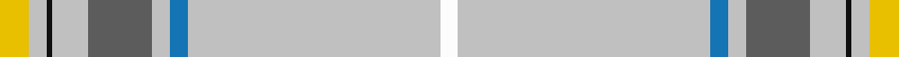

In pattern [WWBWBWKWY](/stripes/wwbwbwkwy/).

This was sourced from register-of-tartans.  It is a [9 stripe tartan](/stripes/stripes9/).

Original link https://www.tartanregister.gov.uk/tartanDetails.aspx?ref=3596

## Also known as

This cloth is also recorded under:

- Royal College of Midwives

## Attestations

This cloth appears in 2 source records; the oldest owns this page.

- 01/08/2002 — Royal College of Midwives (register-of-tartans, [record](https://www.tartanregister.gov.uk/tartanDetails.aspx?ref=3596))
- August 2002 — Midwives (Corporate) (tartans-authority, [record](http://www.tartansauthority.com/tartan-ferret/display/5766/))

## Register references

External register numbers recorded for this tartan.

- Scottish Register of Tartans: [3596](https://www.tartanregister.gov.uk/tartanDetails.aspx?ref=3596)
- Scottish Tartans Authority (ITI): 5766

## Thread count
Y/10 Na6 K2 Na12 N22 Na6 B6 Na86 W/6

## Palette
Each colour and the base-6 reference it is a variant of.

| Colour | Shade | Base |
|---|---|---|
| B | <code style="background-color:#1474B4;">#1474B4</code> `oklch(54.0% 0.129 245.1)` <small>#1474B4</small> | B <code style="background-color:#2A418A;">#2A418A</code> |
| K | <code style="background-color:#101010;">#101010</code> `oklch(17.3% 0.000 89.9)` <small>#101010</small> | K <code style="background-color:#000000;">#000000</code> |
| N | <code style="background-color:#5C5C5C;">#5C5C5C</code> `oklch(47.5% 0.000 89.9)` <small>#5C5C5C</small> | B <code style="background-color:#2A418A;">#2A418A</code> |
| Na | <code style="background-color:#C0C0C0;">#C0C0C0</code> `oklch(80.8% 0.000 89.9)` <small>#C0C0C0</small> | W <code style="background-color:#F7F7F7;">#F7F7F7</code> |
| W | <code style="background-color:#FCFCFC;">#FCFCFC</code> `oklch(99.1% 0.000 89.9)` <small>#FCFCFC</small> | W <code style="background-color:#F7F7F7;">#F7F7F7</code> |
| Y | <code style="background-color:#E8C000;">#E8C000</code> `oklch(81.9% 0.168 93.7)` <small>#E8C000</small> | Y <code style="background-color:#F2BF00;">#F2BF00</code> |

## Nearest tartans

The nearest existing variants by ΔTartan distance.

1. [Kuehle Hunting (Personal)](/setts/s11/lo30db6m1w2m6w2m1db6lo30lb1r3~x2/) — ΔT 1.62
1. [Druid (Corporate)](/setts/s15/dp3o2dp3ly2w4g8ly2w4ly2r8ly2w20ly2w62ly2/) — ΔT 1.68
1. [Quigley of Knockcroghery (Hunting) (Personal)](/setts/s11/t27w2t15ly1t1ly1t15k2w2ly16r1~x2/) — ΔT 1.71
1. [Bourbon, Sebastien (Personal)](/setts/s11/w2k2o4w4o5w4o3w50w2r2w2~x2/) — ΔT 1.78
1. [Boucherville Formal District Tartan Tartan Number: 2118. Earliest known date: 1990 Three designers from La Navette d'Art ENR, Jeanette Blanchette, Pauline Bastien and Jacqueline Provost, based their design on symbolic colours. Le bleu azur represente la loyaute, le gris argent la serenite, le jaune (l'or) la generosite, le vert represente l'esperance, et le blanc symbole de purete et d'innocence "nous rappelle notre appartenance au Quebec." "Les tisserands, c'est nous tous...!" See products available Copyright © Blair Urquhart, Comrie, 2015](/setts/s9/w40ly4o10w8db4o4db4o4g1~x2/) — ΔT 1.79
1. [Miss Emma Halford-MacLeod](/setts/s10/w102dt3ly3dt3w3dt12n14g12w3o3~x2/) — ΔT 1.80
1. [Confederate Memorial (Military)](/setts/s10/t12ly4r4ly4ly2ly56r18w1db4w3~x2/) — ΔT 1.81
1. [Boucherville (Tartan de..), dress](/setts/s9/w40ly4y10w8b4y4b4y4g1~x2/) — ΔT 1.87
1. [MacDonald from Rawtenstall (Personal)](/setts/s8/lb7w2m7w4lb50w2k2r2~x2/) — ΔT 1.91
1. [Kuehle (Personal)](/setts/s7/lp6w2lp1db6o30w1r3~x2/) — ΔT 1.98

## Neighbour map

Every grey dot is one of 14299 variants placed by the first two principal components of the ΔTartan feature space (44% of its variance). Red is this tartan; blue dots are its nearest — click one to open its page.

<svg viewBox="0 0 640 380" role="img" style="max-width:100%;height:auto;border:1px solid #e0e0e0;border-radius:4px;display:block" xmlns="http://www.w3.org/2000/svg"><image href="/nn/cloud.v1.png" width="640" height="380"/><a href="/setts/s11/lo30db6m1w2m6w2m1db6lo30lb1r3~x2/"><circle cx="412.8" cy="88.8" r="4" fill="#3465a4"><title>Kuehle Hunting (Personal)</title></circle></a><a href="/setts/s15/dp3o2dp3ly2w4g8ly2w4ly2r8ly2w20ly2w62ly2/"><circle cx="429.6" cy="34.4" r="4" fill="#3465a4"><title>Druid (Corporate)</title></circle></a><a href="/setts/s11/t27w2t15ly1t1ly1t15k2w2ly16r1~x2/"><circle cx="423.2" cy="111.5" r="4" fill="#3465a4"><title>Quigley of Knockcroghery (Hunting) (Personal)</title></circle></a><a href="/setts/s11/w2k2o4w4o5w4o3w50w2r2w2~x2/"><circle cx="445.8" cy="81.1" r="4" fill="#3465a4"><title>Bourbon, Sebastien (Personal)</title></circle></a><a href="/setts/s9/w40ly4o10w8db4o4db4o4g1~x2/"><circle cx="364.6" cy="81.6" r="4" fill="#3465a4"><title>Boucherville Formal District Tartan Tartan Number: 2118. Earliest known date: 1990 Three designers from La Navette d'Art ENR, Jeanette Blanchette, Pauline Bastien and Jacqueline Provost, based their design on symbolic colours. Le bleu azur represente la loyaute, le gris argent la serenite, le jaune (l'or) la generosite, le vert represente l'esperance, et le blanc symbole de purete et d'innocence &quot;nous rappelle notre appartenance au Quebec.&quot; &quot;Les tisserands, c'est nous tous...!&quot; See products available Copyright © Blair Urquhart, Comrie, 2015</title></circle></a><a href="/setts/s10/w102dt3ly3dt3w3dt12n14g12w3o3~x2/"><circle cx="393.5" cy="37.9" r="4" fill="#3465a4"><title>Miss Emma Halford-MacLeod</title></circle></a><a href="/setts/s10/t12ly4r4ly4ly2ly56r18w1db4w3~x2/"><circle cx="375.7" cy="54.8" r="4" fill="#3465a4"><title>Confederate Memorial (Military)</title></circle></a><a href="/setts/s9/w40ly4y10w8b4y4b4y4g1~x2/"><circle cx="364.2" cy="81.6" r="4" fill="#3465a4"><title>Boucherville (Tartan de..), dress</title></circle></a><a href="/setts/s8/lb7w2m7w4lb50w2k2r2~x2/"><circle cx="470.9" cy="99.0" r="4" fill="#3465a4"><title>MacDonald from Rawtenstall (Personal)</title></circle></a><a href="/setts/s7/lp6w2lp1db6o30w1r3~x2/"><circle cx="377.8" cy="105.4" r="4" fill="#3465a4"><title>Kuehle (Personal)</title></circle></a><circle cx="453.7" cy="76.3" r="5" fill="#c00000"/></svg>

ID: /setts/s9/ly5lb3k1lb6n11lb3b3lb43w3~x2/
