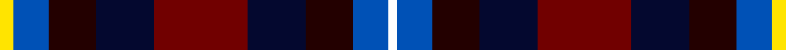

In pattern [WBKKRKKBY](/stripes/wbkkrkkby/).

This was sourced from register-of-tartans.  It is a [9 stripe tartan](/stripes/stripes9/).

Original link https://www.tartanregister.gov.uk/tartanDetails.aspx?ref=10510

## Register references

External register numbers recorded for this tartan.

- Scottish Register of Tartans: [10510](https://www.tartanregister.gov.uk/tartanDetails.aspx?ref=10510)

## Thread count
Y/6 B15 K20 DB25 DR40 DB25 K20 B15 W/4

## Palette
Each colour and the base-6 reference it is a variant of.

| Colour | Shade | Base |
|---|---|---|
| B | <code style="background-color:#0051B6;">#0051B6</code> `oklch(45.9% 0.174 258.5)` <small>#0051B6</small> | B <code style="background-color:#2A418A;">#2A418A</code> |
| DB | <code style="background-color:#04082F;">#04082F</code> `oklch(16.6% 0.077 269.1)` <small>#04082F</small> | K <code style="background-color:#000000;">#000000</code> |
| DR | <code style="background-color:#710000;">#710000</code> `oklch(34.5% 0.141 29.2)` <small>#710000</small> | R <code style="background-color:#CC0000;">#CC0000</code> |
| K | <code style="background-color:#230000;">#230000</code> `oklch(16.1% 0.066 29.2)` <small>#230000</small> | K <code style="background-color:#000000;">#000000</code> |
| W | <code style="background-color:#FFFFFF;">#FFFFFF</code> `oklch(100.0% 0.000 89.9)` <small>#FFFFFF</small> | W <code style="background-color:#F7F7F7;">#F7F7F7</code> |
| Y | <code style="background-color:#FFE400;">#FFE400</code> `oklch(91.3% 0.190 100.6)` <small>#FFE400</small> | Y <code style="background-color:#F2BF00;">#F2BF00</code> |

## Nearest tartans

The nearest existing variants by ΔTartan distance.

1. [Celtic Women International](/setts/s9/r3db16m2db2m12k8g12k12w3~x2/) — ΔT 1.15
1. [Unidentified Scarlett #7](/setts/s10/dp22r3k22g22ly2g22k22r3dp22w3~x2/) — ΔT 1.19
1. [Cumming LO](/setts/s9/r4lr1r4dg10y1k10b4k2b4~x2/) — ΔT 1.28
1. [Eichelberger Family, Jörg (Personal)](/setts/s7/k10r3lo4dt12dg4r4w2~x4/) — ΔT 1.30
1. [Logan Rogers](/setts/s10/db2r2db2w1db8k8dg8r2dg2ly2~x2/) — ΔT 1.32
1. [Highland Titles (Corporate)](/setts/s16/r40dt25k20db15ly6db15k20dt25r40dt25k20db15w4db15k20dt25/) — ΔT 1.35
1. [Kinloch Anderson Old Dress](/setts/s12/r4y14lb2do4lb2k6y3k6db13r2db4r4~x2/) — ΔT 1.41
1. [MacLaren #2](/setts/s7/dp9k7dg5r4dg7k1ly1~x2/) — ΔT 1.43
1. [South Australia #2](/setts/s11/r6db24r3db12r7db12k3dg8ly3dg8k3/) — ΔT 1.45
1. [McCrann, Julian David (Personal)](/setts/s13/db8r2db2r4db8y2k10y10k4y2ly2y4w1~x2/) — ΔT 1.46

## Neighbour map

Every grey dot is one of 14299 variants placed by the first two principal components of the ΔTartan feature space (44% of its variance). Red is this tartan; blue dots are its nearest — click one to open its page.

<svg viewBox="0 0 640 380" role="img" style="max-width:100%;height:auto;border:1px solid #e0e0e0;border-radius:4px;display:block" xmlns="http://www.w3.org/2000/svg"><image href="/nn/cloud.v1.png" width="640" height="380"/><a href="/setts/s9/r3db16m2db2m12k8g12k12w3~x2/"><circle cx="66.2" cy="180.4" r="4" fill="#3465a4"><title>Celtic Women International</title></circle></a><a href="/setts/s10/dp22r3k22g22ly2g22k22r3dp22w3~x2/"><circle cx="113.2" cy="165.3" r="4" fill="#3465a4"><title>Unidentified Scarlett #7</title></circle></a><a href="/setts/s9/r4lr1r4dg10y1k10b4k2b4~x2/"><circle cx="84.7" cy="166.1" r="4" fill="#3465a4"><title>Cumming LO</title></circle></a><a href="/setts/s7/k10r3lo4dt12dg4r4w2~x4/"><circle cx="67.0" cy="204.2" r="4" fill="#3465a4"><title>Eichelberger Family, Jörg (Personal)</title></circle></a><a href="/setts/s10/db2r2db2w1db8k8dg8r2dg2ly2~x2/"><circle cx="104.6" cy="176.0" r="4" fill="#3465a4"><title>Logan Rogers</title></circle></a><a href="/setts/s16/r40dt25k20db15ly6db15k20dt25r40dt25k20db15w4db15k20dt25/"><circle cx="72.5" cy="179.7" r="4" fill="#3465a4"><title>Highland Titles (Corporate)</title></circle></a><a href="/setts/s12/r4y14lb2do4lb2k6y3k6db13r2db4r4~x2/"><circle cx="63.8" cy="168.6" r="4" fill="#3465a4"><title>Kinloch Anderson Old Dress</title></circle></a><a href="/setts/s7/dp9k7dg5r4dg7k1ly1~x2/"><circle cx="143.7" cy="220.9" r="4" fill="#3465a4"><title>MacLaren #2</title></circle></a><a href="/setts/s11/r6db24r3db12r7db12k3dg8ly3dg8k3/"><circle cx="86.0" cy="175.9" r="4" fill="#3465a4"><title>South Australia #2</title></circle></a><a href="/setts/s13/db8r2db2r4db8y2k10y10k4y2ly2y4w1~x2/"><circle cx="97.5" cy="161.1" r="4" fill="#3465a4"><title>McCrann, Julian David (Personal)</title></circle></a><circle cx="76.8" cy="190.7" r="5" fill="#c00000"/></svg>

ID: /setts/s9/ly6b15k20k25o40k25k20b15w4/
