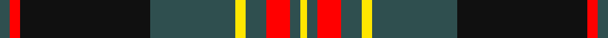

In pattern [BRKBYBRBY](/stripes/brkbybrby/).

This was sourced from register-of-tartans.  It is a [9 stripe tartan](/stripes/stripes9/).

Original link https://www.tartanregister.gov.uk/tartanDetails.aspx?ref=10336

## Also known as

This cloth is also recorded under:

- Greater St Louis Firefighters

## Attestations

This cloth appears in 2 source records; the oldest owns this page.

- 08/12/2010 — Greater St Louis Area Firefighters Highland Guard (register-of-tartans, [record](https://www.tartanregister.gov.uk/tartanDetails.aspx?ref=10336))
- undated — Greater St Louis Firefighters Corporate Tartan Tartan Number: 10336. Earliest known date: 2011 This tartan will be worn by members of the Greater St Louis Firefighters Highland Guard in memory of Firefighter-Paramedic Ryan Hummert of the Maplewood Missouri Fire Department. Firefighter-Paramedic Ryan Hummert was killed in the line of duty on the 21st July 2008 when a lone gunman ambushed emergency responders by setting a vehicle on fire and opening fire on firefighters and police officers when they arrived at the scene. Many of the band members were also involved in this call and the subsequent funeral and memorial services honouring Ryan. The Guard is honoured to design and wear this tartan in Ryan's memory. The tartan uses traditional fire department colours; red, black and gold. Charcoal grey is symbolic of smoke. See products available Copyright © Blair Urquhart, Comrie, 2015 (house-of-tartan, [record](http://www.house-of-tartan.scotland.net/house/TartanViewjs.asp?colr=Def&tnam=10336))

## Register references

External register numbers recorded for this tartan.

- Scottish Register of Tartans: [10336](https://www.tartanregister.gov.uk/tartanDetails.aspx?ref=10336)

## Thread count
N/6 R6 K76 N50 Y6 N12 R14 N6 Y/4

## Palette
Each colour and the base-6 reference it is a variant of.

| Colour | Shade | Base |
|---|---|---|
| K | <code style="background-color:#101010;">#101010</code> `oklch(17.3% 0.000 89.9)` <small>#101010</small> | K <code style="background-color:#000000;">#000000</code> |
| N | <code style="background-color:#2F4F4F;">#2F4F4F</code> `oklch(40.3% 0.038 195.8)` <small>#2F4F4F</small> | B <code style="background-color:#2A418A;">#2A418A</code> |
| R | <code style="background-color:#FF0000;">#FF0000</code> `oklch(62.8% 0.258 29.2)` <small>#FF0000</small> | R <code style="background-color:#CC0000;">#CC0000</code> |
| Y | <code style="background-color:#FFE600;">#FFE600</code> `oklch(91.7% 0.192 101.4)` <small>#FFE600</small> | Y <code style="background-color:#F2BF00;">#F2BF00</code> |

## Nearest tartans

The nearest existing variants by ΔTartan distance.

1. [Nunavut (District)](/setts/s10/k6t2n2t3n2t2n30k20w6k4~x2/) — ΔT 0.82
1. [Carson Red (Personal)](/setts/s8/n19r2n3r2n3k43r22g3~x2/) — ΔT 0.86
1. [Kunbi](/setts/s8/k76dt11k3ly6k3dt13k11o76/) — ΔT 0.90
1. [Glen Tilt #1](/setts/s10/lb1dr1g1dr11db6dr1g14dr1g1lb1~x4/) — ΔT 1.00
1. [Urbino (Fashion)](/setts/s10/dg3dp2dg2dp2dg2dp20k20dg22k1o3~x4/) — ΔT 1.02
1. [Queen of Scots](/setts/s9/g22k3g1k3g2p8m1p8m16~x2/) — ΔT 1.10
1. [Rennie Family Tartan Tartan Number: 716. Earliest known date: 1981. For Robin Rennie. The accreditation list gives the author and weaver, James Scarlett, as the designer in 1980. The tartan register records the designer as Peter MacDonald who worked as a weaver for the Scottish Tartans Society in 1981. Rennies, Rainys and Rainnies (from 'Ranald') are listed as a sept of MacDonell of Keppoch. See products available Copyright © Blair Urquhart, Comrie, 2015](/setts/s10/w6k1g29k23dp27g3dp3g3dp3g4~x2/) — ΔT 1.10
1. [Rennie (Personal)](/setts/s10/w6k1y28k24dp25y3dp3y3dp3y4~x2/) — ΔT 1.12
1. [Southdown (Fashion)](/setts/s9/k3r1k3w5k5w3k5dy23r3~x2/) — ΔT 1.13
1. [Southdown Tartan Tartan Number: 1194. Earliest known date: pre 2003 Designed for the Glasgow conference in 2002 See products available Copyright © Blair Urquhart, Comrie, 2015](/setts/s9/k8r1k3w5k5w3k5dr23r3~x2/) — ΔT 1.15

## Neighbour map

Every grey dot is one of 14299 variants placed by the first two principal components of the ΔTartan feature space (44% of its variance). Red is this tartan; blue dots are its nearest — click one to open its page.

<svg viewBox="0 0 640 380" role="img" style="max-width:100%;height:auto;border:1px solid #e0e0e0;border-radius:4px;display:block" xmlns="http://www.w3.org/2000/svg"><image href="/nn/cloud.v1.png" width="640" height="380"/><a href="/setts/s10/k6t2n2t3n2t2n30k20w6k4~x2/"><circle cx="263.2" cy="150.6" r="4" fill="#3465a4"><title>Nunavut (District)</title></circle></a><a href="/setts/s8/n19r2n3r2n3k43r22g3~x2/"><circle cx="284.9" cy="147.7" r="4" fill="#3465a4"><title>Carson Red (Personal)</title></circle></a><a href="/setts/s8/k76dt11k3ly6k3dt13k11o76/"><circle cx="298.7" cy="139.4" r="4" fill="#3465a4"><title>Kunbi</title></circle></a><a href="/setts/s10/lb1dr1g1dr11db6dr1g14dr1g1lb1~x4/"><circle cx="267.7" cy="160.3" r="4" fill="#3465a4"><title>Glen Tilt #1</title></circle></a><a href="/setts/s10/dg3dp2dg2dp2dg2dp20k20dg22k1o3~x4/"><circle cx="239.7" cy="143.5" r="4" fill="#3465a4"><title>Urbino (Fashion)</title></circle></a><a href="/setts/s9/g22k3g1k3g2p8m1p8m16~x2/"><circle cx="231.4" cy="148.7" r="4" fill="#3465a4"><title>Queen of Scots</title></circle></a><a href="/setts/s10/w6k1g29k23dp27g3dp3g3dp3g4~x2/"><circle cx="243.4" cy="132.8" r="4" fill="#3465a4"><title>Rennie Family Tartan Tartan Number: 716. Earliest known date: 1981. For Robin Rennie. The accreditation list gives the author and weaver, James Scarlett, as the designer in 1980. The tartan register records the designer as Peter MacDonald who worked as a weaver for the Scottish Tartans Society in 1981. Rennies, Rainys and Rainnies (from 'Ranald') are listed as a sept of MacDonell of Keppoch. See products available Copyright © Blair Urquhart, Comrie, 2015</title></circle></a><a href="/setts/s10/w6k1y28k24dp25y3dp3y3dp3y4~x2/"><circle cx="251.0" cy="139.9" r="4" fill="#3465a4"><title>Rennie (Personal)</title></circle></a><a href="/setts/s9/k3r1k3w5k5w3k5dy23r3~x2/"><circle cx="253.5" cy="127.2" r="4" fill="#3465a4"><title>Southdown (Fashion)</title></circle></a><a href="/setts/s9/k8r1k3w5k5w3k5dr23r3~x2/"><circle cx="247.9" cy="141.8" r="4" fill="#3465a4"><title>Southdown Tartan Tartan Number: 1194. Earliest known date: pre 2003 Designed for the Glasgow conference in 2002 See products available Copyright © Blair Urquhart, Comrie, 2015</title></circle></a><circle cx="271.1" cy="144.6" r="5" fill="#c00000"/></svg>

ID: /setts/s9/n3r3k38n25ly3n6r7n3ly2~x2/
