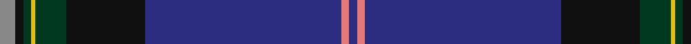

This page is one **sett** — a single exact thread-count. It belongs to the [tartan](/tartans/n4k2dg2y1dg8k20db50lr2db2/)
(the same proportion at any scale), whose colour order is pattern [BRBKGYGKR](/stripes/brbkgygkr/).

Sourced from register-of-tartans.  It is a [9 stripe tartan](/stripes/stripes9/).

Original link https://www.tartanregister.gov.uk/tartanDetails.aspx?ref=432

2 attestations — the source records this cloth was collapsed from (oldest owns this page)

<ul>
<li>01/07/2000 — Buckie (register-of-tartans, <a href="https://www.tartanregister.gov.uk/tartanDetails.aspx?ref=432">record</a>)</li>
<li>pre 2002 — Buckie (District) (tartans-authority, <a href="http://www.tartansauthority.com/tartan-ferret/display/4005/">record</a>)</li>
</ul>

## Register references

External register numbers recorded for this tartan.

- Scottish Register of Tartans: [432](https://www.tartanregister.gov.uk/tartanDetails.aspx?ref=432)
- Scottish Tartans Authority (ITI): 4005
- Scottish Tartans World Register: 2827

## Thread count
N/8 K4 DG4 Y2 DG16 K40 DB100 LR4 DB/4

## Palette
Each colour and the base-6 reference it is a variant of.

| Colour | Shade | Base |
|---|---|---|
| DB | <code style="background-color:#2C2C80;">#2C2C80</code> `oklch(35.0% 0.138 276.6)` <small>#2C2C80</small> | B <code style="background-color:#2A418A;">#2A418A</code> |
| DG | <code style="background-color:#003820;">#003820</code> `oklch(30.0% 0.070 158.3)` <small>#003820</small> | G <code style="background-color:#006100;">#006100</code> |
| K | <code style="background-color:#101010;">#101010</code> `oklch(17.3% 0.000 89.9)` <small>#101010</small> | K <code style="background-color:#000000;">#000000</code> |
| LR | <code style="background-color:#E87878;">#E87878</code> `oklch(70.0% 0.139 21.2)` <small>#E87878</small> | R <code style="background-color:#CC0000;">#CC0000</code> |
| N | <code style="background-color:#888888;">#888888</code> `oklch(62.7% 0.000 89.9)` <small>#888888</small> | R <code style="background-color:#CC0000;">#CC0000</code> |
| Y | <code style="background-color:#E8C000;">#E8C000</code> `oklch(81.9% 0.168 93.7)` <small>#E8C000</small> | Y <code style="background-color:#F2BF00;">#F2BF00</code> |

## Nearest tartans

The nearest existing variants by ΔTartan distance, with this tartan at the top so the swatches line up against it.

ΔTartan

Tartan

Sett

—

<a href="/ttd/edit/#slug=o4k2dg2ly1dg8k20db50r2db2~x2">Buckie</a> <a class="nn-out" href="/setts/s9/o4k2dg2ly1dg8k20db50r2db2~x2/" title="open its dictionary page">↗</a>

0.53

<a href="/ttd/edit/#slug=db5w1db44dp1g12k12dp5k2m2k3~x2">Heart of Scotland (Fashion)</a> <a class="nn-out" href="/setts/s10/db5w1db44dp1g12k12dp5k2m2k3~x2/" title="open its dictionary page">↗</a>

0.90

<a href="/ttd/edit/#slug=db67w1lo6r5dg25db3k5~x2">Guide Dogs (Corporate)</a> <a class="nn-out" href="/setts/s7/db67w1lo6r5dg25db3k5~x2/" title="open its dictionary page">↗</a>

1.01

<a href="/ttd/edit/#slug=db6w1db40m1k12dg12m6dg2dp2dg4~x2">Scotland the Brave (Fashion)</a> <a class="nn-out" href="/setts/s10/db6w1db40m1k12dg12m6dg2dp2dg4~x2/" title="open its dictionary page">↗</a>

1.08

<a href="/ttd/edit/#slug=db3o3db36db7k3db6g5k1ly3~x2">Incorporation of Weavers (Glasgow)</a> <a class="nn-out" href="/setts/s9/db3o3db36db7k3db6g5k1ly3~x2/" title="open its dictionary page">↗</a>

1.14

<a href="/ttd/edit/#slug=db5lb1db44m1g12k12m5k2lp2k3~x2">Heart of Scotland Fancy Tartan Tartan Number: 4230. Earliest known date: 1999 October 1999. Designed by Lochcarron of Scotland for 'Gavin' Kiltmaker. They use it for their hire kilts. Colour checked against sample. See products available Copyright © Blair Urquhart, Comrie, 2015</a> <a class="nn-out" href="/setts/s10/db5lb1db44m1g12k12m5k2lp2k3~x2/" title="open its dictionary page">↗</a>

1.22

<a href="/ttd/edit/#slug=db1p1g3dp6db2k32db2dp12w1~x2">Scottish Heather</a> <a class="nn-out" href="/setts/s9/db1p1g3dp6db2k32db2dp12w1~x2/" title="open its dictionary page">↗</a>

1.37

<a href="/ttd/edit/#slug=db46ly1ly3dg13ly1r7g3ly1~x2">Victorian Highland Pipe Band Assoc</a> <a class="nn-out" href="/setts/s8/db46ly1ly3dg13ly1r7g3ly1~x2/" title="open its dictionary page">↗</a>

1.41

<a href="/ttd/edit/#slug=t48r1db10r1t10lr2db27w1m3~x2">Glasgow Clyde College</a> <a class="nn-out" href="/setts/s9/t48r1db10r1t10lr2db27w1m3~x2/" title="open its dictionary page">↗</a>

1.43

<a href="/ttd/edit/#slug=g6dp2dp2g2dp15g3k2g1k15db43w2~x2">Scottish Pride (Fashion)</a> <a class="nn-out" href="/setts/s11/g6dp2dp2g2dp15g3k2g1k15db43w2~x2/" title="open its dictionary page">↗</a>

1.43

<a href="/ttd/edit/#slug=db36k10dg3r3dg6k1ly2~x2">MacLaurin of Brioch</a> <a class="nn-out" href="/setts/s7/db36k10dg3r3dg6k1ly2~x2/" title="open its dictionary page">↗</a>

## Neighbour map

Every grey dot is one of 14299 variants placed by the first two principal components of the ΔTartan feature space (44% of its variance). Red is this tartan; blue dots are its nearest — click one to open its page.

<svg viewBox="0 0 640 380" role="img" style="max-width:100%;height:auto;border:1px solid #e0e0e0;border-radius:4px;display:block" xmlns="http://www.w3.org/2000/svg"><image href="/nn/cloud.v1.png" width="640" height="380"/><a href="/setts/s10/db5w1db44dp1g12k12dp5k2m2k3~x2/"><circle cx="383.6" cy="105.5" r="4" fill="#3465a4"><title>Heart of Scotland (Fashion)</title></circle></a><a href="/setts/s7/db67w1lo6r5dg25db3k5~x2/"><circle cx="430.9" cy="113.4" r="4" fill="#3465a4"><title>Guide Dogs (Corporate)</title></circle></a><a href="/setts/s10/db6w1db40m1k12dg12m6dg2dp2dg4~x2/"><circle cx="338.8" cy="103.5" r="4" fill="#3465a4"><title>Scotland the Brave (Fashion)</title></circle></a><a href="/setts/s9/db3o3db36db7k3db6g5k1ly3~x2/"><circle cx="364.7" cy="110.3" r="4" fill="#3465a4"><title>Incorporation of Weavers (Glasgow)</title></circle></a><a href="/setts/s10/db5lb1db44m1g12k12m5k2lp2k3~x2/"><circle cx="352.4" cy="88.3" r="4" fill="#3465a4"><title>Heart of Scotland Fancy Tartan Tartan Number: 4230. Earliest known date: 1999 October 1999. Designed by Lochcarron of Scotland for 'Gavin' Kiltmaker. They use it for their hire kilts. Colour checked against sample. See products available Copyright © Blair Urquhart, Comrie, 2015</title></circle></a><a href="/setts/s9/db1p1g3dp6db2k32db2dp12w1~x2/"><circle cx="366.8" cy="121.3" r="4" fill="#3465a4"><title>Scottish Heather</title></circle></a><a href="/setts/s8/db46ly1ly3dg13ly1r7g3ly1~x2/"><circle cx="391.4" cy="88.3" r="4" fill="#3465a4"><title>Victorian Highland Pipe Band Assoc</title></circle></a><a href="/setts/s9/t48r1db10r1t10lr2db27w1m3~x2/"><circle cx="391.8" cy="96.1" r="4" fill="#3465a4"><title>Glasgow Clyde College</title></circle></a><a href="/setts/s11/g6dp2dp2g2dp15g3k2g1k15db43w2~x2/"><circle cx="313.9" cy="95.8" r="4" fill="#3465a4"><title>Scottish Pride (Fashion)</title></circle></a><a href="/setts/s7/db36k10dg3r3dg6k1ly2~x2/"><circle cx="393.9" cy="136.1" r="4" fill="#3465a4"><title>MacLaurin of Brioch</title></circle></a><circle cx="400.3" cy="99.8" r="5" fill="#c00000"/></svg>

ID: /setts/s9/o4k2dg2ly1dg8k20db50r2db2~x2/
