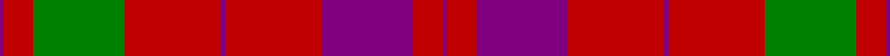

In pattern [BRBRBRGRB](/stripes/brbrbrgrb/).

This was sourced from weddslist.  It is a [9 stripe tartan](/stripes/stripes9/).

Original link http://www.weddslist.com/cgi-bin/tartans/pg.pl?source=sts

## Also known as

This cloth is also recorded under:

- Lovat, or Fraser

## Thread count
P/2 R14 G44 R46 P2 R46 P44 R14 P/2

## Palette
Each colour and the base-6 reference it is a variant of.

| Colour | Shade | Base |
|---|---|---|
| G | <code style="background-color:#008000;">#008000</code> `oklch(52.0% 0.177 142.5)` <small>#008000</small> | G <code style="background-color:#006100;">#006100</code> |
| P | <code style="background-color:#800080;">#800080</code> `oklch(42.1% 0.193 328.4)` <small>#800080</small> | B <code style="background-color:#2A418A;">#2A418A</code> |
| R | <code style="background-color:#C00000;">#C00000</code> `oklch(50.7% 0.208 29.2)` <small>#C00000</small> | R <code style="background-color:#CC0000;">#CC0000</code> |

## Nearest tartans

The nearest existing variants by ΔTartan distance.

1. [Lovat or Fraser Clan Tartan Tartan Number: 400. Earliest known date: 1820 The Scottish Tartans Society archives contain several queries on this name. J. Scarlett lists this sett under Fraser (Frasers of Lovat) with the comment. "The pattern is reputed to have been woven by Wilson's c.1820." (STS archive). 18 year old Simon Fraser became 25th chief of the Frasers of Lovat in March 1995, on the death of his grandfather, Lord Lovat, the famous war veteran. (Scotsman 17 March 1995) See products available Copyright © Blair Urquhart, Comrie, 2015](/setts/s9/dp1r7dp22r23dp1r23g22r7dp1~x2/) — ΔT 0.23
1. [Lovat or Fraser](/setts/s9/dp1r7dg22r23dp1r23dp22r7dp1~x2/) — ΔT 0.83
1. [Franklin Museum Unidentified 2](/setts/s8/r5g20r25db1r25db20r5db1~x4/) — ΔT 0.90
1. [Unidentified Cant #14](/setts/s12/db80r56dg3r56dg88r64db3r4dg3r4db3r64/) — ΔT 0.99
1. [Caledonian District Tartan Tartan Number: 526. Earliest known date: 1819 In view of its widespread use as a foundation for other tartans it is perhaps not surprising that Wilson's named the Mackintosh tartan 'Caledonian'. They also called it 'Lovat or Fraser'. For this reason the tartan is not suitable for persons seeking a Caledonian tartan unless they are also Frasers of Lovat or Mackintoshes. See products available Copyright © Blair Urquhart, Comrie, 2015](/setts/s6/r60dp20r8g45r8dp2~x2/) — ΔT 1.14
1. [MacKintosh](/setts/s6/r70db20r10g40r10db3/) — ΔT 1.20
1. [MacKintosh Plaid](/setts/s6/r16db6r2dg6r2db1~x2/) — ΔT 1.23
1. [MacKintosh #2](/setts/s6/r68db18r9dg34r9db3~x2/) — ΔT 1.24
1. [Caledonian](/setts/s6/r60dp20r8dg45r8dp2~x2/) — ΔT 1.29
1. [MacDonald #7](/setts/s9/dg2r2db1r24db6r3dg12r4db1~x2/) — ΔT 1.29

## Neighbour map

Every grey dot is one of 14299 variants placed by the first two principal components of the ΔTartan feature space (44% of its variance). Red is this tartan; blue dots are its nearest — click one to open its page.

<svg viewBox="0 0 640 380" role="img" style="max-width:100%;height:auto;border:1px solid #e0e0e0;border-radius:4px;display:block" xmlns="http://www.w3.org/2000/svg"><image href="/nn/cloud.v1.png" width="640" height="380"/><a href="/setts/s9/dp1r7dp22r23dp1r23g22r7dp1~x2/"><circle cx="385.7" cy="181.1" r="4" fill="#3465a4"><title>Lovat or Fraser Clan Tartan Tartan Number: 400. Earliest known date: 1820 The Scottish Tartans Society archives contain several queries on this name. J. Scarlett lists this sett under Fraser (Frasers of Lovat) with the comment. &quot;The pattern is reputed to have been woven by Wilson's c.1820.&quot; (STS archive). 18 year old Simon Fraser became 25th chief of the Frasers of Lovat in March 1995, on the death of his grandfather, Lord Lovat, the famous war veteran. (Scotsman 17 March 1995) See products available Copyright © Blair Urquhart, Comrie, 2015</title></circle></a><a href="/setts/s9/dp1r7dg22r23dp1r23dp22r7dp1~x2/"><circle cx="361.6" cy="168.5" r="4" fill="#3465a4"><title>Lovat or Fraser</title></circle></a><a href="/setts/s8/r5g20r25db1r25db20r5db1~x4/"><circle cx="381.1" cy="180.5" r="4" fill="#3465a4"><title>Franklin Museum Unidentified 2</title></circle></a><a href="/setts/s12/db80r56dg3r56dg88r64db3r4dg3r4db3r64/"><circle cx="394.2" cy="149.4" r="4" fill="#3465a4"><title>Unidentified Cant #14</title></circle></a><a href="/setts/s6/r60dp20r8g45r8dp2~x2/"><circle cx="387.4" cy="181.5" r="4" fill="#3465a4"><title>Caledonian District Tartan Tartan Number: 526. Earliest known date: 1819 In view of its widespread use as a foundation for other tartans it is perhaps not surprising that Wilson's named the Mackintosh tartan 'Caledonian'. They also called it 'Lovat or Fraser'. For this reason the tartan is not suitable for persons seeking a Caledonian tartan unless they are also Frasers of Lovat or Mackintoshes. See products available Copyright © Blair Urquhart, Comrie, 2015</title></circle></a><a href="/setts/s6/r70db20r10g40r10db3/"><circle cx="401.2" cy="187.7" r="4" fill="#3465a4"><title>MacKintosh</title></circle></a><a href="/setts/s6/r16db6r2dg6r2db1~x2/"><circle cx="402.9" cy="199.9" r="4" fill="#3465a4"><title>MacKintosh Plaid</title></circle></a><a href="/setts/s6/r68db18r9dg34r9db3~x2/"><circle cx="412.7" cy="180.5" r="4" fill="#3465a4"><title>MacKintosh #2</title></circle></a><a href="/setts/s6/r60dp20r8dg45r8dp2~x2/"><circle cx="370.3" cy="171.8" r="4" fill="#3465a4"><title>Caledonian</title></circle></a><a href="/setts/s9/dg2r2db1r24db6r3dg12r4db1~x2/"><circle cx="414.5" cy="147.2" r="4" fill="#3465a4"><title>MacDonald #7</title></circle></a><circle cx="380.2" cy="179.0" r="5" fill="#c00000"/></svg>

ID: /setts/s9/p1r7g22r23p1r23p22r7p1~x2/
