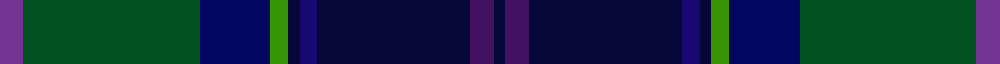

In pattern [BGBGKBKBK](/stripes/bgbgkbkbk/).

This was sourced from register-of-tartans.  It is a [9 stripe tartan](/stripes/stripes9/).

Original link https://www.tartanregister.gov.uk/tartanDetails.aspx?ref=10723

## Attestations

This cloth appears in 2 source records; the oldest owns this page.

- 03/05/2012 — Begg (Scarfskerry) (register-of-tartans, [record](https://www.tartanregister.gov.uk/tartanDetails.aspx?ref=10723))
- undated — Begg (Scarfskerry) Name Tartan Tartan Number: 10723. Earliest known date: 22 October 2012 Designed for Melissa McNulty and her Begg family to commemorate the Begg family name. The base of the tartan design reflects an historical association with Clan Macdonald as well as Scarfskerry in Caithness where the branch of the family comes from. Inspiration for the new design was taken from the Macdonald and Sinclair (Caithness regional tartan) setts. Colours: green signifies the toil and labour of previous generations of Begg family crofters working the bleak wilds of Caithness; blue is for the sea. Working the land was simply not enough for many crofting families to survive on, and many of Melissa McNulty’s ancestors went to sea. Two in particular were, firstly, Sinclair Begg OBE, who worked his way up from cabin boy to be Master of a whaling ship and served with distinction in both World Wars. He was awarded an OBE for his actions in the Second World War, when his ship was torpedoed by Germans just off the Outer Hebrides. Sinclair Begg also went on the Antarctic Surveys of 1955-57 and became the first man to bring penguins back to the UK. Secondly, Sinclair’s older brother, John, served with Christian Salvesen Shipping as a Master Mariner during the First World War, and on two separate occasions faced down German U-Boats. In the first instance he won the DSC for himself and on the second he won the Lloyds Silver Award for Meritorious Sea Service. Purple represents the gentle heather-swept hills of Caithness which were considered ‘home’ for many years after the family had moved to Edinburgh. However, on a more personal note, Melissa McNulty’s Great-Grandmother, from whom her strand of the Begg blood comes, was said to have beautiful, vibrant violet-coloured eyes. This tartan represents Melissa McNulty's personal heritage and that of her remaining family. See products available Copyright © Blair Urquhart, Comrie, 2015 (house-of-tartan, [record](http://www.house-of-tartan.scotland.net/house/TartanViewjs.asp?colr=Def&tnam=10723))

## Register references

External register numbers recorded for this tartan.

- Scottish Register of Tartans: [10723](https://www.tartanregister.gov.uk/tartanDetails.aspx?ref=10723)

## Thread count
P/4 G30 DB12 Ga3 DBb2 DBa3 DBb26 DP4 DBb/2

## Palette
Each colour and the base-6 reference it is a variant of.

| Colour | Shade | Base |
|---|---|---|
| DB | <code style="background-color:#020660;">#020660</code> `oklch(23.0% 0.147 265.2)` <small>#020660</small> | B <code style="background-color:#2A418A;">#2A418A</code> |
| DBa | <code style="background-color:#180972;">#180972</code> `oklch(27.1% 0.160 273.8)` <small>#180972</small> | B <code style="background-color:#2A418A;">#2A418A</code> |
| DBb | <code style="background-color:#050738;">#050738</code> `oklch(17.6% 0.092 269.9)` <small>#050738</small> | K <code style="background-color:#000000;">#000000</code> |
| DP | <code style="background-color:#421162;">#421162</code> `oklch(30.7% 0.134 307.6)` <small>#421162</small> | B <code style="background-color:#2A418A;">#2A418A</code> |
| G | <code style="background-color:#005020;">#005020</code> `oklch(37.7% 0.105 149.6)` <small>#005020</small> | G <code style="background-color:#006100;">#006100</code> |
| Ga | <code style="background-color:#379404;">#379404</code> `oklch(58.7% 0.183 138.7)` <small>#379404</small> | G <code style="background-color:#006100;">#006100</code> |
| P | <code style="background-color:#723392;">#723392</code> `oklch(45.0% 0.156 312.3)` <small>#723392</small> | B <code style="background-color:#2A418A;">#2A418A</code> |

## Nearest tartans

The nearest existing variants by ΔTartan distance.

1. [Begg (Personal)](/setts/s9/p4g30db12g3db2t3db26dp4db2/) — ΔT 0.96
1. [Leung (Personal)](/setts/s9/dp4db7dp2db25k19w2dg23k2lo3~x2/) — ΔT 1.20
1. [Schmidt (2014)](/setts/s10/k3db20db8db4dg20k2dg2r2dg3lo3~x2/) — ΔT 1.31
1. [Nova Scotia Int. Tattoo (Corporate)](/setts/s7/db3t2db21k12dg24r1lo3~x2/) — ΔT 1.34
1. [Boyle (Personal)](/setts/s10/db4db3r2db26k3db3g3db3g17lo3~x2/) — ΔT 1.37
1. [Purves (2014)](/setts/s8/k4w1dg12k3db16r1db1r1~x2/) — ΔT 1.42
1. [Glenisla (Fashion)](/setts/s11/o3dp5r2dp9y8dg2y4dg2n8db28o2~x2/) — ΔT 1.45
1. [Loch Freuchie District Tartan Tartan Number: 10725. Earliest known date: 25 October 2012 A tartan for the area around Loch Freuchie near Crieff. The tartan is based on the Murray of Atholl and Breadalbane setts, with differences, to relate the tartan to the particular Loch Freuchie area. Mr MacArthur-Fox has created a tartan for anyone to wear without fear of offending another person or group. See products available Copyright © Blair Urquhart, Comrie, 2015](/setts/s10/n3dg3r2dg20k25k2n13k2n3r3~x2/) — ΔT 1.48
1. [Heartlands (Fashion)](/setts/s11/db4b1dt20db2dt2db18dg2db2dg22m2dp4~x2/) — ΔT 1.50
1. [Spirit of the Glen (Corporate)](/setts/s11/p2db4db7db3dg20db5k7db3dp3dt35w2~x2/) — ΔT 1.51

## Neighbour map

Every grey dot is one of 14299 variants placed by the first two principal components of the ΔTartan feature space (44% of its variance). Red is this tartan; blue dots are its nearest — click one to open its page.

<svg viewBox="0 0 640 380" role="img" style="max-width:100%;height:auto;border:1px solid #e0e0e0;border-radius:4px;display:block" xmlns="http://www.w3.org/2000/svg"><image href="/nn/cloud.v1.png" width="640" height="380"/><a href="/setts/s9/p4g30db12g3db2t3db26dp4db2/"><circle cx="183.0" cy="141.1" r="4" fill="#3465a4"><title>Begg (Personal)</title></circle></a><a href="/setts/s9/dp4db7dp2db25k19w2dg23k2lo3~x2/"><circle cx="195.7" cy="176.5" r="4" fill="#3465a4"><title>Leung (Personal)</title></circle></a><a href="/setts/s10/k3db20db8db4dg20k2dg2r2dg3lo3~x2/"><circle cx="192.6" cy="171.7" r="4" fill="#3465a4"><title>Schmidt (2014)</title></circle></a><a href="/setts/s7/db3t2db21k12dg24r1lo3~x2/"><circle cx="245.7" cy="172.9" r="4" fill="#3465a4"><title>Nova Scotia Int. Tattoo (Corporate)</title></circle></a><a href="/setts/s10/db4db3r2db26k3db3g3db3g17lo3~x2/"><circle cx="243.8" cy="156.9" r="4" fill="#3465a4"><title>Boyle (Personal)</title></circle></a><a href="/setts/s8/k4w1dg12k3db16r1db1r1~x2/"><circle cx="263.4" cy="163.6" r="4" fill="#3465a4"><title>Purves (2014)</title></circle></a><a href="/setts/s11/o3dp5r2dp9y8dg2y4dg2n8db28o2~x2/"><circle cx="200.3" cy="138.7" r="4" fill="#3465a4"><title>Glenisla (Fashion)</title></circle></a><a href="/setts/s10/n3dg3r2dg20k25k2n13k2n3r3~x2/"><circle cx="193.9" cy="156.7" r="4" fill="#3465a4"><title>Loch Freuchie District Tartan Tartan Number: 10725. Earliest known date: 25 October 2012 A tartan for the area around Loch Freuchie near Crieff. The tartan is based on the Murray of Atholl and Breadalbane setts, with differences, to relate the tartan to the particular Loch Freuchie area. Mr MacArthur-Fox has created a tartan for anyone to wear without fear of offending another person or group. See products available Copyright © Blair Urquhart, Comrie, 2015</title></circle></a><a href="/setts/s11/db4b1dt20db2dt2db18dg2db2dg22m2dp4~x2/"><circle cx="246.8" cy="150.7" r="4" fill="#3465a4"><title>Heartlands (Fashion)</title></circle></a><a href="/setts/s11/p2db4db7db3dg20db5k7db3dp3dt35w2~x2/"><circle cx="203.0" cy="122.9" r="4" fill="#3465a4"><title>Spirit of the Glen (Corporate)</title></circle></a><circle cx="199.4" cy="154.2" r="5" fill="#c00000"/></svg>

ID: /setts/s9/p4dg30db12g3k2db3k26dp4k2/
