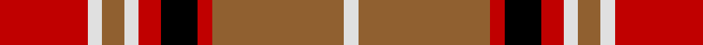

In pattern [RWRWRKRRW](/stripes/rwrwrkrrw/).

This was sourced from weddslist.  It is a [9 stripe tartan](/stripes/stripes9/).

Original link http://www.weddslist.com/cgi-bin/tartans/pg.pl?source=sts

## Also known as

This cloth is also recorded under:

- Ballater Trade or 'Fancy'

## Thread count
R/24 LN4 LT6 LN4 R6 K10 R4 LT36 LN/4

## Palette
Each colour and the base-6 reference it is a variant of.

| Colour | Shade | Base |
|---|---|---|
| K | <code style="background-color:#000000;">#000000</code> `oklch(0.0% 0.000 0.0)` <small>#000000</small> | K <code style="background-color:#000000;">#000000</code> |
| LN | <code style="background-color:#E0E0E0;">#E0E0E0</code> `oklch(90.7% 0.000 89.9)` <small>#E0E0E0</small> | W <code style="background-color:#F7F7F7;">#F7F7F7</code> |
| LT | <code style="background-color:#906030;">#906030</code> `oklch(53.1% 0.089 63.7)` <small>#906030</small> | R <code style="background-color:#CC0000;">#CC0000</code> |
| R | <code style="background-color:#C00000;">#C00000</code> `oklch(50.7% 0.208 29.2)` <small>#C00000</small> | R <code style="background-color:#CC0000;">#CC0000</code> |

## Nearest tartans

The nearest existing variants by ΔTartan distance.

1. [Ballater Trade or 'Fancy' Tartan Tartan Number: 1708. Earliest known date: Modern Many new designs have been given district names to promote their Scottish connections. However, these names should not be confused with the District tartans which have earned their title through 'use and wont' and not a little history. See products available Copyright © Blair Urquhart, Comrie, 2015](/setts/s9/r12w2lo3w2r3k5r2lo18w2~x2/) — ΔT 0.75
1. [Redwood Dress](/setts/s9/dg3r1w5r1dg2r1dg1r9do2~x4/) — ΔT 0.87
1. [MacNaughton (Logan) #2](/setts/s9/k2db2r26dg25k13db13r26db2k2~x2/) — ΔT 0.93
1. [Graham Red](/setts/s9/lr1k1r10g10k5lr5r10k1lr1~x4/) — ΔT 0.99
1. [MacNaughton](/setts/s9/t2k2r27dg27k12t12r27k2t2~x2/) — ΔT 1.06
1. [Henkel](/setts/s10/y28k3r22k8w3k8r22k3y28k3~x2/) — ΔT 1.09
1. [Glenfinnan](/setts/s10/dp28r26w2dp5w2r26g28r5w2r5~x2/) — ΔT 1.09
1. [Normandy (Fashion)](/setts/s12/w8k9ly9r21ly6k6w4k6ly6r49k22w4/) — ΔT 1.11
1. [MacKinnon #10](/setts/s11/w2r4dg8r16t2r3dg16r4t2r4w2~x2/) — ΔT 1.12
1. [Banff](/setts/s7/o6ly3o20o20o3o3lb6~x2/) — ΔT 1.15

## Neighbour map

Every grey dot is one of 14299 variants placed by the first two principal components of the ΔTartan feature space (44% of its variance). Red is this tartan; blue dots are its nearest — click one to open its page.

<svg viewBox="0 0 640 380" role="img" style="max-width:100%;height:auto;border:1px solid #e0e0e0;border-radius:4px;display:block" xmlns="http://www.w3.org/2000/svg"><image href="/nn/cloud.v1.png" width="640" height="380"/><a href="/setts/s9/r12w2lo3w2r3k5r2lo18w2~x2/"><circle cx="230.0" cy="165.0" r="4" fill="#3465a4"><title>Ballater Trade or 'Fancy' Tartan Tartan Number: 1708. Earliest known date: Modern Many new designs have been given district names to promote their Scottish connections. However, these names should not be confused with the District tartans which have earned their title through 'use and wont' and not a little history. See products available Copyright © Blair Urquhart, Comrie, 2015</title></circle></a><a href="/setts/s9/dg3r1w5r1dg2r1dg1r9do2~x4/"><circle cx="228.5" cy="171.1" r="4" fill="#3465a4"><title>Redwood Dress</title></circle></a><a href="/setts/s9/k2db2r26dg25k13db13r26db2k2~x2/"><circle cx="230.2" cy="161.4" r="4" fill="#3465a4"><title>MacNaughton (Logan) #2</title></circle></a><a href="/setts/s9/lr1k1r10g10k5lr5r10k1lr1~x4/"><circle cx="201.2" cy="171.6" r="4" fill="#3465a4"><title>Graham Red</title></circle></a><a href="/setts/s9/t2k2r27dg27k12t12r27k2t2~x2/"><circle cx="252.2" cy="165.9" r="4" fill="#3465a4"><title>MacNaughton</title></circle></a><a href="/setts/s10/y28k3r22k8w3k8r22k3y28k3~x2/"><circle cx="226.4" cy="180.6" r="4" fill="#3465a4"><title>Henkel</title></circle></a><a href="/setts/s10/dp28r26w2dp5w2r26g28r5w2r5~x2/"><circle cx="264.0" cy="151.2" r="4" fill="#3465a4"><title>Glenfinnan</title></circle></a><a href="/setts/s12/w8k9ly9r21ly6k6w4k6ly6r49k22w4/"><circle cx="221.9" cy="127.3" r="4" fill="#3465a4"><title>Normandy (Fashion)</title></circle></a><a href="/setts/s11/w2r4dg8r16t2r3dg16r4t2r4w2~x2/"><circle cx="259.9" cy="173.5" r="4" fill="#3465a4"><title>MacKinnon #10</title></circle></a><a href="/setts/s7/o6ly3o20o20o3o3lb6~x2/"><circle cx="248.2" cy="199.2" r="4" fill="#3465a4"><title>Banff</title></circle></a><circle cx="223.1" cy="162.4" r="5" fill="#c00000"/></svg>

ID: /setts/s9/r12w2o3w2r3k5r2o18w2~x2/
