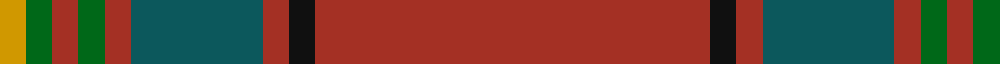

In pattern [RKRBRGRGY](/patterns/rkrbrgrgy/).

This was sourced from register-of-tartans.  It is a [9 stripes tartan](/stripes/stripes9/).

Original link https://www.tartanregister.gov.uk/tartanDetails.aspx?ref=3239

## Attestations

This cloth appears in 2 source records; the oldest owns this page.

- 01/01/1973 — Oliver Dress (Red) (register-of-tartans, [record](https://www.tartanregister.gov.uk/tartanDetails.aspx?ref=3239))
- 1973 — Oliver, Red (Clan) (tartans-authority, [record](http://www.tartansauthority.com/tartan-ferret/display/1606/))

## Thread count
DY/8 G8 T8 G8 T8 Ga40 T8 K8 T/120

## Palette
Each colour and its ΔE from the base-6 reference it is a variant of.

| Colour | Shade | Base | ΔE (OKLab) |
|---|---|---|---|
| DB | <code style="background-color:#1C0070;">#1C0070</code> `#1C0070` | B <code style="background-color:#2A418A;">#2A418A</code> | 0.14 |
| DR | <code style="background-color:#880000;">#880000</code> `#880000` | R <code style="background-color:#CC0000;">#CC0000</code> | 0.15 |
| DY | <code style="background-color:#D09800;">#D09800</code> `#D09800` | Y <code style="background-color:#F2BF00;">#F2BF00</code> | 0.12 |
| G | <code style="background-color:#006818;">#006818</code> `#006818` | G <code style="background-color:#006100;">#006100</code> | 0.02 |
| Ga | <code style="background-color:#0C585C;">#0C585C</code> `#0C585C` | B <code style="background-color:#2A418A;">#2A418A</code> | 0.12 |
| K | <code style="background-color:#101010;">#101010</code> `#101010` | K <code style="background-color:#000000;">#000000</code> | 0.17 |
| T | <code style="background-color:#A43024;">#A43024</code> `#A43024` | R <code style="background-color:#CC0000;">#CC0000</code> | 0.08 |

## Nearest tartans

The nearest existing variants by ΔTartan distance.

1. [Galway Irish County Tartan Tartan Number: 2254. Earliest known date: 1995 One of a series of Irish District tartans designed by Polly Wittering of the House of Edgar, with colours reminiscent of the Country with soft warm colours dominating. See products available Copyright © Blair Urquhart, Comrie, 2015](/setts/s10/r4g13r3b4r3b3r40b3r2y4x2~b141c50-g446844-rb84820-yc48800/) — ΔT 1.11
1. [Galway, County](/setts/s10/r4g13r3b4r3b3r40b3r2y4x2~b440044-g003820-ra00000-ybc8c00/) — ΔT 1.41
1. [Tyrone Irish County Tartan Tartan Number: 2264. Earliest known date: 1993 One of a series of Irish District tartans designed by Polly Wittering of the House of Edgar, with colours reminiscent of the Country with soft warm colours dominating. See products available Copyright © Blair Urquhart, Comrie, 2015](/setts/s12/b50r6g7ga2g2y2g2r14b8g2b9ga3x2~b5c0014-g28200c-ga005448-r9c7c28-yc4c4a4/) — ΔT 1.57
1. [Oakhall (Corporate)](/setts/s8/k3r48g6r6g12y3g2k3x2~g006818-k101010-r901c38-ye8c000/) — ΔT 1.59
1. [Tyrone, County](/setts/s12/r50g6b7ga2b2w2b2g14r8ga2r9ga3x2~b4c3428-g8c7038-ga003820-r880000-wc0c0c0/) — ΔT 1.62
1. [McAlifyfe (Personal)](/setts/s11/g3k3r6g6ra12g3k2g30y2g3k3x2~g696b3a-k101010-rb966ae-raa01d69-ycb8000/) — ΔT 1.62
1. [MacMaster Clan/Family Tartan Tartan Number: 3493. Earliest known date: 1986 Designed by Phil Smith in 1986 for all of the names MacMaster, MacMasters etc. See MacMasters Canada. See products available Copyright © Blair Urquhart, Comrie, 2015](/setts/s12/k1r14g1r1g6w2g6r1g1r14k1wa1x4~g006818-k101010-r880000-wc0c0c0-waa8ace8/) — ΔT 1.63
1. [Kinnaird (1984)](/setts/s13/b17ba3b2ba1b1ba1b1ba1r3y2b1y2ra1x4~b441800-ba4c3428-r800028-rae87878-ybc8c00/) — ΔT 1.65
1. [Islay Whisky Club (Corporate)](/setts/s10/b30g4ba3bb3g4b30ba3bb3ga4y2x2~b680028-ba780078-bb5c8ca8-g006428-ga003820-ye8c000/) — ΔT 1.69
1. [Wcwm 1286-9](/setts/s12/r42b3r6y2r2w2r2g14ra8r2ra3w2x2~b1c0070-g006818-r880000-rac80000-wc0c0c0-yd09800/) — ΔT 1.69

## Neighbour map

Every grey dot is one of 15726 variants placed by the first two principal components of the ΔTartan feature space (44% of its variance). Red is this tartan; blue dots are its nearest — click one to open its page.

<svg viewBox="0 0 640 380" role="img" style="max-width:100%;height:auto;border:1px solid #e0e0e0;border-radius:4px;display:block" xmlns="http://www.w3.org/2000/svg"><image href="/nn/cloud.v1.png" width="640" height="380"/><a href="/setts/s10/r4g13r3b4r3b3r40b3r2y4x2~b141c50-g446844-rb84820-yc48800/"><circle cx="463.4" cy="141.4" r="4" fill="#3465a4"><title>Galway Irish County Tartan Tartan Number: 2254. Earliest known date: 1995 One of a series of Irish District tartans designed by Polly Wittering of the House of Edgar, with colours reminiscent of the Country with soft warm colours dominating. See products available Copyright © Blair Urquhart, Comrie, 2015</title></circle></a><a href="/setts/s10/r4g13r3b4r3b3r40b3r2y4x2~b440044-g003820-ra00000-ybc8c00/"><circle cx="475.2" cy="144.3" r="4" fill="#3465a4"><title>Galway, County</title></circle></a><a href="/setts/s12/b50r6g7ga2g2y2g2r14b8g2b9ga3x2~b5c0014-g28200c-ga005448-r9c7c28-yc4c4a4/"><circle cx="424.5" cy="111.6" r="4" fill="#3465a4"><title>Tyrone Irish County Tartan Tartan Number: 2264. Earliest known date: 1993 One of a series of Irish District tartans designed by Polly Wittering of the House of Edgar, with colours reminiscent of the Country with soft warm colours dominating. See products available Copyright © Blair Urquhart, Comrie, 2015</title></circle></a><a href="/setts/s8/k3r48g6r6g12y3g2k3x2~g006818-k101010-r901c38-ye8c000/"><circle cx="458.7" cy="142.7" r="4" fill="#3465a4"><title>Oakhall (Corporate)</title></circle></a><a href="/setts/s12/r50g6b7ga2b2w2b2g14r8ga2r9ga3x2~b4c3428-g8c7038-ga003820-r880000-wc0c0c0/"><circle cx="469.9" cy="124.3" r="4" fill="#3465a4"><title>Tyrone, County</title></circle></a><a href="/setts/s11/g3k3r6g6ra12g3k2g30y2g3k3x2~g696b3a-k101010-rb966ae-raa01d69-ycb8000/"><circle cx="373.1" cy="143.8" r="4" fill="#3465a4"><title>McAlifyfe (Personal)</title></circle></a><a href="/setts/s12/k1r14g1r1g6w2g6r1g1r14k1wa1x4~g006818-k101010-r880000-wc0c0c0-waa8ace8/"><circle cx="374.2" cy="139.1" r="4" fill="#3465a4"><title>MacMaster Clan/Family Tartan Tartan Number: 3493. Earliest known date: 1986 Designed by Phil Smith in 1986 for all of the names MacMaster, MacMasters etc. See MacMasters Canada. See products available Copyright © Blair Urquhart, Comrie, 2015</title></circle></a><a href="/setts/s13/b17ba3b2ba1b1ba1b1ba1r3y2b1y2ra1x4~b441800-ba4c3428-r800028-rae87878-ybc8c00/"><circle cx="414.1" cy="128.4" r="4" fill="#3465a4"><title>Kinnaird (1984)</title></circle></a><a href="/setts/s10/b30g4ba3bb3g4b30ba3bb3ga4y2x2~b680028-ba780078-bb5c8ca8-g006428-ga003820-ye8c000/"><circle cx="437.2" cy="136.0" r="4" fill="#3465a4"><title>Islay Whisky Club (Corporate)</title></circle></a><a href="/setts/s12/r42b3r6y2r2w2r2g14ra8r2ra3w2x2~b1c0070-g006818-r880000-rac80000-wc0c0c0-yd09800/"><circle cx="389.9" cy="89.8" r="4" fill="#3465a4"><title>Wcwm 1286-9</title></circle></a><circle cx="459.1" cy="144.4" r="5" fill="#c00000"/></svg>

ID: /setts/s9/r15k1r1b5r1g1r1g1y1x8~b0c585c-g006818-k101010-ra43024-yd09800/
