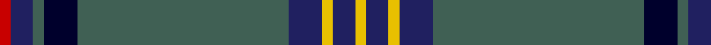

This page is one **sett** — a single exact thread-count. It belongs to the [tartan](/tartans/r1dba2n1db3n19dba3y1dba2y1/)
(the same proportion at any scale), whose colour order is pattern [RBGKGBYBY](/stripes/rbgkgbyby/).

Sourced from tartans-authority.  It is a [9 stripe tartan](/stripes/stripes9/).

Original link http://www.tartansauthority.com/tartan-ferret/display/10962/

## Thread count
R/4 DBa8 N4 DB12 N76 DBa12 Y4 DBa8 Y/4

## Palette
Each colour and the base-6 reference it is a variant of.

| Colour | Shade | Base |
|---|---|---|
| DB | <code style="background-color:#00002C;">#00002C</code> `oklch(13.2% 0.092 264.1)` <small>#00002C</small> | K <code style="background-color:#000000;">#000000</code> |
| DBa | <code style="background-color:#202060;">#202060</code> `oklch(28.9% 0.111 276.9)` <small>#202060</small> | B <code style="background-color:#2A418A;">#2A418A</code> |
| N | <code style="background-color:#406054;">#406054</code> `oklch(46.0% 0.042 169.0)` <small>#406054</small> | G <code style="background-color:#006100;">#006100</code> |
| R | <code style="background-color:#C80000;">#C80000</code> `oklch(52.3% 0.215 29.2)` <small>#C80000</small> | R <code style="background-color:#CC0000;">#CC0000</code> |
| Y | <code style="background-color:#E8C000;">#E8C000</code> `oklch(81.9% 0.168 93.7)` <small>#E8C000</small> | Y <code style="background-color:#F2BF00;">#F2BF00</code> |

## Nearest tartans

The nearest existing variants by ΔTartan distance, with this tartan at the top so the swatches line up against it.

ΔTartan

Tartan

Sett

—

<a href="/ttd/edit/#slug=r1db2y1k3y19db3ly1db2ly1~x4">Pagus Wasia</a> <a class="nn-out" href="/setts/s9/r1db2y1k3y19db3ly1db2ly1~x4/" title="open its dictionary page">↗</a>

0.93

<a href="/ttd/edit/#slug=dt68o5k9o3k3lb3k3o20dt9k3dt5lb4">British Caledonian Airways #1</a> <a class="nn-out" href="/setts/s12/dt68o5k9o3k3lb3k3o20dt9k3dt5lb4/" title="open its dictionary page">↗</a>

1.05

<a href="/ttd/edit/#slug=db17r3dg55db3dg4db3dg4ly3w5~x2">Bundanoon</a> <a class="nn-out" href="/setts/s9/db17r3dg55db3dg4db3dg4ly3w5~x2/" title="open its dictionary page">↗</a>

1.17

<a href="/ttd/edit/#slug=r6k3n4k10n5t2k2n31w1n2w2~x2">William Glen and Son</a> <a class="nn-out" href="/setts/s11/r6k3n4k10n5t2k2n31w1n2w2~x2/" title="open its dictionary page">↗</a>

1.18

<a href="/ttd/edit/#slug=w3dt1k14dt2k1g6k1dt30lo3~x2">Bro-Kerne</a> <a class="nn-out" href="/setts/s9/w3dt1k14dt2k1g6k1dt30lo3~x2/" title="open its dictionary page">↗</a>

1.18

<a href="/ttd/edit/#slug=r2k3db42k3ly2k3g22k3r2~x2">Strachan (Name)</a> <a class="nn-out" href="/setts/s9/r2k3db42k3ly2k3g22k3r2~x2/" title="open its dictionary page">↗</a>

1.20

<a href="/ttd/edit/#slug=k2o4dt27ly3dt12o2k2r7k2o1dt1k2dt2~x2">Brough from Orkney (Name)</a> <a class="nn-out" href="/setts/s13/k2o4dt27ly3dt12o2k2r7k2o1dt1k2dt2~x2/" title="open its dictionary page">↗</a>

1.24

<a href="/ttd/edit/#slug=dg3w2dg39k3g3k3dg3k20g10r2~x2">Zorra Caledonian Society</a> <a class="nn-out" href="/setts/s10/dg3w2dg39k3g3k3dg3k20g10r2~x2/" title="open its dictionary page">↗</a>

1.25

<a href="/ttd/edit/#slug=r6k3n4k10n5lb2k2n31w1n2w2~x2">William Glen &amp; Son (Corporate)</a> <a class="nn-out" href="/setts/s11/r6k3n4k10n5lb2k2n31w1n2w2~x2/" title="open its dictionary page">↗</a>

1.26

<a href="/ttd/edit/#slug=dt48t12lo3w3lo3r11dt5r2lo7w2~x2">Holyrood Golden Jubilee II (Commemo)</a> <a class="nn-out" href="/setts/s10/dt48t12lo3w3lo3r11dt5r2lo7w2~x2/" title="open its dictionary page">↗</a>

1.27

<a href="/ttd/edit/#slug=db40g3db2g12k2g2ly2g2k3~x2">Oliver, hunting</a> <a class="nn-out" href="/setts/s9/db40g3db2g12k2g2ly2g2k3~x2/" title="open its dictionary page">↗</a>

## Neighbour map

Every grey dot is one of 14299 variants placed by the first two principal components of the ΔTartan feature space (44% of its variance). Red is this tartan; blue dots are its nearest — click one to open its page.

<svg viewBox="0 0 640 380" role="img" style="max-width:100%;height:auto;border:1px solid #e0e0e0;border-radius:4px;display:block" xmlns="http://www.w3.org/2000/svg"><image href="/nn/cloud.v1.png" width="640" height="380"/><a href="/setts/s12/dt68o5k9o3k3lb3k3o20dt9k3dt5lb4/"><circle cx="377.0" cy="113.5" r="4" fill="#3465a4"><title>British Caledonian Airways #1</title></circle></a><a href="/setts/s9/db17r3dg55db3dg4db3dg4ly3w5~x2/"><circle cx="392.2" cy="131.4" r="4" fill="#3465a4"><title>Bundanoon</title></circle></a><a href="/setts/s11/r6k3n4k10n5t2k2n31w1n2w2~x2/"><circle cx="378.2" cy="106.8" r="4" fill="#3465a4"><title>William Glen and Son</title></circle></a><a href="/setts/s9/w3dt1k14dt2k1g6k1dt30lo3~x2/"><circle cx="332.9" cy="116.5" r="4" fill="#3465a4"><title>Bro-Kerne</title></circle></a><a href="/setts/s9/r2k3db42k3ly2k3g22k3r2~x2/"><circle cx="322.3" cy="132.5" r="4" fill="#3465a4"><title>Strachan (Name)</title></circle></a><a href="/setts/s13/k2o4dt27ly3dt12o2k2r7k2o1dt1k2dt2~x2/"><circle cx="373.1" cy="106.4" r="4" fill="#3465a4"><title>Brough from Orkney (Name)</title></circle></a><a href="/setts/s10/dg3w2dg39k3g3k3dg3k20g10r2~x2/"><circle cx="316.6" cy="140.6" r="4" fill="#3465a4"><title>Zorra Caledonian Society</title></circle></a><a href="/setts/s11/r6k3n4k10n5lb2k2n31w1n2w2~x2/"><circle cx="387.6" cy="106.6" r="4" fill="#3465a4"><title>William Glen &amp; Son (Corporate)</title></circle></a><a href="/setts/s10/dt48t12lo3w3lo3r11dt5r2lo7w2~x2/"><circle cx="312.8" cy="108.0" r="4" fill="#3465a4"><title>Holyrood Golden Jubilee II (Commemo)</title></circle></a><a href="/setts/s9/db40g3db2g12k2g2ly2g2k3~x2/"><circle cx="398.0" cy="139.4" r="4" fill="#3465a4"><title>Oliver, hunting</title></circle></a><circle cx="375.5" cy="133.1" r="5" fill="#c00000"/></svg>

ID: /setts/s9/r1db2y1k3y19db3ly1db2ly1~x4/
