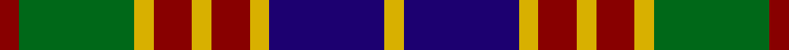

This page is one **sett** — a single exact thread-count. It belongs to the [tartan](/tartans/r1g6ly1r2ly1r2ly1db6ly1/)
(the same proportion at any scale), whose colour order is pattern [RGYRYRYBY](/stripes/rgyryryby/).

Sourced from tartans-authority.  It is a [9 stripe tartan](/stripes/stripes9/).

Original link http://www.tartansauthority.com/tartan-ferret/display/1558/

## Thread count
DR/8 G48 Y8 DR16 Y8 DR16 Y8 DB48 Y/8

## Palette

Palette: <strong>Tartan Register</strong>
<table><thead><tr><th>Colour</th><th>Threads</th><th>Shade</th><th>Base</th><th>OKLCh</th></tr></thead><tbody><tr><td>DR/</td><td style="text-align:right;font-variant-numeric:tabular-nums">8</td><td><code style="background-color:#880000;">#880000</code> <small style="color:#888">#880000</small></td><td>R <code style="background-color:#CC0000;">#CC0000</code></td><td><small style="color:#888">oklch(39.4% 0.162 29.2)</small></td></tr><tr><td>G</td><td style="text-align:right;font-variant-numeric:tabular-nums">48</td><td><code style="background-color:#006818;">#006818</code> <small style="color:#888">#006818</small></td><td>G <code style="background-color:#006100;">#006100</code></td><td><small style="color:#888">oklch(45.0% 0.142 145.0)</small></td></tr><tr><td>Y</td><td style="text-align:right;font-variant-numeric:tabular-nums">8</td><td><code style="background-color:#D8B000;">#D8B000</code> <small style="color:#888">#D8B000</small></td><td>Y <code style="background-color:#F2BF00;">#F2BF00</code></td><td><small style="color:#888">oklch(77.1% 0.158 92.3)</small></td></tr><tr><td>DR</td><td style="text-align:right;font-variant-numeric:tabular-nums">16</td><td><code style="background-color:#880000;">#880000</code> <small style="color:#888">#880000</small></td><td>R <code style="background-color:#CC0000;">#CC0000</code></td><td><small style="color:#888">oklch(39.4% 0.162 29.2)</small></td></tr><tr><td>Y</td><td style="text-align:right;font-variant-numeric:tabular-nums">8</td><td><code style="background-color:#D8B000;">#D8B000</code> <small style="color:#888">#D8B000</small></td><td>Y <code style="background-color:#F2BF00;">#F2BF00</code></td><td><small style="color:#888">oklch(77.1% 0.158 92.3)</small></td></tr><tr><td>DR</td><td style="text-align:right;font-variant-numeric:tabular-nums">16</td><td><code style="background-color:#880000;">#880000</code> <small style="color:#888">#880000</small></td><td>R <code style="background-color:#CC0000;">#CC0000</code></td><td><small style="color:#888">oklch(39.4% 0.162 29.2)</small></td></tr><tr><td>Y</td><td style="text-align:right;font-variant-numeric:tabular-nums">8</td><td><code style="background-color:#D8B000;">#D8B000</code> <small style="color:#888">#D8B000</small></td><td>Y <code style="background-color:#F2BF00;">#F2BF00</code></td><td><small style="color:#888">oklch(77.1% 0.158 92.3)</small></td></tr><tr><td>DB</td><td style="text-align:right;font-variant-numeric:tabular-nums">48</td><td><code style="background-color:#1C0070;">#1C0070</code> <small style="color:#888">#1C0070</small></td><td>B <code style="background-color:#2A418A;">#2A418A</code></td><td><small style="color:#888">oklch(26.3% 0.162 277.1)</small></td></tr><tr><td>Y/</td><td style="text-align:right;font-variant-numeric:tabular-nums">8</td><td><code style="background-color:#D8B000;">#D8B000</code> <small style="color:#888">#D8B000</small></td><td>Y <code style="background-color:#F2BF00;">#F2BF00</code></td><td><small style="color:#888">oklch(77.1% 0.158 92.3)</small></td></tr></tbody></table>

## Nearest tartans

The nearest existing variants by ΔTartan distance, with this tartan at the top so the swatches line up against it.

ΔTartan

Tartan

Sett

—

<a href="/ttd/edit/#slug=r1g6ly1r2ly1r2ly1db6ly1~x8">Stevenson (Name)</a> <a class="nn-out" href="/setts/s9/r1g6ly1r2ly1r2ly1db6ly1~x8/" title="open its dictionary page">↗</a>

0.91

<a href="/ttd/edit/#slug=r1g8ly1r2ly1r2ly1db8ly1~x4">Stevenson Family Tartan Tartan Number: 1558. Earliest known date: 1980 Charles Stevenson of Glasgow emigrated to America in 1861. The Monitoring Committee of the Scottish Tartans Society operated until 1984 when the present system of accreditation was introduced for the 'Register of All Publicly Known Tartans'. The original count has been proportionately increased from the 1980 recording. See products available Copyright © Blair Urquhart, Comrie, 2015</a> <a class="nn-out" href="/setts/s9/r1g8ly1r2ly1r2ly1db8ly1~x4/" title="open its dictionary page">↗</a>

0.94

<a href="/ttd/edit/#slug=ly6g3ly3g22k23dp23k4~x2">Gordon of Esslemont Family Tartan Tartan Number: 1064. Earliest known date: c.1830 This sett is called 'Gordon of Esslemont' according to Captain Wolrige-Gordon of Esslemont in recent research. It was previously listed as 'Ancient Gordon' before the story of its origin came to light. Apparently the Duke of Gordon was offered tartans with one, two, and three stripes when he applied to Forsythe of Huntly to provide kilts for his troops. He chose the single stripe and called in the Heads of the families to choose from the others. Esslemont took the three stripe version. See products available Copyright © Blair Urquhart, Comrie, 2015</a> <a class="nn-out" href="/setts/s7/ly6g3ly3g22k23dp23k4~x2/" title="open its dictionary page">↗</a>

1.04

<a href="/ttd/edit/#slug=r1g6ly1r2ly1r2ly1db6ly1~x2">Stevenson</a> <a class="nn-out" href="/setts/s9/r1g6ly1r2ly1r2ly1db6ly1~x2/" title="open its dictionary page">↗</a>

1.08

<a href="/ttd/edit/#slug=lb13k3lb3k3lb3k15dy18r3~x2">Holden Brown (Corporate)</a> <a class="nn-out" href="/setts/s8/lb13k3lb3k3lb3k15dy18r3~x2/" title="open its dictionary page">↗</a>

1.09

<a href="/ttd/edit/#slug=db11r2db2r4db15r2k15g15r4g2r2g11~x2">MacDonald 7</a> <a class="nn-out" href="/setts/s12/db11r2db2r4db15r2k15g15r4g2r2g11~x2/" title="open its dictionary page">↗</a>

1.11

<a href="/setts/s8/g6k1r1t2r2~x4/">Wilson's No.193</a>

1.12

<a href="/ttd/edit/#slug=db8r2db2r4db10r2k11g10r4g2r2g8~x2">MacDonald 2</a> <a class="nn-out" href="/setts/s12/db8r2db2r4db10r2k11g10r4g2r2g8~x2/" title="open its dictionary page">↗</a>

1.16

<a href="/ttd/edit/#slug=r33g17db50g17r11g17r9k7">Carnegie</a> <a class="nn-out" href="/setts/s8/r33g17db50g17r11g17r9k7/" title="open its dictionary page">↗</a>

1.17

<a href="/ttd/edit/#slug=r21r3r3r3r3db19g22lt3~x2">Akins Clan (Personal)</a> <a class="nn-out" href="/setts/s8/r21r3r3r3r3db19g22lt3~x2/" title="open its dictionary page">↗</a>

1.19

<a href="/ttd/edit/#slug=g6ly1r2ly1r2ly1db6ly1db6ly1r2ly1r2ly1g6r1~x8">Stevenson (Personal)</a> <a class="nn-out" href="/setts/s16/g6ly1r2ly1r2ly1db6ly1db6ly1r2ly1r2ly1g6r1~x8/" title="open its dictionary page">↗</a>

## Neighbour map

Every grey dot is one of 14299 variants placed by the first two principal components of the ΔTartan feature space (44% of its variance). Red is this tartan; blue dots are its nearest — click one to open its page.

<svg viewBox="0 0 640 380" role="img" style="max-width:100%;height:auto;border:1px solid #e0e0e0;border-radius:4px;display:block" xmlns="http://www.w3.org/2000/svg"><image href="/nn/cloud.v1.png" width="640" height="380"/><a href="/setts/s9/r1g8ly1r2ly1r2ly1db8ly1~x4/"><circle cx="158.0" cy="176.1" r="4" fill="#3465a4"><title>Stevenson Family Tartan Tartan Number: 1558. Earliest known date: 1980 Charles Stevenson of Glasgow emigrated to America in 1861. The Monitoring Committee of the Scottish Tartans Society operated until 1984 when the present system of accreditation was introduced for the 'Register of All Publicly Known Tartans'. The original count has been proportionately increased from the 1980 recording. See products available Copyright © Blair Urquhart, Comrie, 2015</title></circle></a><a href="/setts/s7/ly6g3ly3g22k23dp23k4~x2/"><circle cx="143.7" cy="210.8" r="4" fill="#3465a4"><title>Gordon of Esslemont Family Tartan Tartan Number: 1064. Earliest known date: c.1830 This sett is called 'Gordon of Esslemont' according to Captain Wolrige-Gordon of Esslemont in recent research. It was previously listed as 'Ancient Gordon' before the story of its origin came to light. Apparently the Duke of Gordon was offered tartans with one, two, and three stripes when he applied to Forsythe of Huntly to provide kilts for his troops. He chose the single stripe and called in the Heads of the families to choose from the others. Esslemont took the three stripe version. See products available Copyright © Blair Urquhart, Comrie, 2015</title></circle></a><a href="/setts/s9/r1g6ly1r2ly1r2ly1db6ly1~x2/"><circle cx="117.6" cy="193.6" r="4" fill="#3465a4"><title>Stevenson</title></circle></a><a href="/setts/s8/lb13k3lb3k3lb3k15dy18r3~x2/"><circle cx="133.0" cy="195.5" r="4" fill="#3465a4"><title>Holden Brown (Corporate)</title></circle></a><a href="/setts/s12/db11r2db2r4db15r2k15g15r4g2r2g11~x2/"><circle cx="129.2" cy="190.6" r="4" fill="#3465a4"><title>MacDonald 7</title></circle></a><a href="/setts/s8/g6k1r1t2r2~x4/"><circle cx="164.3" cy="218.3" r="4" fill="#3465a4"><title>Wilson's No.193</title></circle></a><a href="/setts/s12/db8r2db2r4db10r2k11g10r4g2r2g8~x2/"><circle cx="95.8" cy="211.3" r="4" fill="#3465a4"><title>MacDonald 2</title></circle></a><a href="/setts/s8/r33g17db50g17r11g17r9k7/"><circle cx="158.1" cy="221.0" r="4" fill="#3465a4"><title>Carnegie</title></circle></a><a href="/setts/s8/r21r3r3r3r3db19g22lt3~x2/"><circle cx="145.6" cy="181.3" r="4" fill="#3465a4"><title>Akins Clan (Personal)</title></circle></a><a href="/setts/s16/g6ly1r2ly1r2ly1db6ly1db6ly1r2ly1r2ly1g6r1~x8/"><circle cx="107.4" cy="177.9" r="4" fill="#3465a4"><title>Stevenson (Personal)</title></circle></a><circle cx="114.6" cy="197.4" r="5" fill="#c00000"/></svg>

ID: /setts/s9/r1g6ly1r2ly1r2ly1db6ly1~x8/
