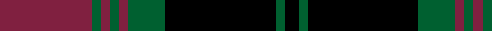

In pattern [KGKGRGRGR](/patterns/kgkgrgrgr/).

This was sourced from weddslist.  It is a [9 stripes tartan](/stripes/stripes9/).

Original link http://www.weddslist.com/cgi-bin/tartans/pg.pl?source=sts

## Thread count
DR/40 G4 DR4 G4 DR4 G16 K48 G4 K/6

## Palette
Each colour and its ΔE from the base-6 reference it is a variant of.

| Colour | Shade | Base | ΔE (OKLab) |
|---|---|---|---|
| DR | <code style="background-color:#802040;">#802040</code> `#802040` | R <code style="background-color:#CC0000;">#CC0000</code> | 0.17 |
| G | <code style="background-color:#006030;">#006030</code> `#006030` | G <code style="background-color:#006100;">#006100</code> | 0.04 |
| K | <code style="background-color:#000000;">#000000</code> `#000000` | K <code style="background-color:#000000;">#000000</code> | 0.00 |

## Nearest tartans

The nearest existing variants by ΔTartan distance.

1. [Douglas (WCWM)](/setts/s10/k2r24b24k2b2k2b3k14r2k2x2~b646464-k000000-r8c0000/) — ΔT 0.96
1. [Grady, Highlands](/setts/s9/k36r3b3r3k8b23r18g3r3x2~b304080-g008000-k000000-rc00000/) — ΔT 1.13
1. [Lunar](/setts/s11/k10r1k3b7ba1b1ba1b1ba1b1ba7x4~b3c2010-ba646464-k000000-r8c0000/) — ΔT 1.18
1. [Brown (Clan)](/setts/s8/b6r1b2r1b2k18r8g2x4~b1c1c50-g004800-k000000-rc80000/) — ΔT 1.25
1. [Brown](/setts/s8/b6r1b2r1b2k18r8g2x2~b304080-g008000-k000000-rc00000/) — ΔT 1.26
1. [Brown](/setts/s8/b6r1b2r1b2k18r8g2x4~b2c2c80-g004800-k000000-rc80000/) — ΔT 1.32
1. [Hume, or Home](/setts/s9/b3g3b20r2k2r2k20g3k3x2~b304080-g008000-k000000-rc00000/) — ΔT 1.39
1. [Unidentified #58](/setts/s9/r4k12w1g6r3k1r3w1r3x4~g004c00-k000000-r8c0000-wc8c8c8/) — ΔT 1.40
1. [Sonsub Corporate Tartan Tartan Number: 6984. Earliest known date: 2006 Corporate colours for Sonsub Ltd, Bridge of Don, Aberdeen. Sonsub is a well known provider of remote subsea systems technology, and provides services to the North Atlantic, Mediterranean, Africa, Caspian and Middle East. See products available Copyright © Blair Urquhart, Comrie, 2015](/setts/s10/k30ka5k19ka5k2b20y2b20ka5y4x2~b645858-k000000-ka101010-yc4bc68/) — ΔT 1.42
1. [Carlow Irish County Tartan Tartan Number: 2275. Earliest known date: 1996 One of a series of Irish District tartans designed by Polly Wittering of the House of Edgar, with colours reminiscent of the Country with soft warm colours dominating. See products available Copyright © Blair Urquhart, Comrie, 2015](/setts/s9/b20g2b2g2b2g8k24g2k3x2~b300438-g005c50-k000000/) — ΔT 1.43

## Neighbour map

Every grey dot is one of 15726 variants placed by the first two principal components of the ΔTartan feature space (44% of its variance). Red is this tartan; blue dots are its nearest — click one to open its page.

<svg viewBox="0 0 640 380" role="img" style="max-width:100%;height:auto;border:1px solid #e0e0e0;border-radius:4px;display:block" xmlns="http://www.w3.org/2000/svg"><image href="/nn/cloud.v1.png" width="640" height="380"/><a href="/setts/s10/k2r24b24k2b2k2b3k14r2k2x2~b646464-k000000-r8c0000/"><circle cx="246.7" cy="171.2" r="4" fill="#3465a4"><title>Douglas (WCWM)</title></circle></a><a href="/setts/s9/k36r3b3r3k8b23r18g3r3x2~b304080-g008000-k000000-rc00000/"><circle cx="229.9" cy="168.5" r="4" fill="#3465a4"><title>Grady, Highlands</title></circle></a><a href="/setts/s11/k10r1k3b7ba1b1ba1b1ba1b1ba7x4~b3c2010-ba646464-k000000-r8c0000/"><circle cx="212.0" cy="177.0" r="4" fill="#3465a4"><title>Lunar</title></circle></a><a href="/setts/s8/b6r1b2r1b2k18r8g2x4~b1c1c50-g004800-k000000-rc80000/"><circle cx="261.6" cy="159.0" r="4" fill="#3465a4"><title>Brown (Clan)</title></circle></a><a href="/setts/s8/b6r1b2r1b2k18r8g2x2~b304080-g008000-k000000-rc00000/"><circle cx="252.2" cy="154.9" r="4" fill="#3465a4"><title>Brown</title></circle></a><a href="/setts/s8/b6r1b2r1b2k18r8g2x4~b2c2c80-g004800-k000000-rc80000/"><circle cx="255.6" cy="156.0" r="4" fill="#3465a4"><title>Brown</title></circle></a><a href="/setts/s9/b3g3b20r2k2r2k20g3k3x2~b304080-g008000-k000000-rc00000/"><circle cx="234.7" cy="176.9" r="4" fill="#3465a4"><title>Hume, or Home</title></circle></a><a href="/setts/s9/r4k12w1g6r3k1r3w1r3x4~g004c00-k000000-r8c0000-wc8c8c8/"><circle cx="200.0" cy="178.5" r="4" fill="#3465a4"><title>Unidentified #58</title></circle></a><a href="/setts/s10/k30ka5k19ka5k2b20y2b20ka5y4x2~b645858-k000000-ka101010-yc4bc68/"><circle cx="234.8" cy="176.5" r="4" fill="#3465a4"><title>Sonsub Corporate Tartan Tartan Number: 6984. Earliest known date: 2006 Corporate colours for Sonsub Ltd, Bridge of Don, Aberdeen. Sonsub is a well known provider of remote subsea systems technology, and provides services to the North Atlantic, Mediterranean, Africa, Caspian and Middle East. See products available Copyright © Blair Urquhart, Comrie, 2015</title></circle></a><a href="/setts/s9/b20g2b2g2b2g8k24g2k3x2~b300438-g005c50-k000000/"><circle cx="292.5" cy="202.7" r="4" fill="#3465a4"><title>Carlow Irish County Tartan Tartan Number: 2275. Earliest known date: 1996 One of a series of Irish District tartans designed by Polly Wittering of the House of Edgar, with colours reminiscent of the Country with soft warm colours dominating. See products available Copyright © Blair Urquhart, Comrie, 2015</title></circle></a><circle cx="264.9" cy="184.7" r="5" fill="#c00000"/></svg>

ID: /setts/s9/r20g2r2g2r2g8k24g2k3x2~g006030-k000000-r802040/
