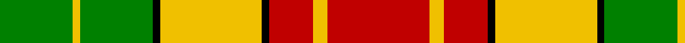

In pattern [GYGKYKRYR](/patterns/gygkykryr/).

This was sourced from weddslist.  It is a [9 stripes tartan](/stripes/stripes9/).

Original link http://www.weddslist.com/cgi-bin/tartans/pg.pl?source=sts

## Thread count
G/20 Y2 G20 K2 Y28 K2 R12 Y4 R/28

## Palette
Each colour and its ΔE from the base-6 reference it is a variant of.

| Colour | Shade | Base | ΔE (OKLab) |
|---|---|---|---|
| G | <code style="background-color:#008000;">#008000</code> `#008000` | G <code style="background-color:#006400;">#006400</code> | 0.09 |
| K | <code style="background-color:#000000;">#000000</code> `#000000` | K <code style="background-color:#000000;">#000000</code> | 0.00 |
| R | <code style="background-color:#C00000;">#C00000</code> `#C00000` | R <code style="background-color:#C80000;">#C80000</code> | 0.02 |
| Y | <code style="background-color:#F0C000;">#F0C000</code> `#F0C000` | Y <code style="background-color:#E8C000;">#E8C000</code> | 0.01 |

## Nearest tartans

The nearest existing variants by ΔTartan distance.

1. [Prince Charles Edward](/setts/s9/r48g12y16k8y16g48y8r12w4-g008000-k000000-rc00000-we0e0e0-yf0c000/) — ΔT 0.92
1. [Karibu (Corporate)](/setts/s9/g48w4r4w16r4w4r32y8r4-g006818-rc80000-wfcfcfc-ye8c000/) — ΔT 1.34
1. [Bannock Bane M.406](/setts/s8/g8ga6g42ga4w28r44ga6r8-g005020-ga604000-rbe7832-we0e0e0/) — ΔT 1.39
1. [Karibu Corporate Tartan Tartan Number: 10674. Earliest known date: 15 August 2012 The colours of the Karibu tartan are those of Karibu Scotland. Karibu (meaning 'welcome' in Swahili) was set-up in 2004 by Henriette Koubakouenda in her living room in Glasgow. She saw a need to provide support to the refugees and asylum seekers arriving in Glasgow at that time as part of the Asylum Seeker's Dispersal Programme. Karibu Scotland now has over 100 members, representing 12 African countries, with premises in the Pearce Institute in the Govan area of Glasgow. The organisation runs multiple projects throughout the city to promote the confidence, skills and integration of African women. See products available Copyright © Blair Urquhart, Comrie, 2015](/setts/s9/g48w4r4w16r4w4r32y8r4-g008b00-rff0000-wffffff-yffe600/) — ΔT 1.39
1. [Kinloch Anderson Check (Fashion)](/setts/s7/k6y36k24y36k4y4k6-k101010-ydc943c/) — ΔT 1.39
1. [Kinloch Anderson Check Fashion Tartan Tartan Number: 3003. Earliest known date: 2002 Designed by Douglas Kinloch Anderson for his Japanese & Korean markets. The use of the word 'Check' indicates that they regard it as a 'fashion tartan'. See products available Copyright © Blair Urquhart, Comrie, 2015](/setts/s12/k36y4k4y6k4y4k36y24ya36g6ya36y18-g604000-k101010-ydc943c-yae8c000/) — ΔT 1.40
1. [MacMillan, Society of Glasgow](/setts/s9/r32k6r32g88k6g16k6y40k8-g008000-k000000-rc00000-yf0c000/) — ΔT 1.40
1. [Bannockbane Orange Stripes](/setts/s8/b4y4b30y2w20ya30y4ya4-b441800-we0e0e0-yd87c00-yaa08858/) — ΔT 1.45
1. [MacMillan Society of Glasgow](/setts/s9/r32k6r32g88k6g16k6y40k8-g006818-k101010-rc80000-yd8b000/) — ΔT 1.45
1. [Dunblane](/setts/s12/g12y10w2g4w2g10w2g4w2r30b4w2-b304080-g008000-rc00000-we0e0e0-yf0c000/) — ΔT 1.55

## Neighbour map

Every grey dot is one of 15726 variants placed by the first two principal components of the ΔTartan feature space (44% of its variance). Red is this tartan; blue dots are its nearest — click one to open its page.

<svg viewBox="0 0 640 380" role="img" style="max-width:100%;height:auto;border:1px solid #e0e0e0;border-radius:4px;display:block" xmlns="http://www.w3.org/2000/svg"><image href="/nn/cloud.v1.png" width="640" height="380"/><a href="/setts/s9/r48g12y16k8y16g48y8r12w4-g008000-k000000-rc00000-we0e0e0-yf0c000/"><circle cx="152.0" cy="149.7" r="4" fill="#3465a4"><title>Prince Charles Edward</title></circle></a><a href="/setts/s9/g48w4r4w16r4w4r32y8r4-g006818-rc80000-wfcfcfc-ye8c000/"><circle cx="198.5" cy="142.1" r="4" fill="#3465a4"><title>Karibu (Corporate)</title></circle></a><a href="/setts/s8/g8ga6g42ga4w28r44ga6r8-g005020-ga604000-rbe7832-we0e0e0/"><circle cx="178.6" cy="178.4" r="4" fill="#3465a4"><title>Bannock Bane M.406</title></circle></a><a href="/setts/s9/g48w4r4w16r4w4r32y8r4-g008b00-rff0000-wffffff-yffe600/"><circle cx="197.5" cy="137.4" r="4" fill="#3465a4"><title>Karibu Corporate Tartan Tartan Number: 10674. Earliest known date: 15 August 2012 The colours of the Karibu tartan are those of Karibu Scotland. Karibu (meaning 'welcome' in Swahili) was set-up in 2004 by Henriette Koubakouenda in her living room in Glasgow. She saw a need to provide support to the refugees and asylum seekers arriving in Glasgow at that time as part of the Asylum Seeker's Dispersal Programme. Karibu Scotland now has over 100 members, representing 12 African countries, with premises in the Pearce Institute in the Govan area of Glasgow. The organisation runs multiple projects throughout the city to promote the confidence, skills and integration of African women. See products available Copyright © Blair Urquhart, Comrie, 2015</title></circle></a><a href="/setts/s7/k6y36k24y36k4y4k6-k101010-ydc943c/"><circle cx="160.3" cy="183.8" r="4" fill="#3465a4"><title>Kinloch Anderson Check (Fashion)</title></circle></a><a href="/setts/s12/k36y4k4y6k4y4k36y24ya36g6ya36y18-g604000-k101010-ydc943c-yae8c000/"><circle cx="147.3" cy="162.0" r="4" fill="#3465a4"><title>Kinloch Anderson Check Fashion Tartan Tartan Number: 3003. Earliest known date: 2002 Designed by Douglas Kinloch Anderson for his Japanese &amp; Korean markets. The use of the word 'Check' indicates that they regard it as a 'fashion tartan'. See products available Copyright © Blair Urquhart, Comrie, 2015</title></circle></a><a href="/setts/s9/r32k6r32g88k6g16k6y40k8-g008000-k000000-rc00000-yf0c000/"><circle cx="213.2" cy="150.6" r="4" fill="#3465a4"><title>MacMillan, Society of Glasgow</title></circle></a><a href="/setts/s8/b4y4b30y2w20ya30y4ya4-b441800-we0e0e0-yd87c00-yaa08858/"><circle cx="183.4" cy="152.4" r="4" fill="#3465a4"><title>Bannockbane Orange Stripes</title></circle></a><a href="/setts/s9/r32k6r32g88k6g16k6y40k8-g006818-k101010-rc80000-yd8b000/"><circle cx="235.3" cy="159.4" r="4" fill="#3465a4"><title>MacMillan Society of Glasgow</title></circle></a><a href="/setts/s12/g12y10w2g4w2g10w2g4w2r30b4w2-b304080-g008000-rc00000-we0e0e0-yf0c000/"><circle cx="176.6" cy="111.3" r="4" fill="#3465a4"><title>Dunblane</title></circle></a><circle cx="177.9" cy="163.2" r="5" fill="#c00000"/></svg>

ID: /setts/s9/r28y4r12k2y28k2g20y2g20-g008000-k000000-rc00000-yf0c000/
