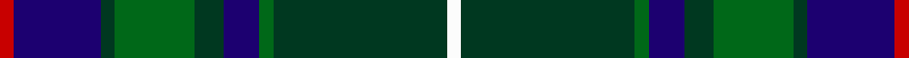

In pattern [RBGGGBGGW](/stripes/rbgggbggw/).

This was sourced from register-of-tartans.  It is a [9 stripe tartan](/stripes/stripes9/).

Original link https://www.tartanregister.gov.uk/tartanDetails.aspx?ref=1255

## Also known as

This cloth is also recorded under:

- Fraser Gathering, Green
- Fraser Gathering, hunting

## Attestations

This cloth appears in 4 source records; the oldest owns this page.

- 01/05/1997 — Fraser Gathering, Green (1997) (register-of-tartans, [record](https://www.tartanregister.gov.uk/tartanDetails.aspx?ref=1255))
- 1997 — Fraser Gathering, Green (Commem) (tartans-authority, [record](http://www.tartansauthority.com/tartan-ferret/display/2363/))
- undated — Fraser Gathering, hunting (weddslist, [record](http://www.weddslist.com/cgi-bin/tartans/pg.pl?source=sts))
- undated — Fraser Gathering Hunting Trade Tartan Tartan Number: 2363. Earliest known date: 1997 Unknown until House of Edgar published their own Old and Rare. See products available Copyright © Blair Urquhart, Comrie, 2015 (house-of-tartan, [record](http://www.house-of-tartan.scotland.net/house/TartanViewjs.asp?colr=Def&tnam=2363))

## Register references

External register numbers recorded for this tartan.

- Scottish Register of Tartans: [1255](https://www.tartanregister.gov.uk/tartanDetails.aspx?ref=1255)
- Scottish Tartans Authority (ITI): 2363
- Scottish Tartans World Register: 2363

## Thread count
R/4 DB24 DG4 G22 DG8 DB10 G4 DG48 W/4

## Palette
Each colour and the base-6 reference it is a variant of.

| Colour | Shade | Base |
|---|---|---|
| DB | <code style="background-color:#1C0070;">#1C0070</code> `oklch(26.3% 0.162 277.1)` <small>#1C0070</small> | B <code style="background-color:#2A418A;">#2A418A</code> |
| DG | <code style="background-color:#003820;">#003820</code> `oklch(30.0% 0.070 158.3)` <small>#003820</small> | G <code style="background-color:#006100;">#006100</code> |
| G | <code style="background-color:#006818;">#006818</code> `oklch(45.0% 0.142 145.0)` <small>#006818</small> | G <code style="background-color:#006100;">#006100</code> |
| R | <code style="background-color:#C80000;">#C80000</code> `oklch(52.3% 0.215 29.2)` <small>#C80000</small> | R <code style="background-color:#CC0000;">#CC0000</code> |
| W | <code style="background-color:#FCFCFC;">#FCFCFC</code> `oklch(99.1% 0.000 89.9)` <small>#FCFCFC</small> | W <code style="background-color:#F7F7F7;">#F7F7F7</code> |

## Nearest tartans

The nearest existing variants by ΔTartan distance.

1. [Scottish Chamber Orchestra, The](/setts/s9/lt3dt20k3dt2k5dt2k3y15r2~x2/) — ΔT 0.69
1. [Guelph, City Of](/setts/s8/g12k1g2r1g2k10db10lo1~x4/) — ΔT 0.72
1. [Maitland Chief](/setts/s9/g5db24g7k10g24ly2db2ly2r2~x2/) — ΔT 0.73
1. [Scott #2](/setts/s10/dg8w1dg1r1dg4k4db8k1db1k1~x2/) — ΔT 0.83
1. [MacThomas Clan Tartan Tartan Number: 407. Earliest known date: 1975 Designed by David Thomas - former director of the Strathmore Woollen Co. in Forfar who still (in 2011) weave this tartan. Adopted by Clan Society in 1975, and registered with Lord Lyon in 1979. See products available Copyright © Blair Urquhart, Comrie, 2015](/setts/s7/db3m2db22k11g24lp2g3~x2/) — ΔT 0.87
1. [Sverker](/setts/s10/w2n4dy3dt3dy3dt20dy3n16dt8lt2~x2/) — ΔT 0.88
1. [Scottish Rugby Union (City of Nagasaki)](/setts/s11/g6k2g24k10dt2p2dt2p2dt10k2lb3~x2/) — ΔT 0.92
1. [Peter of Lee (Chief) (Personal)](/setts/s8/r4dg4k2dg29db21k3db3ly3~x2/) — ΔT 0.95
1. [Manroth (Personal)](/setts/s9/dg15db20k2r4k2db20dg15k2ly2~x2/) — ΔT 0.97
1. [McFadden (Personal)](/setts/s8/db18dp2db16k13g3k2g42lo3~x2/) — ΔT 1.03

## Neighbour map

Every grey dot is one of 14299 variants placed by the first two principal components of the ΔTartan feature space (44% of its variance). Red is this tartan; blue dots are its nearest — click one to open its page.

<svg viewBox="0 0 640 380" role="img" style="max-width:100%;height:auto;border:1px solid #e0e0e0;border-radius:4px;display:block" xmlns="http://www.w3.org/2000/svg"><image href="/nn/cloud.v1.png" width="640" height="380"/><a href="/setts/s9/lt3dt20k3dt2k5dt2k3y15r2~x2/"><circle cx="221.5" cy="177.9" r="4" fill="#3465a4"><title>Scottish Chamber Orchestra, The</title></circle></a><a href="/setts/s8/g12k1g2r1g2k10db10lo1~x4/"><circle cx="220.1" cy="187.8" r="4" fill="#3465a4"><title>Guelph, City Of</title></circle></a><a href="/setts/s9/g5db24g7k10g24ly2db2ly2r2~x2/"><circle cx="241.8" cy="173.1" r="4" fill="#3465a4"><title>Maitland Chief</title></circle></a><a href="/setts/s10/dg8w1dg1r1dg4k4db8k1db1k1~x2/"><circle cx="221.3" cy="198.9" r="4" fill="#3465a4"><title>Scott #2</title></circle></a><a href="/setts/s7/db3m2db22k11g24lp2g3~x2/"><circle cx="233.8" cy="194.8" r="4" fill="#3465a4"><title>MacThomas Clan Tartan Tartan Number: 407. Earliest known date: 1975 Designed by David Thomas - former director of the Strathmore Woollen Co. in Forfar who still (in 2011) weave this tartan. Adopted by Clan Society in 1975, and registered with Lord Lyon in 1979. See products available Copyright © Blair Urquhart, Comrie, 2015</title></circle></a><a href="/setts/s10/w2n4dy3dt3dy3dt20dy3n16dt8lt2~x2/"><circle cx="255.6" cy="183.7" r="4" fill="#3465a4"><title>Sverker</title></circle></a><a href="/setts/s11/g6k2g24k10dt2p2dt2p2dt10k2lb3~x2/"><circle cx="235.3" cy="160.4" r="4" fill="#3465a4"><title>Scottish Rugby Union (City of Nagasaki)</title></circle></a><a href="/setts/s8/r4dg4k2dg29db21k3db3ly3~x2/"><circle cx="297.6" cy="176.4" r="4" fill="#3465a4"><title>Peter of Lee (Chief) (Personal)</title></circle></a><a href="/setts/s9/dg15db20k2r4k2db20dg15k2ly2~x2/"><circle cx="270.6" cy="202.7" r="4" fill="#3465a4"><title>Manroth (Personal)</title></circle></a><a href="/setts/s8/db18dp2db16k13g3k2g42lo3~x2/"><circle cx="270.5" cy="160.1" r="4" fill="#3465a4"><title>McFadden (Personal)</title></circle></a><circle cx="251.2" cy="183.0" r="5" fill="#c00000"/></svg>

ID: /setts/s9/r2db12dg2g11dg4db5g2dg24w2~x2/
