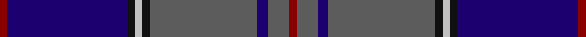

This page is one **sett** — a single exact thread-count. It belongs to the [tartan](/tartans/r2db34k2lb2k2n30db3n6r2/)
(the same proportion at any scale), whose colour order is pattern [RBBBKWKBR](/stripes/rbbbkwkbr/).

Sourced from register-of-tartans.  It is a [9 stripe tartan](/stripes/stripes9/).

Original link https://www.tartanregister.gov.uk/tartanDetails.aspx?ref=4524

## Register references

External register numbers recorded for this tartan.

- Scottish Register of Tartans: [4524](https://www.tartanregister.gov.uk/tartanDetails.aspx?ref=4524)
- Scottish Tartans Authority (ITI): 4307

## Thread count
DR/4 DB68 K4 Na4 K4 N60 DB6 N12 DR/4

## Palette

Palette: <strong>Tartan Register</strong> <small style="color:#888">(4 of 5 colours)</small>
<table><thead><tr><th>Colour</th><th>Threads</th><th>Shade</th><th>Base</th><th>OKLCh</th></tr></thead><tbody><tr><td>DR/</td><td style="text-align:right;font-variant-numeric:tabular-nums">4</td><td><code style="background-color:#880000;">#880000</code> <small style="color:#888">#880000</small></td><td>R <code style="background-color:#CC0000;">#CC0000</code></td><td><small style="color:#888">oklch(39.4% 0.162 29.2)</small></td></tr><tr><td>DB</td><td style="text-align:right;font-variant-numeric:tabular-nums">68</td><td><code style="background-color:#1C0070;">#1C0070</code> <small style="color:#888">#1C0070</small></td><td>B <code style="background-color:#2A418A;">#2A418A</code></td><td><small style="color:#888">oklch(26.3% 0.162 277.1)</small></td></tr><tr><td>K</td><td style="text-align:right;font-variant-numeric:tabular-nums">4</td><td><code style="background-color:#101010;">#101010</code> <small style="color:#888">#101010</small></td><td>K <code style="background-color:#000000;">#000000</code></td><td><small style="color:#888">oklch(17.3% 0.000 89.9)</small></td></tr><tr><td>Na</td><td style="text-align:right;font-variant-numeric:tabular-nums">4</td><td><code style="background-color:#C0C0C0;">#C0C0C0</code> <small style="color:#888">#C0C0C0</small></td><td>W <code style="background-color:#F7F7F7;">#F7F7F7</code></td><td><small style="color:#888">oklch(80.8% 0.000 89.9)</small></td></tr><tr><td>K</td><td style="text-align:right;font-variant-numeric:tabular-nums">4</td><td><code style="background-color:#101010;">#101010</code> <small style="color:#888">#101010</small></td><td>K <code style="background-color:#000000;">#000000</code></td><td><small style="color:#888">oklch(17.3% 0.000 89.9)</small></td></tr><tr><td>N</td><td style="text-align:right;font-variant-numeric:tabular-nums">60</td><td><code style="background-color:#5C5C5C;">#5C5C5C</code> <small style="color:#888">#5C5C5C</small></td><td>B <code style="background-color:#2A418A;">#2A418A</code></td><td><small style="color:#888">oklch(47.5% 0.000 89.9)</small></td></tr><tr><td>DB</td><td style="text-align:right;font-variant-numeric:tabular-nums">6</td><td><code style="background-color:#1C0070;">#1C0070</code> <small style="color:#888">#1C0070</small></td><td>B <code style="background-color:#2A418A;">#2A418A</code></td><td><small style="color:#888">oklch(26.3% 0.162 277.1)</small></td></tr><tr><td>N</td><td style="text-align:right;font-variant-numeric:tabular-nums">12</td><td><code style="background-color:#5C5C5C;">#5C5C5C</code> <small style="color:#888">#5C5C5C</small></td><td>B <code style="background-color:#2A418A;">#2A418A</code></td><td><small style="color:#888">oklch(47.5% 0.000 89.9)</small></td></tr><tr><td>DR/</td><td style="text-align:right;font-variant-numeric:tabular-nums">4</td><td><code style="background-color:#880000;">#880000</code> <small style="color:#888">#880000</small></td><td>R <code style="background-color:#CC0000;">#CC0000</code></td><td><small style="color:#888">oklch(39.4% 0.162 29.2)</small></td></tr></tbody></table>

## Nearest tartans

The nearest existing variants by ΔTartan distance, with this tartan at the top so the swatches line up against it.

ΔTartan

Tartan

Sett

—

<a href="/ttd/edit/#slug=r2db34k2lb2k2n30db3n6r2~x2">Wcwm 1475-2</a> <a class="nn-out" href="/setts/s9/r2db34k2lb2k2n30db3n6r2~x2/" title="open its dictionary page">↗</a>

1.20

<a href="/ttd/edit/#slug=k8ly1k1db28k12dg2k1t2~x2">Hope-Weir/Weir</a> <a class="nn-out" href="/setts/s8/k8ly1k1db28k12dg2k1t2~x2/" title="open its dictionary page">↗</a>

1.23

<a href="/ttd/edit/#slug=r2k3db42k3ly2k3g22k3r2~x2">Strachan (Name)</a> <a class="nn-out" href="/setts/s9/r2k3db42k3ly2k3g22k3r2~x2/" title="open its dictionary page">↗</a>

1.24

<a href="/ttd/edit/#slug=k7lo3db62o16g5o5g5o5g16db16k4">Polkemmet (Corporate)</a> <a class="nn-out" href="/setts/s11/k7lo3db62o16g5o5g5o5g16db16k4/" title="open its dictionary page">↗</a>

1.25

<a href="/ttd/edit/#slug=db8r2db33dt15g12lo2g2r2~x2">Moray Council</a> <a class="nn-out" href="/setts/s8/db8r2db33dt15g12lo2g2r2~x2/" title="open its dictionary page">↗</a>

1.27

<a href="/ttd/edit/#slug=db26db3db1m2db1db3db3db12g14db2w2~x2">Royal Highland Yacht Club (Corporate</a> <a class="nn-out" href="/setts/s11/db26db3db1m2db1db3db3db12g14db2w2~x2/" title="open its dictionary page">↗</a>

1.30

<a href="/ttd/edit/#slug=k8r4k36db48r6g3lo2~x2">Royal Marines Condor</a> <a class="nn-out" href="/setts/s7/k8r4k36db48r6g3lo2~x2/" title="open its dictionary page">↗</a>

1.30

<a href="/ttd/edit/#slug=dp4db5dp3db50k15g3k5g32w2g3">Spirit of Morningside (Fashion)</a> <a class="nn-out" href="/setts/s10/dp4db5dp3db50k15g3k5g32w2g3/" title="open its dictionary page">↗</a>

1.31

<a href="/ttd/edit/#slug=r3dt4w2dt33db32dt2r4w3">BABC</a> <a class="nn-out" href="/setts/s8/r3dt4w2dt33db32dt2r4w3/" title="open its dictionary page">↗</a>

1.31

<a href="/ttd/edit/#slug=r3dt4w2dt33db32dt2r4w3~x2">B.A.B.C. (Corporate)</a> <a class="nn-out" href="/setts/s8/r3dt4w2dt33db32dt2r4w3~x2/" title="open its dictionary page">↗</a>

1.31

<a href="/ttd/edit/#slug=w2r3db12db3db3db28r3db3ly2~x2">Royal Scottish Corporation</a> <a class="nn-out" href="/setts/s9/w2r3db12db3db3db28r3db3ly2~x2/" title="open its dictionary page">↗</a>

## Neighbour map

Every grey dot is one of 14299 variants placed by the first two principal components of the ΔTartan feature space (44% of its variance). Red is this tartan; blue dots are its nearest — click one to open its page.

<svg viewBox="0 0 640 380" role="img" style="max-width:100%;height:auto;border:1px solid #e0e0e0;border-radius:4px;display:block" xmlns="http://www.w3.org/2000/svg"><image href="/nn/cloud.v1.png" width="640" height="380"/><a href="/setts/s8/k8ly1k1db28k12dg2k1t2~x2/"><circle cx="370.7" cy="149.7" r="4" fill="#3465a4"><title>Hope-Weir/Weir</title></circle></a><a href="/setts/s9/r2k3db42k3ly2k3g22k3r2~x2/"><circle cx="322.3" cy="132.5" r="4" fill="#3465a4"><title>Strachan (Name)</title></circle></a><a href="/setts/s11/k7lo3db62o16g5o5g5o5g16db16k4/"><circle cx="323.1" cy="135.9" r="4" fill="#3465a4"><title>Polkemmet (Corporate)</title></circle></a><a href="/setts/s8/db8r2db33dt15g12lo2g2r2~x2/"><circle cx="326.9" cy="180.8" r="4" fill="#3465a4"><title>Moray Council</title></circle></a><a href="/setts/s11/db26db3db1m2db1db3db3db12g14db2w2~x2/"><circle cx="315.7" cy="142.0" r="4" fill="#3465a4"><title>Royal Highland Yacht Club (Corporate</title></circle></a><a href="/setts/s7/k8r4k36db48r6g3lo2~x2/"><circle cx="320.8" cy="163.4" r="4" fill="#3465a4"><title>Royal Marines Condor</title></circle></a><a href="/setts/s10/dp4db5dp3db50k15g3k5g32w2g3/"><circle cx="293.4" cy="135.4" r="4" fill="#3465a4"><title>Spirit of Morningside (Fashion)</title></circle></a><a href="/setts/s8/r3dt4w2dt33db32dt2r4w3/"><circle cx="325.8" cy="177.6" r="4" fill="#3465a4"><title>BABC</title></circle></a><a href="/setts/s8/r3dt4w2dt33db32dt2r4w3~x2/"><circle cx="325.8" cy="177.6" r="4" fill="#3465a4"><title>B.A.B.C. (Corporate)</title></circle></a><a href="/setts/s9/w2r3db12db3db3db28r3db3ly2~x2/"><circle cx="341.6" cy="156.1" r="4" fill="#3465a4"><title>Royal Scottish Corporation</title></circle></a><circle cx="317.9" cy="151.2" r="5" fill="#c00000"/></svg>

ID: /setts/s9/r2db34k2lb2k2n30db3n6r2~x2/
