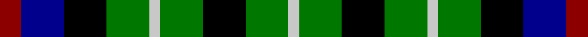

This page is one **sett** — a single exact thread-count. It belongs to the [tartan](/tartans/dr2db4k4g4n1g4k4g4n1/)
(the same proportion at any scale), whose colour order is pattern [RBKGWGKGW](/stripes/rbkgwgkgw/).

Sourced from register-of-tartans.  It is a [9 stripe tartan](/stripes/stripes9/).

Original link https://www.tartanregister.gov.uk/tartanDetails.aspx?ref=119

## Register references

External register numbers recorded for this tartan.

- Scottish Register of Tartans: [119](https://www.tartanregister.gov.uk/tartanDetails.aspx?ref=119)
- Scottish Tartans Authority (ITI): 1365
- Scottish Tartans World Register: 1365

## Thread count
DR/8 DB16 K16 G16 N4 G16 K16 G16 N/4

## Palette
Each colour and the base-6 reference it is a variant of.

| Colour | Shade | Base |
|---|---|---|
| B | <code style="background-color:#788CB4;">#788CB4</code> `oklch(63.9% 0.065 264.0)` <small>#788CB4</small> | B <code style="background-color:#2A418A;">#2A418A</code> |
| DB | <code style="background-color:#00008C;">#00008C</code> `oklch(28.9% 0.200 264.1)` <small>#00008C</small> | B <code style="background-color:#2A418A;">#2A418A</code> |
| DR | <code style="background-color:#8C0000;">#8C0000</code> `oklch(40.2% 0.165 29.2)` <small>#8C0000</small> | R <code style="background-color:#CC0000;">#CC0000</code> |
| DY | <code style="background-color:#C88C00;">#C88C00</code> `oklch(68.2% 0.142 78.2)` <small>#C88C00</small> | Y <code style="background-color:#F2BF00;">#F2BF00</code> |
| G | <code style="background-color:#007800;">#007800</code> `oklch(49.6% 0.169 142.5)` <small>#007800</small> | G <code style="background-color:#006100;">#006100</code> |
| K | <code style="background-color:#000000;">#000000</code> `oklch(0.0% 0.000 0.0)` <small>#000000</small> | K <code style="background-color:#000000;">#000000</code> |
| N | <code style="background-color:#C8C8C8;">#C8C8C8</code> `oklch(83.3% 0.000 89.9)` <small>#C8C8C8</small> | W <code style="background-color:#F7F7F7;">#F7F7F7</code> |
| P | <code style="background-color:#64008C;">#64008C</code> `oklch(38.5% 0.193 311.3)` <small>#64008C</small> | B <code style="background-color:#2A418A;">#2A418A</code> |

## Nearest tartans

The nearest existing variants by ΔTartan distance, with this tartan at the top so the swatches line up against it.

ΔTartan

Tartan

Sett

—

<a href="/ttd/edit/#slug=r2db4k4g4lb1g4k4g4lb1~x4">Arrol</a> <a class="nn-out" href="/setts/s9/r2db4k4g4lb1g4k4g4lb1~x4/" title="open its dictionary page">↗</a>

1.08

<a href="/ttd/edit/#slug=k4g4w1g4k4db4k1db4k4g4w1~x2">Graham of Montrose</a> <a class="nn-out" href="/setts/s11/k4g4w1g4k4db4k1db4k4g4w1~x2/" title="open its dictionary page">↗</a>

1.12

<a href="/ttd/edit/#slug=k4g4w1g4k4db4k1~x4">Graham of Montrose</a> <a class="nn-out" href="/setts/s7/k4g4w1g4k4db4k1~x4/" title="open its dictionary page">↗</a>

1.14

<a href="/ttd/edit/#slug=k4g4ly1g4k4db4k1~x2">MacKay, Coat</a> <a class="nn-out" href="/setts/s7/k4g4ly1g4k4db4k1~x2/" title="open its dictionary page">↗</a>

1.14

<a href="/ttd/edit/#slug=k4g4k1g4k4db4ly1~x2">Unnamed, No 39</a> <a class="nn-out" href="/setts/s7/k4g4k1g4k4db4ly1~x2/" title="open its dictionary page">↗</a>

1.16

<a href="/ttd/edit/#slug=k6g6w1g6k6p6g1~x4">Wilson's, No 233</a> <a class="nn-out" href="/setts/s7/k6g6w1g6k6p6g1~x4/" title="open its dictionary page">↗</a>

1.21

<a href="/ttd/edit/#slug=r5db15k15g15w2g15k15g15w2~x2">Arrol</a> <a class="nn-out" href="/setts/s9/r5db15k15g15w2g15k15g15w2~x2/" title="open its dictionary page">↗</a>

1.24

<a href="/ttd/edit/#slug=k1db3k3g3r1g3k3g1r1~x2">Unnamed, No 30</a> <a class="nn-out" href="/setts/s9/k1db3k3g3r1g3k3g1r1~x2/" title="open its dictionary page">↗</a>

1.28

<a href="/ttd/edit/#slug=k12g12w2g12k12p12r3~x2">Wilson's, No 120</a> <a class="nn-out" href="/setts/s7/k12g12w2g12k12p12r3~x2/" title="open its dictionary page">↗</a>

1.31

<a href="/ttd/edit/#slug=db4g6w1g6k6db6k2~x4">MacNeil of Colonsay</a> <a class="nn-out" href="/setts/s7/db4g6w1g6k6db6k2~x4/" title="open its dictionary page">↗</a>

1.31

<a href="/ttd/edit/#slug=dg3db9dg3k4dg8ly2db2ly2r2">Maitland</a> <a class="nn-out" href="/setts/s9/dg3db9dg3k4dg8ly2db2ly2r2/" title="open its dictionary page">↗</a>

## Neighbour map

Every grey dot is one of 14299 variants placed by the first two principal components of the ΔTartan feature space (44% of its variance). Red is this tartan; blue dots are its nearest — click one to open its page.

<svg viewBox="0 0 640 380" role="img" style="max-width:100%;height:auto;border:1px solid #e0e0e0;border-radius:4px;display:block" xmlns="http://www.w3.org/2000/svg"><image href="/nn/cloud.v1.png" width="640" height="380"/><a href="/setts/s11/k4g4w1g4k4db4k1db4k4g4w1~x2/"><circle cx="77.2" cy="257.5" r="4" fill="#3465a4"><title>Graham of Montrose</title></circle></a><a href="/setts/s7/k4g4w1g4k4db4k1~x4/"><circle cx="109.3" cy="276.7" r="4" fill="#3465a4"><title>Graham of Montrose</title></circle></a><a href="/setts/s7/k4g4ly1g4k4db4k1~x2/"><circle cx="110.9" cy="277.3" r="4" fill="#3465a4"><title>MacKay, Coat</title></circle></a><a href="/setts/s7/k4g4k1g4k4db4ly1~x2/"><circle cx="110.9" cy="277.3" r="4" fill="#3465a4"><title>Unnamed, No 39</title></circle></a><a href="/setts/s7/k6g6w1g6k6p6g1~x4/"><circle cx="99.6" cy="233.3" r="4" fill="#3465a4"><title>Wilson's, No 233</title></circle></a><a href="/setts/s9/r5db15k15g15w2g15k15g15w2~x2/"><circle cx="132.3" cy="214.6" r="4" fill="#3465a4"><title>Arrol</title></circle></a><a href="/setts/s9/k1db3k3g3r1g3k3g1r1~x2/"><circle cx="82.9" cy="269.2" r="4" fill="#3465a4"><title>Unnamed, No 30</title></circle></a><a href="/setts/s7/k12g12w2g12k12p12r3~x2/"><circle cx="92.8" cy="235.6" r="4" fill="#3465a4"><title>Wilson's, No 120</title></circle></a><a href="/setts/s7/db4g6w1g6k6db6k2~x4/"><circle cx="119.9" cy="261.1" r="4" fill="#3465a4"><title>MacNeil of Colonsay</title></circle></a><a href="/setts/s9/dg3db9dg3k4dg8ly2db2ly2r2/"><circle cx="109.3" cy="221.6" r="4" fill="#3465a4"><title>Maitland</title></circle></a><circle cx="76.8" cy="250.3" r="5" fill="#c00000"/></svg>

ID: /setts/s9/r2db4k4g4lb1g4k4g4lb1~x4/
