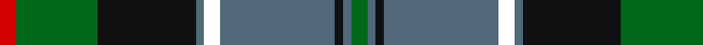

**Bands:** [RGKBKBKBG](/stripes/rgkbkbkbg/) · **Stripes:** [R G K N K N K N G](/stripes/stripes9/) R G K N K N K N G

This was sourced from house-of-tartan.  It is a [9 band tartan](/bands/bands9/).

Original link http://www.house-of-tartan.scotland.net/house/TartanViewjs.asp?colr=Def&tnam=7667

## Thread count
R/4 G20 K24 N2 YY4 N28 K2 N2 G/4

## Palette
Each colour and its ΔE from the base-6 reference it is a variant of.

| Colour | Shade | Base | ΔE (OKLab) |
|---|---|---|---|
| B | <code style="background-color:#1870A4;">#1870A4</code> `#1870A4` | B <code style="background-color:#2A418A;">#2A418A</code> | 0.13 |
| G | <code style="background-color:#006818;">#006818</code> `#006818` | G <code style="background-color:#006100;">#006100</code> | 0.02 |
| K | <code style="background-color:#101010;">#101010</code> `#101010` | K <code style="background-color:#000000;">#000000</code> | 0.17 |
| N | <code style="background-color:#506878;">#506878</code> `#506878` | B <code style="background-color:#2A418A;">#2A418A</code> | 0.14 |
| R | <code style="background-color:#D40000;">#D40000</code> `#D40000` | R <code style="background-color:#CC0000;">#CC0000</code> | 0.02 |

## Nearest tartans

The nearest existing variants by ΔTartan distance.

1. [McWilliams Wedding (Personal)](/setts/s9/r2g10k12n1ly2n14k1n1g2~x2/) — ΔT 0.43
1. [Tait #1](/setts/s8/r5k2db19g4k19g28k2ly5~x2/) — ΔT 0.70
1. [Rhun (Fashion)](/setts/s7/r12db68w7k39g75r6g6/) — ΔT 0.71
1. [Cameron of Erracht (Clan)](/setts/s11/g8r1g1r3g16k16r1db16r3db8ly2~x2/) — ΔT 0.81
1. [New Zealand (2003)](/setts/s10/k3db9k2lo5db1lo5k2dg15k1r3~x2/) — ΔT 0.85
1. [Griffiths of Llangynin (Personal)](/setts/s10/dg40k8r4k4r8k4r4k8db40ly3~x2/) — ΔT 0.85
1. [MacDonell of Glengarry #3](/setts/s11/db16r5db30r2k33g30r5g2r2g7w4/) — ΔT 0.85
1. [Guelph, City Of](/setts/s8/g12k1g2r1g2k10db10lo1~x4/) — ΔT 0.86
1. [Dunbartonshire](/setts/s9/g11k2g1m4db1m4db13lt2db1~x4/) — ΔT 0.88
1. [Ofally, County](/setts/s10/r6db2g5db18g10db2k28db2g10lo3~x2/) — ΔT 0.91

## Neighbour map

Every grey dot is one of 14299 variants placed by the first two principal components of the ΔTartan feature space (44% of its variance). Red is this tartan; blue dots are its nearest — click one to open its page.

<svg viewBox="0 0 640 380" role="img" style="max-width:100%;height:auto;border:1px solid #e0e0e0;border-radius:4px;display:block" xmlns="http://www.w3.org/2000/svg"><image href="/nn/cloud.v1.png" width="640" height="380"/><a href="/setts/s9/r2g10k12n1ly2n14k1n1g2~x2/"><circle cx="191.3" cy="160.0" r="4" fill="#3465a4"><title>McWilliams Wedding (Personal)</title></circle></a><a href="/setts/s8/r5k2db19g4k19g28k2ly5~x2/"><circle cx="184.4" cy="172.1" r="4" fill="#3465a4"><title>Tait #1</title></circle></a><a href="/setts/s7/r12db68w7k39g75r6g6/"><circle cx="196.9" cy="183.3" r="4" fill="#3465a4"><title>Rhun (Fashion)</title></circle></a><a href="/setts/s11/g8r1g1r3g16k16r1db16r3db8ly2~x2/"><circle cx="175.1" cy="156.4" r="4" fill="#3465a4"><title>Cameron of Erracht (Clan)</title></circle></a><a href="/setts/s10/k3db9k2lo5db1lo5k2dg15k1r3~x2/"><circle cx="162.3" cy="159.3" r="4" fill="#3465a4"><title>New Zealand (2003)</title></circle></a><a href="/setts/s10/dg40k8r4k4r8k4r4k8db40ly3~x2/"><circle cx="194.0" cy="154.0" r="4" fill="#3465a4"><title>Griffiths of Llangynin (Personal)</title></circle></a><a href="/setts/s11/db16r5db30r2k33g30r5g2r2g7w4/"><circle cx="182.0" cy="150.1" r="4" fill="#3465a4"><title>MacDonell of Glengarry #3</title></circle></a><a href="/setts/s8/g12k1g2r1g2k10db10lo1~x4/"><circle cx="220.1" cy="187.8" r="4" fill="#3465a4"><title>Guelph, City Of</title></circle></a><a href="/setts/s9/g11k2g1m4db1m4db13lt2db1~x4/"><circle cx="195.6" cy="161.6" r="4" fill="#3465a4"><title>Dunbartonshire</title></circle></a><a href="/setts/s10/r6db2g5db18g10db2k28db2g10lo3~x2/"><circle cx="171.8" cy="163.9" r="4" fill="#3465a4"><title>Ofally, County</title></circle></a><circle cx="199.7" cy="166.4" r="5" fill="#c00000"/></svg>

ID: /setts/s9/r2g10k12n1k2n14k1n1g2~x2/
