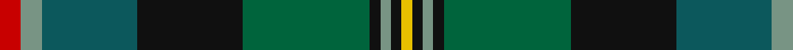

In pattern [RGBKGKGKY](/patterns/rgbkgkgky/).

This was sourced from register-of-tartans.  It is a [9 stripes tartan](/stripes/stripes9/).

Original link https://www.tartanregister.gov.uk/tartanDetails.aspx?ref=4144

## Attestations

This cloth appears in 2 source records; the oldest owns this page.

- 01/01/1997 — Trades House (register-of-tartans, [record](https://www.tartanregister.gov.uk/tartanDetails.aspx?ref=4144))
- 1997 — Trades House (Corporate) (tartans-authority, [record](http://www.tartansauthority.com/tartan-ferret/display/4036/))

## Thread count
R/8 LG8 G36 K40 Ga48 K4 LG4 K4 Y/4

## Palette
Each colour and its ΔE from the base-6 reference it is a variant of.

| Colour | Shade | Base | ΔE (OKLab) |
|---|---|---|---|
| G | <code style="background-color:#0C585C;">#0C585C</code> `#0C585C` | B <code style="background-color:#2A418A;">#2A418A</code> | 0.12 |
| Ga | <code style="background-color:#00643C;">#00643C</code> `#00643C` | G <code style="background-color:#006100;">#006100</code> | 0.05 |
| K | <code style="background-color:#101010;">#101010</code> `#101010` | K <code style="background-color:#000000;">#000000</code> | 0.17 |
| LG | <code style="background-color:#789484;">#789484</code> `#789484` | G <code style="background-color:#006100;">#006100</code> | 0.24 |
| R | <code style="background-color:#C80000;">#C80000</code> `#C80000` | R <code style="background-color:#CC0000;">#CC0000</code> | 0.01 |
| Y | <code style="background-color:#E8C000;">#E8C000</code> `#E8C000` | Y <code style="background-color:#F2BF00;">#F2BF00</code> | 0.02 |

## Nearest tartans

The nearest existing variants by ΔTartan distance.

1. [Whitson (Name)](/setts/s9/w4k1g19y1k19b13r2b4r2x4~b0c585c-g3c6040-k101010-r880000-wc0c0c0-yd09800/) — ΔT 0.77
1. [Big Rory (Corporate)](/setts/s10/b10w5b48k35g5k5g35r5g5ba5~b2c607c-ba780078-g006818-k101010-rc80000-we0e0e0/) — ΔT 0.81
1. [Loch Freuchie (District)](/setts/s10/r3b3k2b18y2k25g20r2g3w3x2~b003c64-g006818-k101010-rc80000-w98c8e8-yfccc00/) — ΔT 0.81
1. [Ithilien Heather (Personal)](/setts/s9/g20r2ga3b12k20r2ba3b4ba3x2~b003c64-ba5c8ca8-g408060-ga5c6428-k101010-re87878/) — ΔT 0.82
1. [Loch Freuchie](/setts/s10/b3g3r2g20k25y2ba13k2ba3r3x2~b4a708b-ba2c4e75-g124d36-k101010-rff0000-yf0da0f/) — ΔT 0.87
1. [Rutledge (Name)](/setts/s10/k3b10k2w1k2g10k2ga10r1ga2x4~b1c1c50-g289c18-ga003820-k101010-rc80000-we0e0e0/) — ΔT 0.94
1. [Wojtek Memorial Trust](/setts/s11/w3b15r6b3r3b4g11ga3g3ga28y3x2~b202060-g003820-ga005020-rdc0000-wffffff-ya08858/) — ΔT 0.95
1. [Ayrton (amended)](/setts/s11/r4k2g25k2b10k2g4k2ba25k2y4x2~b3c82af-ba2c4084-g005020-k101010-rdc0000-ye8c000/) — ΔT 0.99
1. [Chinzei Keiai School](/setts/s9/r3ra3b16k2b2g16r3g2w2x2~b14283c-g006818-k101010-r880000-rab468ac-we0e0e0/) — ΔT 1.00
1. [Loch Freuchie District Tartan Tartan Number: 10725. Earliest known date: 25 October 2012 A tartan for the area around Loch Freuchie near Crieff. The tartan is based on the Murray of Atholl and Breadalbane setts, with differences, to relate the tartan to the particular Loch Freuchie area. Mr MacArthur-Fox has created a tartan for anyone to wear without fear of offending another person or group. See products available Copyright © Blair Urquhart, Comrie, 2015](/setts/s10/b3g3r2g20k25ka2ba13k2ba3r3x2~b4a708b-ba2c4e75-g124d36-k101010-ka000000-rff0000/) — ΔT 1.03

## Neighbour map

Every grey dot is one of 15726 variants placed by the first two principal components of the ΔTartan feature space (44% of its variance). Red is this tartan; blue dots are its nearest — click one to open its page.

<svg viewBox="0 0 640 380" role="img" style="max-width:100%;height:auto;border:1px solid #e0e0e0;border-radius:4px;display:block" xmlns="http://www.w3.org/2000/svg"><image href="/nn/cloud.v1.png" width="640" height="380"/><a href="/setts/s9/w4k1g19y1k19b13r2b4r2x4~b0c585c-g3c6040-k101010-r880000-wc0c0c0-yd09800/"><circle cx="172.5" cy="137.7" r="4" fill="#3465a4"><title>Whitson (Name)</title></circle></a><a href="/setts/s10/b10w5b48k35g5k5g35r5g5ba5~b2c607c-ba780078-g006818-k101010-rc80000-we0e0e0/"><circle cx="166.1" cy="155.5" r="4" fill="#3465a4"><title>Big Rory (Corporate)</title></circle></a><a href="/setts/s10/r3b3k2b18y2k25g20r2g3w3x2~b003c64-g006818-k101010-rc80000-w98c8e8-yfccc00/"><circle cx="152.3" cy="137.7" r="4" fill="#3465a4"><title>Loch Freuchie (District)</title></circle></a><a href="/setts/s9/g20r2ga3b12k20r2ba3b4ba3x2~b003c64-ba5c8ca8-g408060-ga5c6428-k101010-re87878/"><circle cx="117.0" cy="157.5" r="4" fill="#3465a4"><title>Ithilien Heather (Personal)</title></circle></a><a href="/setts/s10/b3g3r2g20k25y2ba13k2ba3r3x2~b4a708b-ba2c4e75-g124d36-k101010-rff0000-yf0da0f/"><circle cx="177.3" cy="141.9" r="4" fill="#3465a4"><title>Loch Freuchie</title></circle></a><a href="/setts/s10/k3b10k2w1k2g10k2ga10r1ga2x4~b1c1c50-g289c18-ga003820-k101010-rc80000-we0e0e0/"><circle cx="97.0" cy="158.2" r="4" fill="#3465a4"><title>Rutledge (Name)</title></circle></a><a href="/setts/s11/w3b15r6b3r3b4g11ga3g3ga28y3x2~b202060-g003820-ga005020-rdc0000-wffffff-ya08858/"><circle cx="157.0" cy="148.0" r="4" fill="#3465a4"><title>Wojtek Memorial Trust</title></circle></a><a href="/setts/s11/r4k2g25k2b10k2g4k2ba25k2y4x2~b3c82af-ba2c4084-g005020-k101010-rdc0000-ye8c000/"><circle cx="169.4" cy="130.9" r="4" fill="#3465a4"><title>Ayrton (amended)</title></circle></a><a href="/setts/s9/r3ra3b16k2b2g16r3g2w2x2~b14283c-g006818-k101010-r880000-rab468ac-we0e0e0/"><circle cx="166.9" cy="161.2" r="4" fill="#3465a4"><title>Chinzei Keiai School</title></circle></a><a href="/setts/s10/b3g3r2g20k25ka2ba13k2ba3r3x2~b4a708b-ba2c4e75-g124d36-k101010-ka000000-rff0000/"><circle cx="190.9" cy="148.5" r="4" fill="#3465a4"><title>Loch Freuchie District Tartan Tartan Number: 10725. Earliest known date: 25 October 2012 A tartan for the area around Loch Freuchie near Crieff. The tartan is based on the Murray of Atholl and Breadalbane setts, with differences, to relate the tartan to the particular Loch Freuchie area. Mr MacArthur-Fox has created a tartan for anyone to wear without fear of offending another person or group. See products available Copyright © Blair Urquhart, Comrie, 2015</title></circle></a><circle cx="151.2" cy="153.8" r="5" fill="#c00000"/></svg>

ID: /setts/s9/r2g2b9k10ga12k1g1k1y1x4~b0c585c-g789484-ga00643c-k101010-rc80000-ye8c000/
