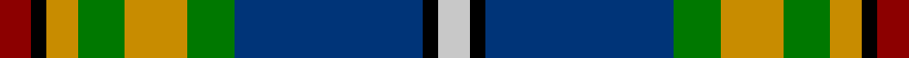

In pattern [RKYGYGBKW](/stripes/rkygygbkw/).

This was sourced from register-of-tartans.  It is a [9 stripe tartan](/stripes/stripes9/).

Original link https://www.tartanregister.gov.uk/tartanDetails.aspx?ref=1157

## Also known as

This cloth is also recorded under:

- Federated Women's Institutes of

## Attestations

This cloth appears in 2 source records; the oldest owns this page.

- 01/01/1996 — Federated Women's Institutes of (register-of-tartans, [record](https://www.tartanregister.gov.uk/tartanDetails.aspx?ref=1157))
- 1996 — FWI of Ontario (Corporate) (tartans-authority, [record](http://www.tartansauthority.com/tartan-ferret/display/4840/))

## Register references

External register numbers recorded for this tartan.

- Scottish Register of Tartans: [1157](https://www.tartanregister.gov.uk/tartanDetails.aspx?ref=1157)
- Scottish Tartans Authority (ITI): 4840

## Thread count
DR/8 K4 DY8 G12 DY16 G12 DB48 K4 N/8

## Palette
Each colour and the base-6 reference it is a variant of.

| Colour | Shade | Base |
|---|---|---|
| DB | <code style="background-color:#003478;">#003478</code> `oklch(34.1% 0.127 258.1)` <small>#003478</small> | B <code style="background-color:#2A418A;">#2A418A</code> |
| DR | <code style="background-color:#8C0000;">#8C0000</code> `oklch(40.2% 0.165 29.2)` <small>#8C0000</small> | R <code style="background-color:#CC0000;">#CC0000</code> |
| DY | <code style="background-color:#C88C00;">#C88C00</code> `oklch(68.2% 0.142 78.2)` <small>#C88C00</small> | Y <code style="background-color:#F2BF00;">#F2BF00</code> |
| G | <code style="background-color:#007800;">#007800</code> `oklch(49.6% 0.169 142.5)` <small>#007800</small> | G <code style="background-color:#006100;">#006100</code> |
| K | <code style="background-color:#000000;">#000000</code> `oklch(0.0% 0.000 0.0)` <small>#000000</small> | K <code style="background-color:#000000;">#000000</code> |
| N | <code style="background-color:#C8C8C8;">#C8C8C8</code> `oklch(83.3% 0.000 89.9)` <small>#C8C8C8</small> | W <code style="background-color:#F7F7F7;">#F7F7F7</code> |

## Nearest tartans

The nearest existing variants by ΔTartan distance.

1. [Minnesota (District)](/setts/s8/k6w3k2db30r9k4g20ly3~x2/) — ΔT 0.55
1. [Dunedin (USA) (District)](/setts/s9/w3t25k3r3k3r8g21k3k2~x2/) — ΔT 0.64
1. [Mary, Queen of Scots](/setts/s9/r5w1db10g10w1ly1g2t2w1~x2/) — ΔT 0.64
1. [McCuaig (2010) (Name)](/setts/s9/k10ly3k2b20k10g15k2r3w3~x2/) — ΔT 0.78
1. [Ayrshire (District)](/setts/s8/db2r1db10w1y4g8lo1g2~x4/) — ΔT 0.82
1. [Glasgow, City of Culture](/setts/s11/r6g2r2g21k2w4k2db23ly2db2ly6~x2/) — ΔT 0.83
1. [Dunedin](/setts/s9/k3r3g21r8r3r4k3db26w3~x2/) — ΔT 0.90
1. [State Seal of Utah (Fashion)](/setts/s8/dt48lo25dy15r7lb5dt7k10lb10~x2/) — ΔT 0.90
1. [Loch Awe](/setts/s9/t3k2r3g20k24db20r3k2ly3~x2/) — ΔT 0.91
1. [Kleto, Susan (Personal)](/setts/s9/w1db16ly1r3ly1g6g2g6w1~x2/) — ΔT 0.92

## Neighbour map

Every grey dot is one of 14299 variants placed by the first two principal components of the ΔTartan feature space (44% of its variance). Red is this tartan; blue dots are its nearest — click one to open its page.

<svg viewBox="0 0 640 380" role="img" style="max-width:100%;height:auto;border:1px solid #e0e0e0;border-radius:4px;display:block" xmlns="http://www.w3.org/2000/svg"><image href="/nn/cloud.v1.png" width="640" height="380"/><a href="/setts/s8/k6w3k2db30r9k4g20ly3~x2/"><circle cx="154.7" cy="132.9" r="4" fill="#3465a4"><title>Minnesota (District)</title></circle></a><a href="/setts/s9/w3t25k3r3k3r8g21k3k2~x2/"><circle cx="140.2" cy="131.2" r="4" fill="#3465a4"><title>Dunedin (USA) (District)</title></circle></a><a href="/setts/s9/r5w1db10g10w1ly1g2t2w1~x2/"><circle cx="136.3" cy="142.8" r="4" fill="#3465a4"><title>Mary, Queen of Scots</title></circle></a><a href="/setts/s9/k10ly3k2b20k10g15k2r3w3~x2/"><circle cx="115.4" cy="159.5" r="4" fill="#3465a4"><title>McCuaig (2010) (Name)</title></circle></a><a href="/setts/s8/db2r1db10w1y4g8lo1g2~x4/"><circle cx="152.8" cy="153.2" r="4" fill="#3465a4"><title>Ayrshire (District)</title></circle></a><a href="/setts/s11/r6g2r2g21k2w4k2db23ly2db2ly6~x2/"><circle cx="129.8" cy="114.1" r="4" fill="#3465a4"><title>Glasgow, City of Culture</title></circle></a><a href="/setts/s9/k3r3g21r8r3r4k3db26w3~x2/"><circle cx="128.7" cy="146.9" r="4" fill="#3465a4"><title>Dunedin</title></circle></a><a href="/setts/s8/dt48lo25dy15r7lb5dt7k10lb10~x2/"><circle cx="157.9" cy="163.0" r="4" fill="#3465a4"><title>State Seal of Utah (Fashion)</title></circle></a><a href="/setts/s9/t3k2r3g20k24db20r3k2ly3~x2/"><circle cx="120.5" cy="134.4" r="4" fill="#3465a4"><title>Loch Awe</title></circle></a><a href="/setts/s9/w1db16ly1r3ly1g6g2g6w1~x2/"><circle cx="198.7" cy="120.9" r="4" fill="#3465a4"><title>Kleto, Susan (Personal)</title></circle></a><circle cx="142.0" cy="137.0" r="5" fill="#c00000"/></svg>

ID: /setts/s9/r2k1lo2g3lo4g3db12k1lb2~x4/
