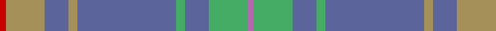

This page is one **sett** — a single exact thread-count. It belongs to the [tartan](/tartans/r2lt13b8lt3b33g3b8g13p2/)
(the same proportion at any scale), whose colour order is pattern [RYBYBYBYR](/stripes/rybybybyr/).

Sourced from tartans-authority.  It is a [9 stripe tartan](/stripes/stripes9/).

Original link http://www.tartansauthority.com/tartan-ferret/display/6148/

## Thread count
R/4 LT26 B16 LT6 B66 G6 B16 G26 P/4

## Palette
Each colour and the base-6 reference it is a variant of.

| Colour | Shade | Base |
|---|---|---|
| B | <code style="background-color:#5C649C;">#5C649C</code> `oklch(52.1% 0.089 276.7)` <small>#5C649C</small> | B <code style="background-color:#2A418A;">#2A418A</code> |
| G | <code style="background-color:#44AC64;">#44AC64</code> `oklch(66.6% 0.143 150.7)` <small>#44AC64</small> | Y <code style="background-color:#F2BF00;">#F2BF00</code> |
| LT | <code style="background-color:#A49058;">#A49058</code> `oklch(65.8% 0.079 90.5)` <small>#A49058</small> | Y <code style="background-color:#F2BF00;">#F2BF00</code> |
| P | <code style="background-color:#B468AC;">#B468AC</code> `oklch(62.5% 0.131 330.9)` <small>#B468AC</small> | R <code style="background-color:#CC0000;">#CC0000</code> |
| R | <code style="background-color:#C80000;">#C80000</code> `oklch(52.3% 0.215 29.2)` <small>#C80000</small> | R <code style="background-color:#CC0000;">#CC0000</code> |

## Nearest tartans

The nearest existing variants by ΔTartan distance, with this tartan at the top so the swatches line up against it.

ΔTartan

Tartan

Sett

—

<a href="/ttd/edit/#slug=r2lo13b8lo3b33lg3b8lg13m2~x2">Burt #1 (Name)</a> <a class="nn-out" href="/setts/s9/r2lo13b8lo3b33lg3b8lg13m2~x2/" title="open its dictionary page">↗</a>

1.25

<a href="/ttd/edit/#slug=r4y2db4y35t27r3~x2">Royal Deeside (District)</a> <a class="nn-out" href="/setts/s6/r4y2db4y35t27r3~x2/" title="open its dictionary page">↗</a>

1.31

<a href="/ttd/edit/#slug=o4dp2o7n30o8n7dp5dp1w2~x2">Hebridean Thistle (Fashion)</a> <a class="nn-out" href="/setts/s9/o4dp2o7n30o8n7dp5dp1w2~x2/" title="open its dictionary page">↗</a>

1.33

<a href="/ttd/edit/#slug=n33w2r3w2db14r3g15n20r2n3~x2">Kansai St Andrews Society (Corp)</a> <a class="nn-out" href="/setts/s10/n33w2r3w2db14r3g15n20r2n3~x2/" title="open its dictionary page">↗</a>

1.36

<a href="/ttd/edit/#slug=n44o8n8o22lb4o4lb11o2lb2~x2">Titanium (Fashion)</a> <a class="nn-out" href="/setts/s9/n44o8n8o22lb4o4lb11o2lb2~x2/" title="open its dictionary page">↗</a>

1.37

<a href="/ttd/edit/#slug=o4dg2o7n30o8n7g5dg1w2~x2">Inchforth (Personal)</a> <a class="nn-out" href="/setts/s9/o4dg2o7n30o8n7g5dg1w2~x2/" title="open its dictionary page">↗</a>

1.48

<a href="/ttd/edit/#slug=dp3n24n10n2g11n8w3~x2">Hesco</a> <a class="nn-out" href="/setts/s7/dp3n24n10n2g11n8w3~x2/" title="open its dictionary page">↗</a>

1.48

<a href="/ttd/edit/#slug=dy6ly3n42w4dg18ly2n12r3~x2">Glasgow High (School)</a> <a class="nn-out" href="/setts/s8/dy6ly3n42w4dg18ly2n12r3~x2/" title="open its dictionary page">↗</a>

1.53

<a href="/ttd/edit/#slug=lr30w3lr3w3lr12n30o3n5~x2">Dama Classic (Fashion)</a> <a class="nn-out" href="/setts/s8/lr30w3lr3w3lr12n30o3n5~x2/" title="open its dictionary page">↗</a>

1.54

<a href="/ttd/edit/#slug=r2lr2r1lr24o1n3k3lr3o12lr4r1~x2">Dabney Grey (Personal)</a> <a class="nn-out" href="/setts/s11/r2lr2r1lr24o1n3k3lr3o12lr4r1~x2/" title="open its dictionary page">↗</a>

1.56

<a href="/ttd/edit/#slug=r1g4lo1g3r4n15w1~x4">Bressuire (District)</a> <a class="nn-out" href="/setts/s7/r1g4lo1g3r4n15w1~x4/" title="open its dictionary page">↗</a>

## Neighbour map

Every grey dot is one of 14299 variants placed by the first two principal components of the ΔTartan feature space (44% of its variance). Red is this tartan; blue dots are its nearest — click one to open its page.

<svg viewBox="0 0 640 380" role="img" style="max-width:100%;height:auto;border:1px solid #e0e0e0;border-radius:4px;display:block" xmlns="http://www.w3.org/2000/svg"><image href="/nn/cloud.v1.png" width="640" height="380"/><a href="/setts/s6/r4y2db4y35t27r3~x2/"><circle cx="341.8" cy="186.8" r="4" fill="#3465a4"><title>Royal Deeside (District)</title></circle></a><a href="/setts/s9/o4dp2o7n30o8n7dp5dp1w2~x2/"><circle cx="406.7" cy="154.4" r="4" fill="#3465a4"><title>Hebridean Thistle (Fashion)</title></circle></a><a href="/setts/s10/n33w2r3w2db14r3g15n20r2n3~x2/"><circle cx="332.1" cy="155.7" r="4" fill="#3465a4"><title>Kansai St Andrews Society (Corp)</title></circle></a><a href="/setts/s9/n44o8n8o22lb4o4lb11o2lb2~x2/"><circle cx="379.5" cy="181.5" r="4" fill="#3465a4"><title>Titanium (Fashion)</title></circle></a><a href="/setts/s9/o4dg2o7n30o8n7g5dg1w2~x2/"><circle cx="408.9" cy="160.7" r="4" fill="#3465a4"><title>Inchforth (Personal)</title></circle></a><a href="/setts/s7/dp3n24n10n2g11n8w3~x2/"><circle cx="324.2" cy="217.5" r="4" fill="#3465a4"><title>Hesco</title></circle></a><a href="/setts/s8/dy6ly3n42w4dg18ly2n12r3~x2/"><circle cx="367.1" cy="150.6" r="4" fill="#3465a4"><title>Glasgow High (School)</title></circle></a><a href="/setts/s8/lr30w3lr3w3lr12n30o3n5~x2/"><circle cx="344.0" cy="207.7" r="4" fill="#3465a4"><title>Dama Classic (Fashion)</title></circle></a><a href="/setts/s11/r2lr2r1lr24o1n3k3lr3o12lr4r1~x2/"><circle cx="394.2" cy="130.0" r="4" fill="#3465a4"><title>Dabney Grey (Personal)</title></circle></a><a href="/setts/s7/r1g4lo1g3r4n15w1~x4/"><circle cx="332.7" cy="183.3" r="4" fill="#3465a4"><title>Bressuire (District)</title></circle></a><circle cx="371.4" cy="183.7" r="5" fill="#c00000"/></svg>

ID: /setts/s9/r2lo13b8lo3b33lg3b8lg13m2~x2/
