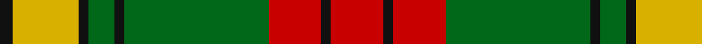

In pattern [KYKGKGRKR](/patterns/kykgkgrkr/).

This was sourced from tartans-authority.  It is a [9 stripes tartan](/stripes/stripes9/).

Original link http://www.tartansauthority.com/tartan-ferret/display/1271/

## Attestations

This cloth appears in 2 source records; the oldest owns this page.

- June 1952 — MacMillan Society of Glasgow (tartans-authority, [record](http://www.tartansauthority.com/tartan-ferret/display/1271/))
- 01/01/2002 — MacMillan Society of Glasgow (register-of-tartans, [record](https://www.tartanregister.gov.uk/tartanDetails.aspx?ref=2661))

## Thread count
K/8 Y40 K6 G16 K6 G88 R32 K6 R/32

## Palette
Each colour and its ΔE from the base-6 reference it is a variant of.

| Colour | Shade | Base | ΔE (OKLab) |
|---|---|---|---|
| G | <code style="background-color:#006818;">#006818</code> `#006818` | G <code style="background-color:#006100;">#006100</code> | 0.02 |
| K | <code style="background-color:#101010;">#101010</code> `#101010` | K <code style="background-color:#000000;">#000000</code> | 0.17 |
| R | <code style="background-color:#C80000;">#C80000</code> `#C80000` | R <code style="background-color:#CC0000;">#CC0000</code> | 0.01 |
| Y | <code style="background-color:#D8B000;">#D8B000</code> `#D8B000` | Y <code style="background-color:#F2BF00;">#F2BF00</code> | 0.06 |

## Nearest tartans

The nearest existing variants by ΔTartan distance.

1. [MacMillan, Society of Glasgow](/setts/s9/r32k6r32g88k6g16k6y40k8-g008000-k000000-rc00000-yf0c000/) — ΔT 0.79
1. [Lindsay](/setts/s9/g24k2g2k2g2r10ra20k2ra4-g008000-k000000-r900030-rac00000/) — ΔT 0.92
1. [Buccleuch (Fashion)](/setts/s8/y30k2y4k2y4k20g28w4-g5c6428-k101010-we0e0e0-ya08858/) — ΔT 0.96
1. [MacMillan Old Clan Tartan Tartan Number: 2025. Earliest known date: 1847 The term 'ancient' normally describes a change in colour that can be applied to any tartan. In the case of MacMillan the 'ancient' form involves a more radical change, justifying the traditional use of the adjective in the name of the tartan. James Logan, co-author of 'The Clans of the Scottish Highlands' (1847), states that this version is identical with Buchanan. The thread count was deduced by J. Cant from the illustration by R.R. MacIan in the same work. In 1951 Lieut. General Sir Gordon MacMillan, then G.O.C. Scottish Command, was recognised as chief of the clan by the Lord Lyon. See products available Copyright © Blair Urquhart, Comrie, 2015](/setts/s12/g4k2g36k2g4k2r24g8y12k2y12k2-g006818-k101010-ra00048-ye8c000/) — ΔT 0.98
1. [Cranston, dress](/setts/s8/r30b3r2b3r6b14g26ga6-b304080-g30a010-ga008000-rc00000/) — ΔT 0.98
1. [MacMillan Ancient](/setts/s12/g4k2g36k2g4k2r24g8y12k2y12k2-g005020-k101010-r960028-ye8c000/) — ΔT 1.00
1. [Glen Tilt](/setts/s10/w4g4r4g56r4b24r44g4r4w4-b304080-g008000-rc00000-we0e0e0/) — ΔT 1.01
1. [Scott, hunting](/setts/s8/r6ra28g16r4g4w4g4r2-g008000-rc00000-ra703000-we0e0e0/) — ΔT 1.02
1. [Cape Breton University](/setts/s10/b8r34b8g8b4g8b8g54b8y8-b202060-g006818-re86000-yfccc00/) — ΔT 1.04
1. [Buccleuch Weavers Tartan Tartan Number: 6009. Earliest known date: pre 2003 A Fashion tartan from Marton Mills See products available Copyright © Blair Urquhart, Comrie, 2015](/setts/s8/y30k2y4k2y4k20g28w4-g4c5428-k101010-we0e0e0-ya08858/) — ΔT 1.06

## Neighbour map

Every grey dot is one of 15726 variants placed by the first two principal components of the ΔTartan feature space (44% of its variance). Red is this tartan; blue dots are its nearest — click one to open its page.

<svg viewBox="0 0 640 380" role="img" style="max-width:100%;height:auto;border:1px solid #e0e0e0;border-radius:4px;display:block" xmlns="http://www.w3.org/2000/svg"><image href="/nn/cloud.v1.png" width="640" height="380"/><a href="/setts/s9/r32k6r32g88k6g16k6y40k8-g008000-k000000-rc00000-yf0c000/"><circle cx="213.2" cy="150.6" r="4" fill="#3465a4"><title>MacMillan, Society of Glasgow</title></circle></a><a href="/setts/s9/g24k2g2k2g2r10ra20k2ra4-g008000-k000000-r900030-rac00000/"><circle cx="233.1" cy="158.2" r="4" fill="#3465a4"><title>Lindsay</title></circle></a><a href="/setts/s8/y30k2y4k2y4k20g28w4-g5c6428-k101010-we0e0e0-ya08858/"><circle cx="227.4" cy="167.7" r="4" fill="#3465a4"><title>Buccleuch (Fashion)</title></circle></a><a href="/setts/s12/g4k2g36k2g4k2r24g8y12k2y12k2-g006818-k101010-ra00048-ye8c000/"><circle cx="248.6" cy="128.1" r="4" fill="#3465a4"><title>MacMillan Old Clan Tartan Tartan Number: 2025. Earliest known date: 1847 The term 'ancient' normally describes a change in colour that can be applied to any tartan. In the case of MacMillan the 'ancient' form involves a more radical change, justifying the traditional use of the adjective in the name of the tartan. James Logan, co-author of 'The Clans of the Scottish Highlands' (1847), states that this version is identical with Buchanan. The thread count was deduced by J. Cant from the illustration by R.R. MacIan in the same work. In 1951 Lieut. General Sir Gordon MacMillan, then G.O.C. Scottish Command, was recognised as chief of the clan by the Lord Lyon. See products available Copyright © Blair Urquhart, Comrie, 2015</title></circle></a><a href="/setts/s8/r30b3r2b3r6b14g26ga6-b304080-g30a010-ga008000-rc00000/"><circle cx="240.7" cy="169.1" r="4" fill="#3465a4"><title>Cranston, dress</title></circle></a><a href="/setts/s12/g4k2g36k2g4k2r24g8y12k2y12k2-g005020-k101010-r960028-ye8c000/"><circle cx="250.5" cy="129.6" r="4" fill="#3465a4"><title>MacMillan Ancient</title></circle></a><a href="/setts/s10/w4g4r4g56r4b24r44g4r4w4-b304080-g008000-rc00000-we0e0e0/"><circle cx="257.1" cy="143.3" r="4" fill="#3465a4"><title>Glen Tilt</title></circle></a><a href="/setts/s8/r6ra28g16r4g4w4g4r2-g008000-rc00000-ra703000-we0e0e0/"><circle cx="260.0" cy="176.2" r="4" fill="#3465a4"><title>Scott, hunting</title></circle></a><a href="/setts/s10/b8r34b8g8b4g8b8g54b8y8-b202060-g006818-re86000-yfccc00/"><circle cx="248.5" cy="158.1" r="4" fill="#3465a4"><title>Cape Breton University</title></circle></a><a href="/setts/s8/y30k2y4k2y4k20g28w4-g4c5428-k101010-we0e0e0-ya08858/"><circle cx="226.9" cy="167.9" r="4" fill="#3465a4"><title>Buccleuch Weavers Tartan Tartan Number: 6009. Earliest known date: pre 2003 A Fashion tartan from Marton Mills See products available Copyright © Blair Urquhart, Comrie, 2015</title></circle></a><circle cx="235.3" cy="159.4" r="5" fill="#c00000"/></svg>

ID: /setts/s9/r32k6r32g88k6g16k6y40k8-g006818-k101010-rc80000-yd8b000/
