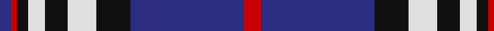

In pattern [BRKWKWKBR](/patterns/brkwkwkbr/).

This was sourced from house-of-tartan.  It is a [9 stripes tartan](/stripes/stripes9/).

Original link http://www.house-of-tartan.scotland.net/house/TartanViewjs.asp?colr=Def&tnam=560

## Thread count
DB/4 R2 K4 LN6 K8 LN10 K12 DB40 R/6

## Palette
Each colour and its ΔE from the base-6 reference it is a variant of.

| Colour | Shade | Base | ΔE (OKLab) |
|---|---|---|---|
| DB | <code style="background-color:#2C2C80;">#2C2C80</code> `#2C2C80` | B <code style="background-color:#2A418A;">#2A418A</code> | 0.06 |
| K | <code style="background-color:#101010;">#101010</code> `#101010` | K <code style="background-color:#000000;">#000000</code> | 0.17 |
| LN | <code style="background-color:#E0E0E0;">#E0E0E0</code> `#E0E0E0` | W <code style="background-color:#F7F7F7;">#F7F7F7</code> | 0.07 |
| R | <code style="background-color:#C80000;">#C80000</code> `#C80000` | R <code style="background-color:#CC0000;">#CC0000</code> | 0.01 |

## Nearest tartans

The nearest existing variants by ΔTartan distance.

1. [Scottish Knights Templar Int. (Corp)](/setts/s9/r3b20k6w5k4w3k2r1b2x2~b2c2c80-k101010-rc80000-wc0c0c0/) — ΔT 0.40
1. [Scottish Knights Templar, of M.T.S. International](/setts/s9/r3b20k6w5k4w3k2r1b2x2~b304080-k000000-rc00000-we0e0e0/) — ΔT 0.53
1. [Scottish Knights Templar, of M.T.S. St Andrew](/setts/s10/w4r1b20k6w5k4w3k2r1b2x2~b304080-k000000-rc00000-we0e0e0/) — ΔT 0.71
1. [Highlands School (North Carolina)](/setts/s8/y12b2y2b30ba2b2ba13w4x2~b1c0070-ba14283c-wc0c0c0-yd09800/) — ΔT 0.74
1. [Highlands School (N. Carolina) Corporate Tartan Tartan Number: 2109. Earliest known date: 1990 Highlands in North Carolina is the home of the Scottish Tartans Society's Museum Extension. The school tartan was designed by Bob Martin who is a 'Fellow of the Society'. Blue and Gold are the school colours. See products available Copyright © Blair Urquhart, Comrie, 2015](/setts/s8/y12b2y2b30ba3b2ba13w4x2~b2c2c80-ba202060-we0e0e0-ye8c000/) — ΔT 0.78
1. [DeCloud-McMasters (Personal)](/setts/s8/r3b2w2b26k22w3b3w3x2~b2c2c80-k101010-rc80000-wfcfcfc/) — ΔT 0.89
1. [Scottish Knights Templar St. A (Corp](/setts/s12/w4r1b20k6w5k4w4k4w3k2r1b2x2~b2c2c80-k101010-rc80000-wc0c0c0/) — ΔT 0.96
1. [Longniddry Eildon Blue Dress Fancy Tartan Tartan Number: 5486. Earliest known date: pre 1992 Dancers tartan See products available Copyright © Blair Urquhart, Comrie, 2015](/setts/s8/b42w2wa2w2b5ba12wa32b4x2~b202060-ba003c64-wa8ace8-wac0c0c0/) — ΔT 1.01
1. [Icelandic](/setts/s13/r8w4b24ba2b4ba2b1ba2b4ba2b1ba20w6x2~b2c4084-ba080848-rdc0000-we0e0e0/) — ΔT 1.08
1. [Hakkarain (Personal)](/setts/s10/k37w18ka37r2ka2r2ka2r2ka37w18x2~k000040-ka101010-rc80000-we0e0e0/) — ΔT 1.13

## Neighbour map

Every grey dot is one of 15726 variants placed by the first two principal components of the ΔTartan feature space (44% of its variance). Red is this tartan; blue dots are its nearest — click one to open its page.

<svg viewBox="0 0 640 380" role="img" style="max-width:100%;height:auto;border:1px solid #e0e0e0;border-radius:4px;display:block" xmlns="http://www.w3.org/2000/svg"><image href="/nn/cloud.v1.png" width="640" height="380"/><a href="/setts/s9/r3b20k6w5k4w3k2r1b2x2~b2c2c80-k101010-rc80000-wc0c0c0/"><circle cx="263.3" cy="146.4" r="4" fill="#3465a4"><title>Scottish Knights Templar Int. (Corp)</title></circle></a><a href="/setts/s9/r3b20k6w5k4w3k2r1b2x2~b304080-k000000-rc00000-we0e0e0/"><circle cx="241.3" cy="138.9" r="4" fill="#3465a4"><title>Scottish Knights Templar, of M.T.S. International</title></circle></a><a href="/setts/s10/w4r1b20k6w5k4w3k2r1b2x2~b304080-k000000-rc00000-we0e0e0/"><circle cx="229.5" cy="129.4" r="4" fill="#3465a4"><title>Scottish Knights Templar, of M.T.S. St Andrew</title></circle></a><a href="/setts/s8/y12b2y2b30ba2b2ba13w4x2~b1c0070-ba14283c-wc0c0c0-yd09800/"><circle cx="270.0" cy="161.4" r="4" fill="#3465a4"><title>Highlands School (North Carolina)</title></circle></a><a href="/setts/s8/y12b2y2b30ba3b2ba13w4x2~b2c2c80-ba202060-we0e0e0-ye8c000/"><circle cx="257.4" cy="157.3" r="4" fill="#3465a4"><title>Highlands School (N. Carolina) Corporate Tartan Tartan Number: 2109. Earliest known date: 1990 Highlands in North Carolina is the home of the Scottish Tartans Society's Museum Extension. The school tartan was designed by Bob Martin who is a 'Fellow of the Society'. Blue and Gold are the school colours. See products available Copyright © Blair Urquhart, Comrie, 2015</title></circle></a><a href="/setts/s8/r3b2w2b26k22w3b3w3x2~b2c2c80-k101010-rc80000-wfcfcfc/"><circle cx="260.3" cy="160.6" r="4" fill="#3465a4"><title>DeCloud-McMasters (Personal)</title></circle></a><a href="/setts/s12/w4r1b20k6w5k4w4k4w3k2r1b2x2~b2c2c80-k101010-rc80000-wc0c0c0/"><circle cx="208.9" cy="129.4" r="4" fill="#3465a4"><title>Scottish Knights Templar St. A (Corp</title></circle></a><a href="/setts/s8/b42w2wa2w2b5ba12wa32b4x2~b202060-ba003c64-wa8ace8-wac0c0c0/"><circle cx="286.3" cy="141.0" r="4" fill="#3465a4"><title>Longniddry Eildon Blue Dress Fancy Tartan Tartan Number: 5486. Earliest known date: pre 1992 Dancers tartan See products available Copyright © Blair Urquhart, Comrie, 2015</title></circle></a><a href="/setts/s13/r8w4b24ba2b4ba2b1ba2b4ba2b1ba20w6x2~b2c4084-ba080848-rdc0000-we0e0e0/"><circle cx="244.8" cy="118.8" r="4" fill="#3465a4"><title>Icelandic</title></circle></a><a href="/setts/s10/k37w18ka37r2ka2r2ka2r2ka37w18x2~k000040-ka101010-rc80000-we0e0e0/"><circle cx="243.7" cy="148.1" r="4" fill="#3465a4"><title>Hakkarain (Personal)</title></circle></a><circle cx="251.8" cy="141.2" r="5" fill="#c00000"/></svg>

ID: /setts/s9/r3b20k6w5k4w3k2r1b2x2~b2c2c80-k101010-rc80000-we0e0e0/
