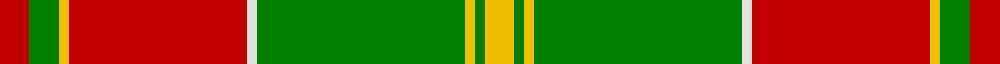

In pattern [RGYRWGYGY](/stripes/rgyrwgygy/).

This was sourced from weddslist.  It is a [9 stripe tartan](/stripes/stripes9/).

Original link http://www.weddslist.com/cgi-bin/tartans/pg.pl?source=sts

## Attestations

This cloth appears in 2 source records; the oldest owns this page.

- undated — MacDonald of Kingsburgh (weddslist, [record](http://www.weddslist.com/cgi-bin/tartans/pg.pl?source=sts))
- undated — MacDonald of Kingsburgh Clan Tartan Tartan Number: 1562. Earliest known date: 1746 D.W.Stewart recorded this pattern from a relic, worn by Prince Charles Edward, and hidden in a cleft of a rock, to be recovered later and eventually preserved in the Advocates' Library in Edinburgh. See products available Copyright © Blair Urquhart, Comrie, 2015 (house-of-tartan, [record](http://www.house-of-tartan.scotland.net/house/TartanViewjs.asp?colr=Def&tnam=1562))

## Thread count
R/6 G6 Y2 R36 LN2 G42 Y2 G2 Y/6

## Palette
Each colour and the base-6 reference it is a variant of.

| Colour | Shade | Base |
|---|---|---|
| G | <code style="background-color:#008000;">#008000</code> `oklch(52.0% 0.177 142.5)` <small>#008000</small> | G <code style="background-color:#006100;">#006100</code> |
| LN | <code style="background-color:#E0E0E0;">#E0E0E0</code> `oklch(90.7% 0.000 89.9)` <small>#E0E0E0</small> | W <code style="background-color:#F7F7F7;">#F7F7F7</code> |
| R | <code style="background-color:#C00000;">#C00000</code> `oklch(50.7% 0.208 29.2)` <small>#C00000</small> | R <code style="background-color:#CC0000;">#CC0000</code> |
| Y | <code style="background-color:#F0C000;">#F0C000</code> `oklch(82.7% 0.169 90.5)` <small>#F0C000</small> | Y <code style="background-color:#F2BF00;">#F2BF00</code> |

## Nearest tartans

The nearest existing variants by ΔTartan distance.

1. [Brisbane (Artefact)](/setts/s8/g18lb3ly1r2ly1r3ly1r10~x4/) — ΔT 0.73
1. [Brisbane (Artefact)](/setts/s8/g18w3ly1r2ly1r3ly1r10~x4/) — ΔT 0.90
1. [Gleneil](/setts/s8/k2r2k2r24g31k1g2ly2~x2/) — ΔT 1.07
1. [MacPhee, MacFie](/setts/s9/w1r12g2r1g16r1g2r12ly1~x2/) — ΔT 1.29
1. [Leask](/setts/s14/g2r2w1r2k1r24g12ly2g3ly2g12r2g3ly2~x2/) — ΔT 1.29
1. [Crieff](/setts/s13/r4r10g7r70g7r4p21r4g85r4g7r10r4/) — ΔT 1.30
1. [MacDonell of Glengarry](/setts/s11/g18r3g2r2db6r2g2r24g1r2g6~x2/) — ΔT 1.35
1. [Longmore (Name)](/setts/s9/g15ly3g27r2g2r33b2w1b4~x2/) — ΔT 1.38
1. [Glen Tilt](/setts/s10/w1r1g1r11db6r1g14r1g1w1~x4/) — ΔT 1.39
1. [Glendronach](/setts/s12/g21r2w1y3r2g5r21y1ly1y1r1g8~x2/) — ΔT 1.40

## Neighbour map

Every grey dot is one of 14299 variants placed by the first two principal components of the ΔTartan feature space (44% of its variance). Red is this tartan; blue dots are its nearest — click one to open its page.

<svg viewBox="0 0 640 380" role="img" style="max-width:100%;height:auto;border:1px solid #e0e0e0;border-radius:4px;display:block" xmlns="http://www.w3.org/2000/svg"><image href="/nn/cloud.v1.png" width="640" height="380"/><a href="/setts/s8/g18lb3ly1r2ly1r3ly1r10~x4/"><circle cx="297.8" cy="146.2" r="4" fill="#3465a4"><title>Brisbane (Artefact)</title></circle></a><a href="/setts/s8/g18w3ly1r2ly1r3ly1r10~x4/"><circle cx="282.8" cy="138.0" r="4" fill="#3465a4"><title>Brisbane (Artefact)</title></circle></a><a href="/setts/s8/k2r2k2r24g31k1g2ly2~x2/"><circle cx="341.4" cy="115.5" r="4" fill="#3465a4"><title>Gleneil</title></circle></a><a href="/setts/s9/w1r12g2r1g16r1g2r12ly1~x2/"><circle cx="360.4" cy="155.6" r="4" fill="#3465a4"><title>MacPhee, MacFie</title></circle></a><a href="/setts/s14/g2r2w1r2k1r24g12ly2g3ly2g12r2g3ly2~x2/"><circle cx="291.8" cy="91.2" r="4" fill="#3465a4"><title>Leask</title></circle></a><a href="/setts/s13/r4r10g7r70g7r4p21r4g85r4g7r10r4/"><circle cx="327.9" cy="114.5" r="4" fill="#3465a4"><title>Crieff</title></circle></a><a href="/setts/s11/g18r3g2r2db6r2g2r24g1r2g6~x2/"><circle cx="363.3" cy="147.3" r="4" fill="#3465a4"><title>MacDonell of Glengarry</title></circle></a><a href="/setts/s9/g15ly3g27r2g2r33b2w1b4~x2/"><circle cx="333.9" cy="114.4" r="4" fill="#3465a4"><title>Longmore (Name)</title></circle></a><a href="/setts/s10/w1r1g1r11db6r1g14r1g1w1~x4/"><circle cx="260.0" cy="144.3" r="4" fill="#3465a4"><title>Glen Tilt</title></circle></a><a href="/setts/s12/g21r2w1y3r2g5r21y1ly1y1r1g8~x2/"><circle cx="326.8" cy="117.0" r="4" fill="#3465a4"><title>Glendronach</title></circle></a><circle cx="325.7" cy="130.9" r="5" fill="#c00000"/></svg>

ID: /setts/s9/r3g3ly1r18w1g21ly1g1ly3~x2/
