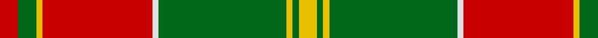

In pattern [RGYRWGYGY](/patterns/rgyrwgygy/).

This was sourced from house-of-tartan.  It is a [9 stripes tartan](/stripes/stripes9/).

Original link http://www.house-of-tartan.scotland.net/house/TartanViewjs.asp?colr=Def&tnam=1562

## Thread count
R/6 G6 Y2 R36 LN2 G42 Y2 G2 Y/6

## Palette
Each colour and its ΔE from the base-6 reference it is a variant of.

| Colour | Shade | Base | ΔE (OKLab) |
|---|---|---|---|
| G | <code style="background-color:#006818;">#006818</code> `#006818` | G <code style="background-color:#006100;">#006100</code> | 0.02 |
| LN | <code style="background-color:#E0E0E0;">#E0E0E0</code> `#E0E0E0` | W <code style="background-color:#F7F7F7;">#F7F7F7</code> | 0.07 |
| R | <code style="background-color:#C80000;">#C80000</code> `#C80000` | R <code style="background-color:#CC0000;">#CC0000</code> | 0.01 |
| Y | <code style="background-color:#E8C000;">#E8C000</code> `#E8C000` | Y <code style="background-color:#F2BF00;">#F2BF00</code> | 0.02 |

## Nearest tartans

The nearest existing variants by ΔTartan distance.

1. [MacDonald of Kingsburgh](/setts/s9/r3g3y1r18w1g21y1g1y3x2~g008000-rc00000-we0e0e0-yf0c000/) — ΔT 0.44
1. [Brisbane (Artefact)](/setts/s8/g18w3y1r2y1r3y1r10x4~g006818-rc80000-wc0c0c0-ye8c000/) — ΔT 0.57
1. [Brisbane (Artefact)](/setts/s8/g18w3y1r2y1r3y1r10x4~g006818-rc80000-wffffff-ye8c000/) — ΔT 0.80
1. [Gleneil](/setts/s8/k2r2k2r24g31k1g2y2x2~g008000-k000000-rc00000-yf0c000/) — ΔT 0.99
1. [Crieff](/setts/s13/r4ra10g7ra70g7ra4b21ra4g85ra4g7ra10r4~b800080-g008000-rd03030-rac00000/) — ΔT 1.06
1. [MacLintock](/setts/s12/g36r3g3r3b9r3ba2r40b3r3b2r6x2~b304080-ba5480b0-g008000-rc00000/) — ΔT 1.10
1. [MacPhee, MacFie](/setts/s9/w1r12g2r1g16r1g2r12y1x2~g008000-rc00000-we0e0e0-yf0c000/) — ΔT 1.14
1. [MacDonell of Glengarry](/setts/s11/g18r3g2r2b6r2g2r24g1r2g6x2~b304080-g008000-rc00000/) — ΔT 1.16
1. [Fort William (Fashion)](/setts/s11/r10w2y3w2b24w4b4r34b2w3b2x2~b381c0c-rb07430-w94acfc-y38c438/) — ΔT 1.16
1. [Oriel](/setts/s9/r12b2r3g20k4g20r30k2r1x2~b304080-g008000-k000000-rc00000/) — ΔT 1.16

## Neighbour map

Every grey dot is one of 15726 variants placed by the first two principal components of the ΔTartan feature space (44% of its variance). Red is this tartan; blue dots are its nearest — click one to open its page.

<svg viewBox="0 0 640 380" role="img" style="max-width:100%;height:auto;border:1px solid #e0e0e0;border-radius:4px;display:block" xmlns="http://www.w3.org/2000/svg"><image href="/nn/cloud.v1.png" width="640" height="380"/><a href="/setts/s9/r3g3y1r18w1g21y1g1y3x2~g008000-rc00000-we0e0e0-yf0c000/"><circle cx="324.7" cy="132.1" r="4" fill="#3465a4"><title>MacDonald of Kingsburgh</title></circle></a><a href="/setts/s8/g18w3y1r2y1r3y1r10x4~g006818-rc80000-wc0c0c0-ye8c000/"><circle cx="296.8" cy="147.3" r="4" fill="#3465a4"><title>Brisbane (Artefact)</title></circle></a><a href="/setts/s8/g18w3y1r2y1r3y1r10x4~g006818-rc80000-wffffff-ye8c000/"><circle cx="281.6" cy="140.8" r="4" fill="#3465a4"><title>Brisbane (Artefact)</title></circle></a><a href="/setts/s8/k2r2k2r24g31k1g2y2x2~g008000-k000000-rc00000-yf0c000/"><circle cx="340.1" cy="118.2" r="4" fill="#3465a4"><title>Gleneil</title></circle></a><a href="/setts/s13/r4ra10g7ra70g7ra4b21ra4g85ra4g7ra10r4~b800080-g008000-rd03030-rac00000/"><circle cx="327.1" cy="113.6" r="4" fill="#3465a4"><title>Crieff</title></circle></a><a href="/setts/s12/g36r3g3r3b9r3ba2r40b3r3b2r6x2~b304080-ba5480b0-g008000-rc00000/"><circle cx="348.4" cy="121.6" r="4" fill="#3465a4"><title>MacLintock</title></circle></a><a href="/setts/s9/w1r12g2r1g16r1g2r12y1x2~g008000-rc00000-we0e0e0-yf0c000/"><circle cx="360.2" cy="157.7" r="4" fill="#3465a4"><title>MacPhee, MacFie</title></circle></a><a href="/setts/s11/g18r3g2r2b6r2g2r24g1r2g6x2~b304080-g008000-rc00000/"><circle cx="362.6" cy="147.7" r="4" fill="#3465a4"><title>MacDonell of Glengarry</title></circle></a><a href="/setts/s11/r10w2y3w2b24w4b4r34b2w3b2x2~b381c0c-rb07430-w94acfc-y38c438/"><circle cx="297.0" cy="128.7" r="4" fill="#3465a4"><title>Fort William (Fashion)</title></circle></a><a href="/setts/s9/r12b2r3g20k4g20r30k2r1x2~b304080-g008000-k000000-rc00000/"><circle cx="323.9" cy="139.8" r="4" fill="#3465a4"><title>Oriel</title></circle></a><circle cx="326.5" cy="132.4" r="5" fill="#c00000"/></svg>

ID: /setts/s9/r3g3y1r18w1g21y1g1y3x2~g006818-rc80000-we0e0e0-ye8c000/
