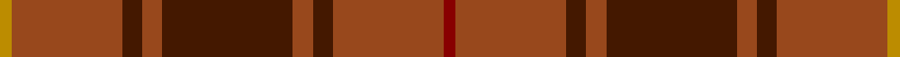

In pattern [RRBRBRBRY](/stripes/rrbrbrbry/).

This was sourced from tartans-authority.  It is a [9 stripe tartan](/stripes/stripes9/).

Original link http://www.tartansauthority.com/tartan-ferret/display/3397/

## Also known as

This cloth is also recorded under:

- MacIver of Strathendry Hunting

## Attestations

This cloth appears in 2 source records; the oldest owns this page.

- 2002 — MacIver of Strathendry Htg (Personal (tartans-authority, [record](http://www.tartansauthority.com/tartan-ferret/display/3397/))
- undated — MacIver of Strathendry Hunting (Personal) (register-of-tartans, [record](https://www.tartanregister.gov.uk/tartanDetails.aspx?ref=5036))

## Register references

External register numbers recorded for this tartan.

- Scottish Register of Tartans: [5036](https://www.tartanregister.gov.uk/tartanDetails.aspx?ref=5036)
- Scottish Tartans Authority (ITI): 3397

## Thread count
DY/6 T56 DR10 T10 DR66 T10 DR10 T56 DRa/6

## Palette
Each colour and the base-6 reference it is a variant of.

| Colour | Shade | Base |
|---|---|---|
| DR | <code style="background-color:#441800;">#441800</code> `oklch(27.3% 0.076 46.3)` <small>#441800</small> | B <code style="background-color:#2A418A;">#2A418A</code> |
| DRa | <code style="background-color:#880000;">#880000</code> `oklch(39.4% 0.162 29.2)` <small>#880000</small> | R <code style="background-color:#CC0000;">#CC0000</code> |
| DY | <code style="background-color:#BC8C00;">#BC8C00</code> `oklch(66.8% 0.137 84.1)` <small>#BC8C00</small> | Y <code style="background-color:#F2BF00;">#F2BF00</code> |
| T | <code style="background-color:#98481C;">#98481C</code> `oklch(49.6% 0.121 46.1)` <small>#98481C</small> | R <code style="background-color:#CC0000;">#CC0000</code> |

## Nearest tartans

The nearest existing variants by ΔTartan distance.

1. [Chisholm](/setts/s8/r12n2lr1n2r3dg8r3n1~x2/) — ΔT 0.98
1. [Chisholm](/setts/s8/r12n2lr1n2r3dg8r3n1/) — ΔT 0.98
1. [Unidentified Scarlett #17](/setts/s12/r12r2g4r2r2g6r2r2g4r2r12k1~x2/) — ΔT 1.24
1. [Land's End (Unnamed Camel)](/setts/s9/o24dr2o3o6o3dr2dg15o20dr4~x2/) — ΔT 1.38
1. [Frame - Ferniegair (Personal)](/setts/s12/dg4dy14r1dy1dg1dy1r1dy14r14dy1r1dg1~x4/) — ΔT 1.38
1. [Cairn O'Mount (Personal)](/setts/s6/r58n12r5y28r7lo5~x2/) — ΔT 1.39
1. [Wasko (Personal)](/setts/s7/r8lr2o30dg12o3dg12o3~x2/) — ΔT 1.48
1. [MacColl](/setts/s14/r12g1r1o8r2o1r1db3r1o1r12g1r1g4~x2/) — ΔT 1.56
1. [Frame (Ferniegair) (Personal)](/setts/s12/dg4do14r1do1dg1do1r1do14r14do1r1dg1~x4/) — ΔT 1.56
1. [Burnett of Powis (Personal)](/setts/s8/r3y19ly3y19r3y3r21t3~x2/) — ΔT 1.58

## Neighbour map

Every grey dot is one of 14299 variants placed by the first two principal components of the ΔTartan feature space (44% of its variance). Red is this tartan; blue dots are its nearest — click one to open its page.

<svg viewBox="0 0 640 380" role="img" style="max-width:100%;height:auto;border:1px solid #e0e0e0;border-radius:4px;display:block" xmlns="http://www.w3.org/2000/svg"><image href="/nn/cloud.v1.png" width="640" height="380"/><a href="/setts/s8/r12n2lr1n2r3dg8r3n1~x2/"><circle cx="377.1" cy="207.0" r="4" fill="#3465a4"><title>Chisholm</title></circle></a><a href="/setts/s8/r12n2lr1n2r3dg8r3n1/"><circle cx="377.1" cy="207.0" r="4" fill="#3465a4"><title>Chisholm</title></circle></a><a href="/setts/s12/r12r2g4r2r2g6r2r2g4r2r12k1~x2/"><circle cx="359.7" cy="192.0" r="4" fill="#3465a4"><title>Unidentified Scarlett #17</title></circle></a><a href="/setts/s9/o24dr2o3o6o3dr2dg15o20dr4~x2/"><circle cx="410.3" cy="212.4" r="4" fill="#3465a4"><title>Land's End (Unnamed Camel)</title></circle></a><a href="/setts/s12/dg4dy14r1dy1dg1dy1r1dy14r14dy1r1dg1~x4/"><circle cx="446.2" cy="192.8" r="4" fill="#3465a4"><title>Frame - Ferniegair (Personal)</title></circle></a><a href="/setts/s6/r58n12r5y28r7lo5~x2/"><circle cx="427.7" cy="215.5" r="4" fill="#3465a4"><title>Cairn O'Mount (Personal)</title></circle></a><a href="/setts/s7/r8lr2o30dg12o3dg12o3~x2/"><circle cx="385.7" cy="226.2" r="4" fill="#3465a4"><title>Wasko (Personal)</title></circle></a><a href="/setts/s14/r12g1r1o8r2o1r1db3r1o1r12g1r1g4~x2/"><circle cx="412.9" cy="166.4" r="4" fill="#3465a4"><title>MacColl</title></circle></a><a href="/setts/s12/dg4do14r1do1dg1do1r1do14r14do1r1dg1~x4/"><circle cx="440.9" cy="193.3" r="4" fill="#3465a4"><title>Frame (Ferniegair) (Personal)</title></circle></a><a href="/setts/s8/r3y19ly3y19r3y3r21t3~x2/"><circle cx="352.2" cy="225.5" r="4" fill="#3465a4"><title>Burnett of Powis (Personal)</title></circle></a><circle cx="420.6" cy="217.3" r="5" fill="#c00000"/></svg>

ID: /setts/s9/r3o28do5o5do33o5do5o28lo3~x2/
