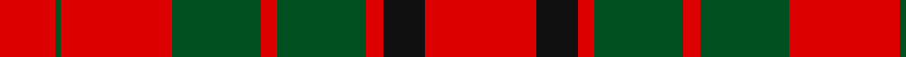

In pattern [RGRGRGRKR](/patterns/rgrgrgrkr/).

This was sourced from register-of-tartans.  It is a [9 stripes tartan](/stripes/stripes9/).

Original link https://www.tartanregister.gov.uk/tartanDetails.aspx?ref=2864

## Thread count
R/20 G2 R40 G32 R6 G32 R6 K15 R/40

## Palette
Each colour and its ΔE from the base-6 reference it is a variant of.

| Colour | Shade | Base | ΔE (OKLab) |
|---|---|---|---|
| G | <code style="background-color:#005020;">#005020</code> `#005020` | G <code style="background-color:#006100;">#006100</code> | 0.07 |
| K | <code style="background-color:#101010;">#101010</code> `#101010` | K <code style="background-color:#000000;">#000000</code> | 0.17 |
| R | <code style="background-color:#DC0000;">#DC0000</code> `#DC0000` | R <code style="background-color:#CC0000;">#CC0000</code> | 0.03 |

## Nearest tartans

The nearest existing variants by ΔTartan distance.

1. [Franklin Museum Unidentified 2](/setts/s8/r5g20r25b1r25b20r5b1~b202060-g006818-rc80000~x4/) — ΔT 0.97
1. [MacKinnon #4](/setts/s7/k1r18g12r2g12r18w1~g005020-k101010-rdc0000-we0e0e0~x2/) — ΔT 1.17
1. [Livingston](/setts/s10/g12r3k1r3k1r4g16r20g2r8~g004c00-k000000-rc80000~x2/) — ΔT 1.20
1. [Livingston](/setts/s9/g20k2r3k2r6g20r29g3r10~g005020-k101010-rdc0000~x2/) — ΔT 1.26
1. [Auld Lang Syne (red) Tartan Tartan Number: 2402. Earliest known date: Threadcount and colours aren't 100% original. Generated manually. See products available Copyright © Blair Urquhart, Comrie, 2015](/setts/s7/r4g14r5k6r24g2r4~g006818-k101010-rc80000~x2/) — ΔT 1.29
1. [MacLeod and MacNicol](/setts/s12/r8g1r8g16r4k2b1k4r8g1r8k1~b3c82af-g005020-k101010-rdc0000~x2/) — ΔT 1.32
1. [Dunbar Family Tartan Tartan Number: 1472. Earliest known date: 1842 The sett for this Lowland family first appeared in the Vestiarium Scoticum. There is also a Dunbar district tartan woven by Wilson's of Bannockburn around 1850. It is not possible to say whether Wilson's pattern was intended as a district or a family sett. The Chief of the Dunbars, Sir Jean Dunbar of Mochrum, once a jockey, lives in Florida, U.S.A. See products available Copyright © Blair Urquhart, Comrie, 2015](/setts/s6/r6g21k8r28k1r4~g006818-k101010-rc80000~x2/) — ΔT 1.34
1. [Dunbar](/setts/s6/r6g21k8r28k2r4~g006818-k101010-rc80000~x2/) — ΔT 1.34
1. [Tipperary](/setts/s7/r33k8b12g12r8b2r8~b401000-g008000-k000000-rc00000~x2/) — ΔT 1.36
1. [Crawford](/setts/s7/r6w2r30g12r3g12r3~g004c00-rc80000-wd0d0d0/) — ΔT 1.37

## Neighbour map

Every grey dot is one of 15726 variants placed by the first two principal components of the ΔTartan feature space (44% of its variance). Red is this tartan; blue dots are its nearest — click one to open its page.

<svg viewBox="0 0 640 380" role="img" style="max-width:100%;height:auto;border:1px solid #e0e0e0;border-radius:4px;display:block" xmlns="http://www.w3.org/2000/svg"><image href="/nn/cloud.v1.png" width="640" height="380"/><a href="/setts/s8/r5g20r25b1r25b20r5b1~b202060-g006818-rc80000~x4/"><circle cx="381.3" cy="183.7" r="4" fill="#3465a4"><title>Franklin Museum Unidentified 2</title></circle></a><a href="/setts/s7/k1r18g12r2g12r18w1~g005020-k101010-rdc0000-we0e0e0~x2/"><circle cx="374.5" cy="183.9" r="4" fill="#3465a4"><title>MacKinnon #4</title></circle></a><a href="/setts/s10/g12r3k1r3k1r4g16r20g2r8~g004c00-k000000-rc80000~x2/"><circle cx="378.4" cy="175.2" r="4" fill="#3465a4"><title>Livingston</title></circle></a><a href="/setts/s9/g20k2r3k2r6g20r29g3r10~g005020-k101010-rdc0000~x2/"><circle cx="344.4" cy="189.7" r="4" fill="#3465a4"><title>Livingston</title></circle></a><a href="/setts/s7/r4g14r5k6r24g2r4~g006818-k101010-rc80000~x2/"><circle cx="395.2" cy="210.1" r="4" fill="#3465a4"><title>Auld Lang Syne (red) Tartan Tartan Number: 2402. Earliest known date: Threadcount and colours aren't 100% original. Generated manually. See products available Copyright © Blair Urquhart, Comrie, 2015</title></circle></a><a href="/setts/s12/r8g1r8g16r4k2b1k4r8g1r8k1~b3c82af-g005020-k101010-rdc0000~x2/"><circle cx="333.6" cy="155.3" r="4" fill="#3465a4"><title>MacLeod and MacNicol</title></circle></a><a href="/setts/s6/r6g21k8r28k1r4~g006818-k101010-rc80000~x2/"><circle cx="380.3" cy="185.4" r="4" fill="#3465a4"><title>Dunbar Family Tartan Tartan Number: 1472. Earliest known date: 1842 The sett for this Lowland family first appeared in the Vestiarium Scoticum. There is also a Dunbar district tartan woven by Wilson's of Bannockburn around 1850. It is not possible to say whether Wilson's pattern was intended as a district or a family sett. The Chief of the Dunbars, Sir Jean Dunbar of Mochrum, once a jockey, lives in Florida, U.S.A. See products available Copyright © Blair Urquhart, Comrie, 2015</title></circle></a><a href="/setts/s6/r6g21k8r28k2r4~g006818-k101010-rc80000~x2/"><circle cx="345.4" cy="211.3" r="4" fill="#3465a4"><title>Dunbar</title></circle></a><a href="/setts/s7/r33k8b12g12r8b2r8~b401000-g008000-k000000-rc00000~x2/"><circle cx="329.3" cy="182.6" r="4" fill="#3465a4"><title>Tipperary</title></circle></a><a href="/setts/s7/r6w2r30g12r3g12r3~g004c00-rc80000-wd0d0d0/"><circle cx="417.8" cy="197.9" r="4" fill="#3465a4"><title>Crawford</title></circle></a><circle cx="360.1" cy="195.5" r="5" fill="#c00000"/></svg>

ID: /setts/s9/r40k15r6g32r6g32r40g2r20~g005020-k101010-rdc0000/
