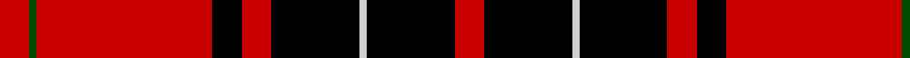

**Bands:** [RGRKRKWKR](/stripes/rgrkrkwkr/) · **Stripes:** [R DG R K R K LB K R](/stripes/stripes9/) R DG R K R K LB K R

This was sourced from weddslist.  It is a [9 band tartan](/bands/bands9/).

Original link http://www.weddslist.com/cgi-bin/tartans/pg.pl?source=rb

## Register references

External register numbers recorded for this tartan.

- Scottish Register of Tartans: [2540](https://www.tartanregister.gov.uk/tartanDetails.aspx?ref=2540)
- Scottish Register of Tartans: [2666](https://www.tartanregister.gov.uk/tartanDetails.aspx?ref=2666)
- Scottish Register of Tartans: [3808](https://www.tartanregister.gov.uk/tartanDetails.aspx?ref=3808)
- Scottish Tartans Authority (ITI): 218
- Scottish Tartans World Register: 1010
- Scottish Tartans World Register: 1585
- Scottish Tartans World Register: 218

## Thread count
R/4 G1 R24 K4 R4 K12 N1 K12 R/4

## Palette
Each colour and its ΔE from the base-6 reference it is a variant of.

| Colour | Shade | Base | ΔE (OKLab) |
|---|---|---|---|
| G | <code style="background-color:#004C00;">#004C00</code> `#004C00` | G <code style="background-color:#006100;">#006100</code> | 0.07 |
| K | <code style="background-color:#000000;">#000000</code> `#000000` | K <code style="background-color:#000000;">#000000</code> | 0.00 |
| N | <code style="background-color:#D0D0D0;">#D0D0D0</code> `#D0D0D0` | W <code style="background-color:#F7F7F7;">#F7F7F7</code> | 0.12 |
| R | <code style="background-color:#C80000;">#C80000</code> `#C80000` | R <code style="background-color:#CC0000;">#CC0000</code> | 0.01 |

## Nearest tartans

The nearest existing variants by ΔTartan distance.

1. [Wemyss](/setts/s9/r4k12w1k12r4k4r24g1r4~x2/) — ΔT 0.10
1. [Wemyss](/setts/s9/r4k12lr1k12r4k4r24dg1r4~x2/) — ΔT 0.50
1. [Wemyss](/setts/s9/r4k12lr1k12r4k4r24dg1r4/) — ΔT 0.50
1. [MacIvor](/setts/s9/lb1r12k2r2k16r2k2r12ly1/) — ΔT 0.68
1. [MacIver](/setts/s9/lr1r12k2r2k16r2k2r12ly1~x2/) — ΔT 0.72
1. [Wemyss](/setts/s9/r4k12w1k12r4k4r24g1r4~x4/) — ΔT 0.99
1. [MacIver](/setts/s9/ly1r9k2r2k12r2k2r9w1~x4/) — ΔT 1.08
1. [Ramsay](/setts/s6/k4lb2k28r30db1r3~x2/) — ΔT 1.15
1. [Ramsay](/setts/s6/k4w2k28r30dp1r3~x2/) — ΔT 1.17
1. [Cunningham](/setts/s7/k3r1k30r28db1r1lb3~x2/) — ΔT 1.27

## Neighbour map

Every grey dot is one of 14313 variants placed by the first two principal components of the ΔTartan feature space (44% of its variance). Red is this tartan; blue dots are its nearest — click one to open its page.

<svg viewBox="0 0 640 380" role="img" style="max-width:100%;height:auto;border:1px solid #e0e0e0;border-radius:4px;display:block" xmlns="http://www.w3.org/2000/svg"><image href="/nn/cloud.v1.png" width="640" height="380"/><a href="/setts/s9/r4k12w1k12r4k4r24g1r4~x2/"><circle cx="341.7" cy="137.0" r="4" fill="#3465a4"><title>Wemyss</title></circle></a><a href="/setts/s9/r4k12lr1k12r4k4r24dg1r4~x2/"><circle cx="349.1" cy="143.5" r="4" fill="#3465a4"><title>Wemyss</title></circle></a><a href="/setts/s9/r4k12lr1k12r4k4r24dg1r4/"><circle cx="349.1" cy="143.5" r="4" fill="#3465a4"><title>Wemyss</title></circle></a><a href="/setts/s9/lb1r12k2r2k16r2k2r12ly1/"><circle cx="331.0" cy="143.1" r="4" fill="#3465a4"><title>MacIvor</title></circle></a><a href="/setts/s9/lr1r12k2r2k16r2k2r12ly1~x2/"><circle cx="338.7" cy="151.2" r="4" fill="#3465a4"><title>MacIver</title></circle></a><a href="/setts/s9/r4k12w1k12r4k4r24g1r4~x4/"><circle cx="359.5" cy="141.1" r="4" fill="#3465a4"><title>Wemyss</title></circle></a><a href="/setts/s9/ly1r9k2r2k12r2k2r9w1~x4/"><circle cx="305.4" cy="161.5" r="4" fill="#3465a4"><title>MacIver</title></circle></a><a href="/setts/s6/k4lb2k28r30db1r3~x2/"><circle cx="338.2" cy="136.3" r="4" fill="#3465a4"><title>Ramsay</title></circle></a><a href="/setts/s6/k4w2k28r30dp1r3~x2/"><circle cx="339.3" cy="137.4" r="4" fill="#3465a4"><title>Ramsay</title></circle></a><a href="/setts/s7/k3r1k30r28db1r1lb3~x2/"><circle cx="340.9" cy="119.6" r="4" fill="#3465a4"><title>Cunningham</title></circle></a><circle cx="341.1" cy="135.8" r="5" fill="#c00000"/></svg>

ID: /setts/s9/r4k12lb1k12r4k4r24dg1r4/
