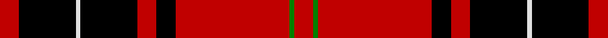

In pattern [RGRKRKWKR](/stripes/rgrkrkwkr/).

This was sourced from weddslist.  It is a [9 stripe tartan](/stripes/stripes9/).

Original link http://www.weddslist.com/cgi-bin/tartans/pg.pl?source=sts

## Attestations

This cloth appears in 2 source records; the oldest owns this page.

- undated — Wemyss (weddslist, [record](http://www.weddslist.com/cgi-bin/tartans/pg.pl?source=sts))
- undated — Wemyss Clan Tartan Tartan Number: 1512. Earliest known date: 1842 Wemyss means cave and probably originates from the caves beneath MacDuff castle. There is a long and interesting article on the family of Wemyss in William Anderson's 'The Scottish Nation' published by A Fullarton in 1874. See products available Copyright © Blair Urquhart, Comrie, 2015 (house-of-tartan, [record](http://www.house-of-tartan.scotland.net/house/TartanViewjs.asp?colr=Def&tnam=1512))

## Thread count
R/8 K24 LN2 K24 R8 K8 R48 G2 R/8

## Palette
Each colour and the base-6 reference it is a variant of.

| Colour | Shade | Base |
|---|---|---|
| G | <code style="background-color:#008000;">#008000</code> `oklch(52.0% 0.177 142.5)` <small>#008000</small> | G <code style="background-color:#006100;">#006100</code> |
| K | <code style="background-color:#000000;">#000000</code> `oklch(0.0% 0.000 0.0)` <small>#000000</small> | K <code style="background-color:#000000;">#000000</code> |
| LN | <code style="background-color:#E0E0E0;">#E0E0E0</code> `oklch(90.7% 0.000 89.9)` <small>#E0E0E0</small> | W <code style="background-color:#F7F7F7;">#F7F7F7</code> |
| R | <code style="background-color:#C00000;">#C00000</code> `oklch(50.7% 0.208 29.2)` <small>#C00000</small> | R <code style="background-color:#CC0000;">#CC0000</code> |

## Nearest tartans

The nearest existing variants by ΔTartan distance.

1. [Wemyss](/setts/s9/r4k12lb1k12r4k4r24dg1r4~x2/) — ΔT 0.10
1. [Wemyss](/setts/s9/r4k12lr1k12r4k4r24dg1r4~x2/) — ΔT 0.41
1. [MacIver](/setts/s9/lr1r12k2r2k16r2k2r12ly1~x2/) — ΔT 0.68
1. [MacIvor](/setts/s9/ly1r12k2r2k16r2k2r12lb1/) — ΔT 0.72
1. [Wemyss](/setts/s9/r4k12w1k12r4k4r24g1r4~x4/) — ΔT 1.00
1. [MacIver](/setts/s9/w1r9k2r2k12r2k2r9ly1~x4/) — ΔT 1.09
1. [Ramsay](/setts/s6/k4lb2k28r30db1r3~x2/) — ΔT 1.13
1. [Ramsay](/setts/s6/k4w2k28r30dp1r3~x2/) — ΔT 1.14
1. [Hebridean 8](/setts/s11/k2r2k12r2k2r18k2r2k12r2w1~x2/) — ΔT 1.24
1. [Cunningham](/setts/s7/k3r1k30r28db1r1lb3~x2/) — ΔT 1.24

## Neighbour map

Every grey dot is one of 14299 variants placed by the first two principal components of the ΔTartan feature space (44% of its variance). Red is this tartan; blue dots are its nearest — click one to open its page.

<svg viewBox="0 0 640 380" role="img" style="max-width:100%;height:auto;border:1px solid #e0e0e0;border-radius:4px;display:block" xmlns="http://www.w3.org/2000/svg"><image href="/nn/cloud.v1.png" width="640" height="380"/><a href="/setts/s9/r4k12lb1k12r4k4r24dg1r4~x2/"><circle cx="340.9" cy="135.6" r="4" fill="#3465a4"><title>Wemyss</title></circle></a><a href="/setts/s9/r4k12lr1k12r4k4r24dg1r4~x2/"><circle cx="348.9" cy="143.3" r="4" fill="#3465a4"><title>Wemyss</title></circle></a><a href="/setts/s9/lr1r12k2r2k16r2k2r12ly1~x2/"><circle cx="338.6" cy="151.0" r="4" fill="#3465a4"><title>MacIver</title></circle></a><a href="/setts/s9/ly1r12k2r2k16r2k2r12lb1/"><circle cx="330.8" cy="142.9" r="4" fill="#3465a4"><title>MacIvor</title></circle></a><a href="/setts/s9/r4k12w1k12r4k4r24g1r4~x4/"><circle cx="359.2" cy="141.0" r="4" fill="#3465a4"><title>Wemyss</title></circle></a><a href="/setts/s9/w1r9k2r2k12r2k2r9ly1~x4/"><circle cx="305.2" cy="161.3" r="4" fill="#3465a4"><title>MacIver</title></circle></a><a href="/setts/s6/k4lb2k28r30db1r3~x2/"><circle cx="338.1" cy="136.2" r="4" fill="#3465a4"><title>Ramsay</title></circle></a><a href="/setts/s6/k4w2k28r30dp1r3~x2/"><circle cx="339.2" cy="137.2" r="4" fill="#3465a4"><title>Ramsay</title></circle></a><a href="/setts/s11/k2r2k12r2k2r18k2r2k12r2w1~x2/"><circle cx="348.0" cy="150.7" r="4" fill="#3465a4"><title>Hebridean 8</title></circle></a><a href="/setts/s7/k3r1k30r28db1r1lb3~x2/"><circle cx="340.7" cy="119.5" r="4" fill="#3465a4"><title>Cunningham</title></circle></a><circle cx="341.5" cy="136.9" r="5" fill="#c00000"/></svg>

ID: /setts/s9/r4k12w1k12r4k4r24g1r4~x2/
