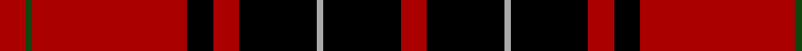

In pattern [RGRKRKYKR](/patterns/rgrkrkykr/).

This was sourced from weddslist.  It is a [9 stripes tartan](/stripes/stripes9/).

Original link http://www.weddslist.com/cgi-bin/tartans/pg.pl?source=tinsel

## Thread count
DR/8 DG2 DR48 K8 DR8 K24 N2 K24 DR/8

## Palette
Each colour and its ΔE from the base-6 reference it is a variant of.

| Colour | Shade | Base | ΔE (OKLab) |
|---|---|---|---|
| DG | <code style="background-color:#11450D;">#11450D</code> `#11450D` | G <code style="background-color:#006100;">#006100</code> | 0.09 |
| DR | <code style="background-color:#AA0000;">#AA0000</code> `#AA0000` | R <code style="background-color:#CC0000;">#CC0000</code> | 0.07 |
| K | <code style="background-color:#000000;">#000000</code> `#000000` | K <code style="background-color:#000000;">#000000</code> | 0.00 |
| N | <code style="background-color:#AAAAAA;">#AAAAAA</code> `#AAAAAA` | Y <code style="background-color:#F2BF00;">#F2BF00</code> | 0.19 |

## Nearest tartans

The nearest existing variants by ΔTartan distance.

1. [Wemyss](/setts/s9/r4k12y1k12r4k4r24g1r4~g11450d-k000000-raa0000-yaaaaaa/) — ΔT 0.00
1. [Wemyss](/setts/s9/r4k12w1k12r4k4r24g1r4~g008000-k000000-rc00000-we0e0e0~x2/) — ΔT 0.41
1. [Wemyss](/setts/s9/r4k12w1k12r4k4r24g1r4~g004c00-k000000-rc80000-wd0d0d0/) — ΔT 0.50
1. [MacIver](/setts/s9/y1r12k2r2k16r2k2r12ya1~k000000-raa0000-yaaaa00-yaaaaaaa~x2/) — ΔT 0.67
1. [MacIvor](/setts/s9/w1r12k2r2k16r2k2r12y1~k000000-rc80000-wd0d0d0-yffc800/) — ΔT 0.96
1. [Wemyss](/setts/s9/r4k12w1k12r4k4r24g1r4~g006818-k101010-rc80000-wfcfcfc~x4/) — ΔT 1.08
1. [Wemyss Clan Tartan Tartan Number: 1512. Earliest known date: 1842 Wemyss means cave and probably originates from the caves beneath MacDuff castle. There is a long and interesting article on the family of Wemyss in William Anderson's 'The Scottish Nation' published by A Fullarton in 1874. See products available Copyright © Blair Urquhart, Comrie, 2015](/setts/s9/r4k12w1k12r4k4r24g1r4~g006818-k101010-rc80000-we0e0e0~x2/) — ΔT 1.10
1. [Ramsay](/setts/s6/k4y2k28r30b1r3~b6e5058-k000000-raa0000-yaaaaaa~x2/) — ΔT 1.13
1. [Ramsay](/setts/s6/k4y2k28r30b1r3~b6e5058-k000000-raa0000-yaaaaaa/) — ΔT 1.13
1. [Ramsay](/setts/s6/k4w2k28r30b1r3~b300030-k000000-rc00000-we0e0e0~x2/) — ΔT 1.15

## Neighbour map

Every grey dot is one of 15726 variants placed by the first two principal components of the ΔTartan feature space (44% of its variance). Red is this tartan; blue dots are its nearest — click one to open its page.

<svg viewBox="0 0 640 380" role="img" style="max-width:100%;height:auto;border:1px solid #e0e0e0;border-radius:4px;display:block" xmlns="http://www.w3.org/2000/svg"><image href="/nn/cloud.v1.png" width="640" height="380"/><a href="/setts/s9/r4k12y1k12r4k4r24g1r4~g11450d-k000000-raa0000-yaaaaaa/"><circle cx="348.0" cy="148.9" r="4" fill="#3465a4"><title>Wemyss</title></circle></a><a href="/setts/s9/r4k12w1k12r4k4r24g1r4~g008000-k000000-rc00000-we0e0e0~x2/"><circle cx="340.8" cy="143.6" r="4" fill="#3465a4"><title>Wemyss</title></circle></a><a href="/setts/s9/r4k12w1k12r4k4r24g1r4~g004c00-k000000-rc80000-wd0d0d0/"><circle cx="340.2" cy="142.5" r="4" fill="#3465a4"><title>Wemyss</title></circle></a><a href="/setts/s9/y1r12k2r2k16r2k2r12ya1~k000000-raa0000-yaaaa00-yaaaaaaa~x2/"><circle cx="337.7" cy="157.1" r="4" fill="#3465a4"><title>MacIver</title></circle></a><a href="/setts/s9/w1r12k2r2k16r2k2r12y1~k000000-rc80000-wd0d0d0-yffc800/"><circle cx="330.2" cy="150.3" r="4" fill="#3465a4"><title>MacIvor</title></circle></a><a href="/setts/s9/r4k12w1k12r4k4r24g1r4~g006818-k101010-rc80000-wfcfcfc~x4/"><circle cx="359.0" cy="146.1" r="4" fill="#3465a4"><title>Wemyss</title></circle></a><a href="/setts/s9/r4k12w1k12r4k4r24g1r4~g006818-k101010-rc80000-we0e0e0~x2/"><circle cx="360.5" cy="146.7" r="4" fill="#3465a4"><title>Wemyss Clan Tartan Tartan Number: 1512. Earliest known date: 1842 Wemyss means cave and probably originates from the caves beneath MacDuff castle. There is a long and interesting article on the family of Wemyss in William Anderson's 'The Scottish Nation' published by A Fullarton in 1874. See products available Copyright © Blair Urquhart, Comrie, 2015</title></circle></a><a href="/setts/s6/k4y2k28r30b1r3~b6e5058-k000000-raa0000-yaaaaaa~x2/"><circle cx="344.5" cy="148.5" r="4" fill="#3465a4"><title>Ramsay</title></circle></a><a href="/setts/s6/k4y2k28r30b1r3~b6e5058-k000000-raa0000-yaaaaaa/"><circle cx="344.5" cy="148.5" r="4" fill="#3465a4"><title>Ramsay</title></circle></a><a href="/setts/s6/k4w2k28r30b1r3~b300030-k000000-rc00000-we0e0e0~x2/"><circle cx="338.0" cy="143.7" r="4" fill="#3465a4"><title>Ramsay</title></circle></a><circle cx="348.0" cy="148.9" r="5" fill="#c00000"/></svg>

ID: /setts/s9/r4k12y1k12r4k4r24g1r4~g11450d-k000000-raa0000-yaaaaaa~x2/
