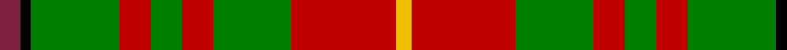

In pattern [RKGRGRGRY](/patterns/rkgrgrgry/).

This was sourced from weddslist.  It is a [9 stripes tartan](/stripes/stripes9/).

Original link http://www.weddslist.com/cgi-bin/tartans/pg.pl?source=sts

## Thread count
DR/8 K4 G34 R12 G12 R12 G30 R40 Y/6

## Palette
Each colour and its ΔE from the base-6 reference it is a variant of.

| Colour | Shade | Base | ΔE (OKLab) |
|---|---|---|---|
| DR | <code style="background-color:#802040;">#802040</code> `#802040` | R <code style="background-color:#CC0000;">#CC0000</code> | 0.17 |
| G | <code style="background-color:#008000;">#008000</code> `#008000` | G <code style="background-color:#006100;">#006100</code> | 0.10 |
| K | <code style="background-color:#000000;">#000000</code> `#000000` | K <code style="background-color:#000000;">#000000</code> | 0.00 |
| R | <code style="background-color:#C00000;">#C00000</code> `#C00000` | R <code style="background-color:#CC0000;">#CC0000</code> | 0.03 |
| Y | <code style="background-color:#F0C000;">#F0C000</code> `#F0C000` | Y <code style="background-color:#F2BF00;">#F2BF00</code> | 0.00 |

## Nearest tartans

The nearest existing variants by ΔTartan distance.

1. [Fulton Family Tartan Tartan Number: 2205. Earliest known date: 1982 For anyone of the name Fulton. See products available Copyright © Blair Urquhart, Comrie, 2015](/setts/s9/r4k2g17ra6g6ra6g15ra20y3~g006818-k101010-r880000-rac80000-yd09800~x2/) — ΔT 0.74
1. [Bruce County](/setts/s12/w1b1r7g2r2g6r1g6r2g2r8y1~b304080-g008000-rc00000-we0e0e0-yf0c000~x2/) — ΔT 0.99
1. [Bruce County District Tartan Tartan Number: 1778. Earliest known date: 1964 Bruce County is an administrative district of the Province of Ontario. The design is attributed to Lord Bruce, the son of the Earl of Elgin, and chief of the Clan Bruce, for his role in adapting the Bruce clan tartan. Two blue stripes have been added to represent the coastline of Lake Huron and Georgian Bay. See products available Copyright © Blair Urquhart, Comrie, 2015](/setts/s12/w1b1r7g2r2g6r1g6r2g2r8y1~b2c2c80-g006818-rc80000-we0e0e0-ye8c000~x2/) — ΔT 1.17
1. [Bruce County](/setts/s12/w1b1r7g2r2g6r1g6r2g2r8y1~b1c0070-g006818-rc80000-wfcfcfc-yd09800~x4/) — ΔT 1.18
1. [Hynde](/setts/s11/g14r1g14r7w1r7w1r7b5ba3w1~b000050-ba800080-g008000-rc00000-we0e0e0~x4/) — ΔT 1.20
1. [Unidentified #57](/setts/s8/g20r8y2r8g5ya8g2ya8~g004c00-r8c0000-yb0b0b0-yac89800~x2/) — ΔT 1.21
1. [Hynde Artifact Tartan Tartan Number: 976. Earliest known date: 1744 Trews belonging to Sir John Hynde. See products available Copyright © Blair Urquhart, Comrie, 2015](/setts/s11/g14r1g14r7w1r7w1r7b5ba3w1~b202060-ba780078-g006818-rc80000-we0e0e0~x4/) — ΔT 1.26
1. [Craik, of Assington](/setts/s8/b4r11b1g8r2g4k1y2~b304080-g008000-k000000-rc00000-yf0c000~x4/) — ΔT 1.32
1. [MacKinnon 7](/setts/s11/w2r4g8r16b2r3g16r4b2r4w2~b5480b0-g008000-rc00000-we0e0e0~x2/) — ΔT 1.33
1. [Glenfinnan (Fashion)](/setts/s10/r5w2g3w2r10g10r2w1r2ga1~g006818-ga005448-r880000-we0e0e0~x4/) — ΔT 1.35

## Neighbour map

Every grey dot is one of 15726 variants placed by the first two principal components of the ΔTartan feature space (44% of its variance). Red is this tartan; blue dots are its nearest — click one to open its page.

<svg viewBox="0 0 640 380" role="img" style="max-width:100%;height:auto;border:1px solid #e0e0e0;border-radius:4px;display:block" xmlns="http://www.w3.org/2000/svg"><image href="/nn/cloud.v1.png" width="640" height="380"/><a href="/setts/s9/r4k2g17ra6g6ra6g15ra20y3~g006818-k101010-r880000-rac80000-yd09800~x2/"><circle cx="261.3" cy="191.9" r="4" fill="#3465a4"><title>Fulton Family Tartan Tartan Number: 2205. Earliest known date: 1982 For anyone of the name Fulton. See products available Copyright © Blair Urquhart, Comrie, 2015</title></circle></a><a href="/setts/s12/w1b1r7g2r2g6r1g6r2g2r8y1~b304080-g008000-rc00000-we0e0e0-yf0c000~x2/"><circle cx="263.4" cy="173.9" r="4" fill="#3465a4"><title>Bruce County</title></circle></a><a href="/setts/s12/w1b1r7g2r2g6r1g6r2g2r8y1~b2c2c80-g006818-rc80000-we0e0e0-ye8c000~x2/"><circle cx="266.6" cy="174.5" r="4" fill="#3465a4"><title>Bruce County District Tartan Tartan Number: 1778. Earliest known date: 1964 Bruce County is an administrative district of the Province of Ontario. The design is attributed to Lord Bruce, the son of the Earl of Elgin, and chief of the Clan Bruce, for his role in adapting the Bruce clan tartan. Two blue stripes have been added to represent the coastline of Lake Huron and Georgian Bay. See products available Copyright © Blair Urquhart, Comrie, 2015</title></circle></a><a href="/setts/s12/w1b1r7g2r2g6r1g6r2g2r8y1~b1c0070-g006818-rc80000-wfcfcfc-yd09800~x4/"><circle cx="264.0" cy="173.5" r="4" fill="#3465a4"><title>Bruce County</title></circle></a><a href="/setts/s11/g14r1g14r7w1r7w1r7b5ba3w1~b000050-ba800080-g008000-rc00000-we0e0e0~x4/"><circle cx="220.0" cy="147.4" r="4" fill="#3465a4"><title>Hynde</title></circle></a><a href="/setts/s8/g20r8y2r8g5ya8g2ya8~g004c00-r8c0000-yb0b0b0-yac89800~x2/"><circle cx="222.5" cy="209.7" r="4" fill="#3465a4"><title>Unidentified #57</title></circle></a><a href="/setts/s11/g14r1g14r7w1r7w1r7b5ba3w1~b202060-ba780078-g006818-rc80000-we0e0e0~x4/"><circle cx="233.1" cy="151.4" r="4" fill="#3465a4"><title>Hynde Artifact Tartan Tartan Number: 976. Earliest known date: 1744 Trews belonging to Sir John Hynde. See products available Copyright © Blair Urquhart, Comrie, 2015</title></circle></a><a href="/setts/s8/b4r11b1g8r2g4k1y2~b304080-g008000-k000000-rc00000-yf0c000~x4/"><circle cx="187.0" cy="170.1" r="4" fill="#3465a4"><title>Craik, of Assington</title></circle></a><a href="/setts/s11/w2r4g8r16b2r3g16r4b2r4w2~b5480b0-g008000-rc00000-we0e0e0~x2/"><circle cx="264.5" cy="180.7" r="4" fill="#3465a4"><title>MacKinnon 7</title></circle></a><a href="/setts/s10/r5w2g3w2r10g10r2w1r2ga1~g006818-ga005448-r880000-we0e0e0~x4/"><circle cx="260.7" cy="179.6" r="4" fill="#3465a4"><title>Glenfinnan (Fashion)</title></circle></a><circle cx="241.2" cy="184.7" r="5" fill="#c00000"/></svg>

ID: /setts/s9/r4k2g17ra6g6ra6g15ra20y3~g008000-k000000-r802040-rac00000-yf0c000~x2/
