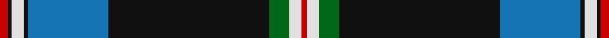

In pattern [RKWKBKGWR](/stripes/rkwkbkgwr/).

This was sourced from tartans-authority.  It is a [9 stripe tartan](/stripes/stripes9/).

Original link http://www.tartansauthority.com/tartan-ferret/display/10135/

## Also known as

This cloth is also recorded under:

- Italian

## Attestations

This cloth appears in 2 source records; the oldest owns this page.

- 5th Jan. 2010 — Italian American (Corporate) (tartans-authority, [record](http://www.tartansauthority.com/tartan-ferret/display/10135/))
- undated — Italian American Corporate Tartan Tartan Number: 10135. Earliest known date: 5th Jan. 2010 This tartan was designed by Rocky Roeger of USA Kilts and was commissioned by Tony Licalzi, to celebrate the creativity and passion of Italian Americans. The green, white and red represent the colours of the Italian flag and the red, white and blue, the American flag. This is a Universal tartan that is available for anyone to wear. See products available Copyright © Blair Urquhart, Comrie, 2015 (house-of-tartan, [record](http://www.house-of-tartan.scotland.net/house/TartanViewjs.asp?colr=Def&tnam=10135))

## Thread count
R/4 K2 LN6 K2 B40 K80 G10 LN6 R/3

## Palette
Each colour and the base-6 reference it is a variant of.

| Colour | Shade | Base |
|---|---|---|
| B | <code style="background-color:#1474B4;">#1474B4</code> `oklch(54.0% 0.129 245.1)` <small>#1474B4</small> | B <code style="background-color:#2A418A;">#2A418A</code> |
| G | <code style="background-color:#006818;">#006818</code> `oklch(45.0% 0.142 145.0)` <small>#006818</small> | G <code style="background-color:#006100;">#006100</code> |
| K | <code style="background-color:#101010;">#101010</code> `oklch(17.3% 0.000 89.9)` <small>#101010</small> | K <code style="background-color:#000000;">#000000</code> |
| LN | <code style="background-color:#E0E0E0;">#E0E0E0</code> `oklch(90.7% 0.000 89.9)` <small>#E0E0E0</small> | W <code style="background-color:#F7F7F7;">#F7F7F7</code> |
| R | <code style="background-color:#C80000;">#C80000</code> `oklch(52.3% 0.215 29.2)` <small>#C80000</small> | R <code style="background-color:#CC0000;">#CC0000</code> |

## Nearest tartans

The nearest existing variants by ΔTartan distance.

1. [Italian American](/setts/s9/r4k2w6k2db40k80dg10w6r3/) — ΔT 0.64
1. [MacLaurin, of Brioch](/setts/s7/db36k10g3r3g6k1ly2~x2/) — ΔT 0.87
1. [Sinclair-Brown](/setts/s8/db64k11r2k4r2k4g32y4~x2/) — ΔT 0.87
1. [Melrose Newbigging Grey](/setts/s10/n1k6n35k6k2dp3n1k6k2w1~x2/) — ΔT 1.08
1. [Sandelin #2 (Personal)](/setts/s8/w10db2w1db35dg10lo3dg10r4~x2/) — ΔT 1.12
1. [Bro-Kerne](/setts/s9/w3dt1k14dt2k1g6k1dt30lo3~x2/) — ΔT 1.12
1. [Midnight Balmoral (Personal)](/setts/s9/t4w1k36db2r4w1db14r8w1~x2/) — ΔT 1.12
1. [Distripress (Corporate)](/setts/s8/r6k1w4k4n15r1k35o2~x2/) — ΔT 1.21
1. [Royal College of G.P.s (Corporate)](/setts/s8/lo8k50o15dg6o6db3o6lo2~x2/) — ΔT 1.23
1. [Skye (Fashion)](/setts/s10/n50k12o2k2w2k2o12n7k7w2~x2/) — ΔT 1.23

## Neighbour map

Every grey dot is one of 14299 variants placed by the first two principal components of the ΔTartan feature space (44% of its variance). Red is this tartan; blue dots are its nearest — click one to open its page.

<svg viewBox="0 0 640 380" role="img" style="max-width:100%;height:auto;border:1px solid #e0e0e0;border-radius:4px;display:block" xmlns="http://www.w3.org/2000/svg"><image href="/nn/cloud.v1.png" width="640" height="380"/><a href="/setts/s9/r4k2w6k2db40k80dg10w6r3/"><circle cx="341.6" cy="97.0" r="4" fill="#3465a4"><title>Italian American</title></circle></a><a href="/setts/s7/db36k10g3r3g6k1ly2~x2/"><circle cx="353.3" cy="115.7" r="4" fill="#3465a4"><title>MacLaurin, of Brioch</title></circle></a><a href="/setts/s8/db64k11r2k4r2k4g32y4~x2/"><circle cx="313.0" cy="115.7" r="4" fill="#3465a4"><title>Sinclair-Brown</title></circle></a><a href="/setts/s10/n1k6n35k6k2dp3n1k6k2w1~x2/"><circle cx="319.5" cy="69.3" r="4" fill="#3465a4"><title>Melrose Newbigging Grey</title></circle></a><a href="/setts/s8/w10db2w1db35dg10lo3dg10r4~x2/"><circle cx="271.8" cy="113.8" r="4" fill="#3465a4"><title>Sandelin #2 (Personal)</title></circle></a><a href="/setts/s9/w3dt1k14dt2k1g6k1dt30lo3~x2/"><circle cx="332.9" cy="116.5" r="4" fill="#3465a4"><title>Bro-Kerne</title></circle></a><a href="/setts/s9/t4w1k36db2r4w1db14r8w1~x2/"><circle cx="297.2" cy="93.3" r="4" fill="#3465a4"><title>Midnight Balmoral (Personal)</title></circle></a><a href="/setts/s8/r6k1w4k4n15r1k35o2~x2/"><circle cx="355.5" cy="110.0" r="4" fill="#3465a4"><title>Distripress (Corporate)</title></circle></a><a href="/setts/s8/lo8k50o15dg6o6db3o6lo2~x2/"><circle cx="297.3" cy="121.3" r="4" fill="#3465a4"><title>Royal College of G.P.s (Corporate)</title></circle></a><a href="/setts/s10/n50k12o2k2w2k2o12n7k7w2~x2/"><circle cx="344.6" cy="117.2" r="4" fill="#3465a4"><title>Skye (Fashion)</title></circle></a><circle cx="328.8" cy="88.7" r="5" fill="#c00000"/></svg>

ID: /setts/s9/r4k2w6k2b40k80g10w6r3/
