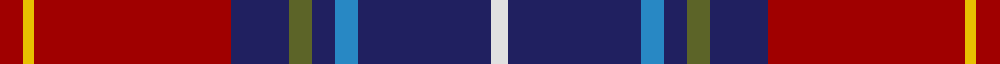

This page is one **sett** — a single exact thread-count. It belongs to the [tartan](/tartans/dr4y2dr34db10g4db4b4db23ln3/)
(the same proportion at any scale), whose colour order is pattern [RYRBGBBBW](/stripes/ryrbgbbbw/).

Sourced from tartans-authority.  It is a [9 stripe tartan](/stripes/stripes9/).

Original link http://www.tartansauthority.com/tartan-ferret/display/6407/

## Thread count
DR/8 Y4 DR68 DB20 G8 DB8 B8 DB46 LN/6

## Palette
Each colour and the base-6 reference it is a variant of.

| Colour | Shade | Base |
|---|---|---|
| B | <code style="background-color:#2888C4;">#2888C4</code> `oklch(60.1% 0.125 241.5)` <small>#2888C4</small> | B <code style="background-color:#2A418A;">#2A418A</code> |
| DB | <code style="background-color:#202060;">#202060</code> `oklch(28.9% 0.111 276.9)` <small>#202060</small> | B <code style="background-color:#2A418A;">#2A418A</code> |
| DR | <code style="background-color:#A00000;">#A00000</code> `oklch(44.3% 0.182 29.2)` <small>#A00000</small> | R <code style="background-color:#CC0000;">#CC0000</code> |
| G | <code style="background-color:#5C6428;">#5C6428</code> `oklch(48.3% 0.084 116.0)` <small>#5C6428</small> | G <code style="background-color:#006100;">#006100</code> |
| LN | <code style="background-color:#E0E0E0;">#E0E0E0</code> `oklch(90.7% 0.000 89.9)` <small>#E0E0E0</small> | W <code style="background-color:#F7F7F7;">#F7F7F7</code> |
| Y | <code style="background-color:#E8C000;">#E8C000</code> `oklch(81.9% 0.168 93.7)` <small>#E8C000</small> | Y <code style="background-color:#F2BF00;">#F2BF00</code> |

## Nearest tartans

The nearest existing variants by ΔTartan distance, with this tartan at the top so the swatches line up against it.

ΔTartan

Tartan

Sett

—

<a href="/ttd/edit/#slug=r4ly2r34db10y4db4t4db23w3~x2">Heirloom Red Alba (Fashion)</a> <a class="nn-out" href="/setts/s9/r4ly2r34db10y4db4t4db23w3~x2/" title="open its dictionary page">↗</a>

0.91

<a href="/setts/s12/k7db4r31db3ly2db27lb4~x2/">Wishart Dress</a>

0.97

<a href="/ttd/edit/#slug=g18g2db5r45lb3db18lb3r8lb2~x2">MacNiven</a> <a class="nn-out" href="/setts/s9/g18g2db5r45lb3db18lb3r8lb2~x2/" title="open its dictionary page">↗</a>

1.05

<a href="/ttd/edit/#slug=db20ly1o1db3k1y2k1r10k1y2r4~x2">Blais</a> <a class="nn-out" href="/setts/s11/db20ly1o1db3k1y2k1r10k1y2r4~x2/" title="open its dictionary page">↗</a>

1.10

<a href="/ttd/edit/#slug=db20ly1dy1db3k1o2k1r10k1o2r4~x4">Blais (Personal)</a> <a class="nn-out" href="/setts/s11/db20ly1dy1db3k1o2k1r10k1o2r4~x4/" title="open its dictionary page">↗</a>

1.13

<a href="/ttd/edit/#slug=k7db4r31db3ly2db27lb4~x2">Wishart Dress (Clan)</a> <a class="nn-out" href="/setts/s7/k7db4r31db3ly2db27lb4~x2/" title="open its dictionary page">↗</a>

1.17

<a href="/ttd/edit/#slug=db4w1k2db25k12b1k2r16k2lo1~x2">Sidey Dress Tartan (Name)</a> <a class="nn-out" href="/setts/s10/db4w1k2db25k12b1k2r16k2lo1~x2/" title="open its dictionary page">↗</a>

1.17

<a href="/ttd/edit/#slug=dp3lo2r19r4dp6k36dp2lo3~x2">Hyland Evening (Personal)</a> <a class="nn-out" href="/setts/s8/dp3lo2r19r4dp6k36dp2lo3~x2/" title="open its dictionary page">↗</a>

1.18

<a href="/ttd/edit/#slug=k4db12lb3db4g8lo2r24db4r4~x2">MacCreary (Personal)</a> <a class="nn-out" href="/setts/s9/k4db12lb3db4g8lo2r24db4r4~x2/" title="open its dictionary page">↗</a>

1.19

<a href="/ttd/edit/#slug=g3r22k5dt22ly2dt22k5r22g3g3~x2">MacLeod Society of Scotland Clan Tartan Tartan Number: 2375. Earliest known date: 1991 Designed by Rosemary Flemming and Derek MacLeod to celebrate the centenary of the Clan MacLeod Society of Scotland. Trudi Mann of Wick, a TECA scholar, also played a part in the design which was accepted by the Chief as the Society sett. Thread count from Trudi Mann March 2004. See products available Copyright © Blair Urquhart, Comrie, 2015</a> <a class="nn-out" href="/setts/s10/g3r22k5dt22ly2dt22k5r22g3g3~x2/" title="open its dictionary page">↗</a>

1.20

<a href="/setts/s16/r4ly2r34db10y4db4t4db23w3~x2/">Heirloom Red Alba</a>

## Neighbour map

Every grey dot is one of 14299 variants placed by the first two principal components of the ΔTartan feature space (44% of its variance). Red is this tartan; blue dots are its nearest — click one to open its page.

<svg viewBox="0 0 640 380" role="img" style="max-width:100%;height:auto;border:1px solid #e0e0e0;border-radius:4px;display:block" xmlns="http://www.w3.org/2000/svg"><image href="/nn/cloud.v1.png" width="640" height="380"/><a href="/setts/s12/k7db4r31db3ly2db27lb4~x2/"><circle cx="220.9" cy="110.2" r="4" fill="#3465a4"><title>Wishart Dress</title></circle></a><a href="/setts/s9/g18g2db5r45lb3db18lb3r8lb2~x2/"><circle cx="281.0" cy="109.9" r="4" fill="#3465a4"><title>MacNiven</title></circle></a><a href="/setts/s11/db20ly1o1db3k1y2k1r10k1y2r4~x2/"><circle cx="283.4" cy="95.2" r="4" fill="#3465a4"><title>Blais</title></circle></a><a href="/setts/s11/db20ly1dy1db3k1o2k1r10k1o2r4~x4/"><circle cx="285.5" cy="95.2" r="4" fill="#3465a4"><title>Blais (Personal)</title></circle></a><a href="/setts/s7/k7db4r31db3ly2db27lb4~x2/"><circle cx="200.2" cy="126.7" r="4" fill="#3465a4"><title>Wishart Dress (Clan)</title></circle></a><a href="/setts/s10/db4w1k2db25k12b1k2r16k2lo1~x2/"><circle cx="259.4" cy="106.1" r="4" fill="#3465a4"><title>Sidey Dress Tartan (Name)</title></circle></a><a href="/setts/s8/dp3lo2r19r4dp6k36dp2lo3~x2/"><circle cx="254.5" cy="113.0" r="4" fill="#3465a4"><title>Hyland Evening (Personal)</title></circle></a><a href="/setts/s9/k4db12lb3db4g8lo2r24db4r4~x2/"><circle cx="182.7" cy="134.9" r="4" fill="#3465a4"><title>MacCreary (Personal)</title></circle></a><a href="/setts/s10/g3r22k5dt22ly2dt22k5r22g3g3~x2/"><circle cx="191.3" cy="150.2" r="4" fill="#3465a4"><title>MacLeod Society of Scotland Clan Tartan Tartan Number: 2375. Earliest known date: 1991 Designed by Rosemary Flemming and Derek MacLeod to celebrate the centenary of the Clan MacLeod Society of Scotland. Trudi Mann of Wick, a TECA scholar, also played a part in the design which was accepted by the Chief as the Society sett. Thread count from Trudi Mann March 2004. See products available Copyright © Blair Urquhart, Comrie, 2015</title></circle></a><a href="/setts/s16/r4ly2r34db10y4db4t4db23w3~x2/"><circle cx="249.8" cy="106.8" r="4" fill="#3465a4"><title>Heirloom Red Alba</title></circle></a><circle cx="252.8" cy="123.7" r="5" fill="#c00000"/></svg>

ID: /setts/s9/r4ly2r34db10y4db4t4db23w3~x2/
