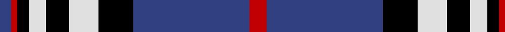

In pattern [BRKWKWKBR](/patterns/brkwkwkbr/).

This was sourced from weddslist.  It is a [9 stripes tartan](/stripes/stripes9/).

Original link http://www.weddslist.com/cgi-bin/tartans/pg.pl?source=sts

## Thread count
B/4 R2 K4 LN6 K8 LN10 K12 B40 R/6

## Palette
Each colour and its ΔE from the base-6 reference it is a variant of.

| Colour | Shade | Base | ΔE (OKLab) |
|---|---|---|---|
| B | <code style="background-color:#304080;">#304080</code> `#304080` | B <code style="background-color:#2A418A;">#2A418A</code> | 0.02 |
| K | <code style="background-color:#000000;">#000000</code> `#000000` | K <code style="background-color:#000000;">#000000</code> | 0.00 |
| LN | <code style="background-color:#E0E0E0;">#E0E0E0</code> `#E0E0E0` | W <code style="background-color:#F7F7F7;">#F7F7F7</code> | 0.07 |
| R | <code style="background-color:#C00000;">#C00000</code> `#C00000` | R <code style="background-color:#CC0000;">#CC0000</code> | 0.03 |

## Nearest tartans

The nearest existing variants by ΔTartan distance.

1. [Scottish Knights Templar, of M.T.S. St Andrew](/setts/s10/w8r2b40k12w10k8w6k4r2b4-b304080-k000000-rc00000-we0e0e0/) — ΔT 0.48
1. [Knights Templar International Corporate Tartan Tartan Number: 560. Earliest known date: 1989 Alternative sett (International Branch). Stuart Davidson was a founder member of the Scottish Tartans Society. See products available Copyright © Blair Urquhart, Comrie, 2015](/setts/s9/r6b40k12w10k8w6k4r2b4-b2c2c80-k101010-rc80000-we0e0e0/) — ΔT 0.53
1. [Hakkarain (Personal)](/setts/s10/k74w36ka74r4ka4r4ka4r4ka74w36-k000040-ka101010-rc80000-we0e0e0/) — ΔT 0.73
1. [Scottish Knights Templar Int. (Corp)](/setts/s9/r6b40k12w10k8w6k4r2b4-b2c2c80-k101010-rc80000-wc0c0c0/) — ΔT 0.79
1. [Highlands School (North Carolina)](/setts/s8/y24b4y4b60ba4b4ba26w8-b1c0070-ba14283c-wc0c0c0-yd09800/) — ΔT 0.95
1. [DeCloud-McMasters (Personal)](/setts/s8/r6b4w4b52k44w6b6w6-b2c2c80-k101010-rc80000-wfcfcfc/) — ΔT 0.97
1. [Highlands School (N. Carolina) Corporate Tartan Tartan Number: 2109. Earliest known date: 1990 Highlands in North Carolina is the home of the Scottish Tartans Society's Museum Extension. The school tartan was designed by Bob Martin who is a 'Fellow of the Society'. Blue and Gold are the school colours. See products available Copyright © Blair Urquhart, Comrie, 2015](/setts/s8/y24b4y4b60ba6b4ba26w8-b2c2c80-ba202060-we0e0e0-ye8c000/) — ΔT 1.05
1. [Scottish Knights Templar St. A (Corp](/setts/s12/w8r2b40k12w10k8w8k8w6k4r2b4-b2c2c80-k101010-rc80000-wc0c0c0/) — ΔT 1.06
1. [Carsaig](/setts/s12/y12r3y3b4y16ra3y3ra3y3ra16b52y4-b000048-r880000-rab07430-yacacac/) — ΔT 1.11
1. [Historic Scotland](/setts/s9/b8w2b2w6b48g18k2g18k6-b000050-g808080-k000000-we0e0e0/) — ΔT 1.15

## Neighbour map

Every grey dot is one of 15726 variants placed by the first two principal components of the ΔTartan feature space (44% of its variance). Red is this tartan; blue dots are its nearest — click one to open its page.

<svg viewBox="0 0 640 380" role="img" style="max-width:100%;height:auto;border:1px solid #e0e0e0;border-radius:4px;display:block" xmlns="http://www.w3.org/2000/svg"><image href="/nn/cloud.v1.png" width="640" height="380"/><a href="/setts/s10/w8r2b40k12w10k8w6k4r2b4-b304080-k000000-rc00000-we0e0e0/"><circle cx="228.5" cy="126.8" r="4" fill="#3465a4"><title>Scottish Knights Templar, of M.T.S. St Andrew</title></circle></a><a href="/setts/s9/r6b40k12w10k8w6k4r2b4-b2c2c80-k101010-rc80000-we0e0e0/"><circle cx="250.8" cy="138.9" r="4" fill="#3465a4"><title>Knights Templar International Corporate Tartan Tartan Number: 560. Earliest known date: 1989 Alternative sett (International Branch). Stuart Davidson was a founder member of the Scottish Tartans Society. See products available Copyright © Blair Urquhart, Comrie, 2015</title></circle></a><a href="/setts/s10/k74w36ka74r4ka4r4ka4r4ka74w36-k000040-ka101010-rc80000-we0e0e0/"><circle cx="243.1" cy="145.4" r="4" fill="#3465a4"><title>Hakkarain (Personal)</title></circle></a><a href="/setts/s9/r6b40k12w10k8w6k4r2b4-b2c2c80-k101010-rc80000-wc0c0c0/"><circle cx="262.2" cy="144.4" r="4" fill="#3465a4"><title>Scottish Knights Templar Int. (Corp)</title></circle></a><a href="/setts/s8/y24b4y4b60ba4b4ba26w8-b1c0070-ba14283c-wc0c0c0-yd09800/"><circle cx="269.3" cy="159.1" r="4" fill="#3465a4"><title>Highlands School (North Carolina)</title></circle></a><a href="/setts/s8/r6b4w4b52k44w6b6w6-b2c2c80-k101010-rc80000-wfcfcfc/"><circle cx="259.7" cy="158.0" r="4" fill="#3465a4"><title>DeCloud-McMasters (Personal)</title></circle></a><a href="/setts/s8/y24b4y4b60ba6b4ba26w8-b2c2c80-ba202060-we0e0e0-ye8c000/"><circle cx="256.7" cy="155.1" r="4" fill="#3465a4"><title>Highlands School (N. Carolina) Corporate Tartan Tartan Number: 2109. Earliest known date: 1990 Highlands in North Carolina is the home of the Scottish Tartans Society's Museum Extension. The school tartan was designed by Bob Martin who is a 'Fellow of the Society'. Blue and Gold are the school colours. See products available Copyright © Blair Urquhart, Comrie, 2015</title></circle></a><a href="/setts/s12/w8r2b40k12w10k8w8k8w6k4r2b4-b2c2c80-k101010-rc80000-wc0c0c0/"><circle cx="207.4" cy="127.9" r="4" fill="#3465a4"><title>Scottish Knights Templar St. A (Corp</title></circle></a><a href="/setts/s12/y12r3y3b4y16ra3y3ra3y3ra16b52y4-b000048-r880000-rab07430-yacacac/"><circle cx="249.2" cy="114.6" r="4" fill="#3465a4"><title>Carsaig</title></circle></a><a href="/setts/s9/b8w2b2w6b48g18k2g18k6-b000050-g808080-k000000-we0e0e0/"><circle cx="297.1" cy="136.3" r="4" fill="#3465a4"><title>Historic Scotland</title></circle></a><circle cx="240.5" cy="136.2" r="5" fill="#c00000"/></svg>

ID: /setts/s9/r6b40k12w10k8w6k4r2b4-b304080-k000000-rc00000-we0e0e0/
